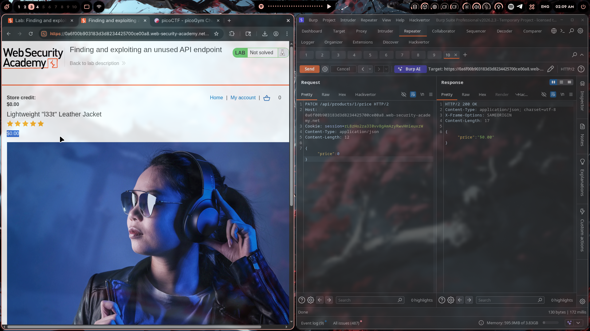
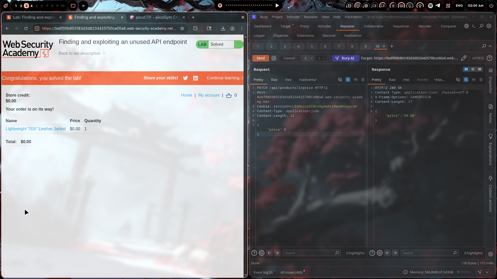

# Lab 02: Finding and Exploiting an Unused API Endpoint

> **Topic**: API Testing Vulnerabilities  
> **Lab Number**: 02  
> **Platform**: PortSwigger Web Security Academy

## Category
Broken Access Control / API Security / Business Logic

## Vulnerability Summary
The application exposes an undocumented API endpoint (`PATCH /api/products/{id}/price`) that allows authenticated users to modify product prices without proper authorization. This enables attackers to set product prices to $0 and purchase items for free, representing a critical business logic vulnerability combined with inadequate API access controls.

## Attack Methodology

### Step 1: Initial Reconnaissance
Logged into the application and identified it as an e-commerce platform with:
- Product catalog
- Shopping cart functionality
- User account system
- Store credit system

### Step 2: API Endpoint Discovery
Started enumerating API endpoints using Burp Suite. Common patterns to test:
- `/api/products`
- `/api/users`
- `/api/orders`
- `/api/admin`

Discovered the `/api/products/` endpoint structure through:
- JavaScript file analysis
- Burp Suite proxy traffic monitoring
- Common API naming conventions

### Step 3: Identifying the Vulnerable Endpoint
Found an unused/undocumented endpoint: `PATCH /api/products/{id}/price`

This endpoint was:
- Not referenced in the frontend UI
- Missing from API documentation
- Lacking proper authorization checks

### Step 4: Exploitation - Price Manipulation
Sent a PATCH request to modify the product price:



```http
PATCH /api/products/1/price HTTP/2
Host: 0a6f00b903183d3d8234425700ce00a8.web-security-academy.net
Cookie: session=rL8zHo2za3I0vv8gAmAzyRwvHnieuxzW
Content-Type: application/json
Content-Length: 12

{
    "price": 0
}
```

**Response:**
```http
HTTP/2 200 OK
Content-Type: application/json; charset=utf-8

{
    "price": "$0.00"
}
```

The server accepted the price modification without any authorization check.

### Step 5: Purchase at $0
After modifying the price:
1. Added the product to cart
2. Proceeded to checkout
3. Total price showed: **$0.00**
4. Completed the purchase successfully



**Result:** "Congratulations, you solved the lab!" + "Your order is on its way!"

## Technical Root Cause

The vulnerability stems from multiple security failures:

### 1. **Broken Object Level Authorization (BOLA)**
The API endpoint trusted the client to provide valid price data without verifying:
- Whether the user has permission to modify prices
- Whether the price value is within acceptable ranges
- Whether this operation should be allowed at all

### 2. **Undocumented/Hidden Endpoints**
The `/api/products/{id}/price` endpoint was:
- Not exposed in the UI
- Likely intended for internal/admin use only
- Left accessible to all authenticated users

### 3. **Missing Business Logic Validation**
No server-side checks for:
- Minimum price thresholds
- Price modification permissions
- Audit logging for price changes

### 4. **Insecure Direct Object Reference (IDOR)**
The product ID in the URL path (`/api/products/1/price`) was user-controllable without authorization.

**Vulnerable Code Pattern:**
```javascript
// ❌ Vulnerable - No authorization check
app.patch('/api/products/:id/price', authenticate, async (req, res) => {
    const { id } = req.params;
    const { price } = req.body;
    
    // Directly update price without checking permissions
    await db.products.update(id, { price });
    res.json({ price: formatPrice(price) });
});

// ✅ Secure - Admin-only access with validation
app.patch('/api/products/:id/price', authenticate, requireAdmin, async (req, res) => {
    const { id } = req.params;
    const { price } = req.body;
    
    // Verify admin role
    if (!req.user.isAdmin) {
        return res.status(403).json({ error: 'Admin access required' });
    }
    
    // Validate price is positive
    if (price < 0) {
        return res.status(400).json({ error: 'Price must be positive' });
    }
    
    // Log price modification for audit
    await auditLog.log('price_change', { 
        productId: id, 
        oldPrice: await getPrice(id), 
        newPrice: price, 
        userId: req.user.id 
    });
    
    await db.products.update(id, { price });
    res.json({ price: formatPrice(price) });
});
```

## Impact

This vulnerability allows attackers to:

| Attack Scenario | Business Impact |
|----------------|-----------------|
| Purchase items for $0 | Direct revenue loss |
| Modify prices site-wide | Massive financial damage |
| Resell discounted items | Brand reputation damage |
| Manipulate competitor pricing | Market disruption |

**Severity Rating**: **Critical** ⚠️

In a real e-commerce application, this could result in:
- Thousands/millions in lost revenue
- Inventory depletion
- Customer trust issues
- Regulatory scrutiny
- Potential criminal charges for fraud

## Remediation

### Immediate Actions

1. **Disable or Remove the Endpoint**
   ```javascript
   // If endpoint is not needed, remove it entirely
   // app.patch('/api/products/:id/price', ...) // DELETE THIS
   ```

2. **Implement Role-Based Access Control**
   ```javascript
   // Only allow admin users to modify prices
   function requireAdmin(req, res, next) {
       if (!req.user || !req.user.role === 'admin') {
           return res.status(403).json({ error: 'Forbidden' });
       }
       next();
   }
   ```

3. **Add Input Validation**
   ```javascript
   // Validate price is a positive number
   if (typeof price !== 'number' || price <= 0) {
       return res.status(400).json({ error: 'Invalid price' });
   }
   ```

### Long-term Improvements

1. **API Security Testing**
   - Regular penetration testing of all API endpoints
   - Automated scanning with tools like Burp Suite, OWASP ZAP
   - API security gates in CI/CD pipeline

2. **Audit Logging**
   - Log all price modifications
   - Alert on suspicious patterns (e.g., price set to $0)
   - Maintain audit trail for compliance

3. **API Documentation & Governance**
   - Document all API endpoints
   - Review and approve new endpoints before deployment
   - Implement API versioning and deprecation policies

4. **Business Logic Validation**
   - Validate all business-critical operations server-side
   - Implement price floors and approval workflows
   - Separate read and write API permissions

## Tools Used

- **Burp Suite Professional** — Repeater tab for API manipulation
- **Chromium** — Browser for the lab

## Lessons Learned

1. **Hidden ≠ Secure** — Just because an endpoint isn't in the UI doesn't mean it's not accessible

2. **Test All HTTP Methods** — GET might be safe, but PATCH, PUT, POST could be dangerous

3. **Business Logic is Critical** — Not all vulnerabilities are technical; logic flaws can be just as severe

4. **API Endpoints Multiply** — Modern apps have dozens/hundreds of endpoints; each one needs security review

5. **Price Manipulation is Common** — This is a classic e-commerce vulnerability; always validate pricing server-side

## References

- [OWASP API Security Top 10](https://owasp.org/www-project-api-security/)
- [PortSwigger: Business Logic Vulnerabilities](https://portswigger.net/web-security/logic-flaws)
- [OWASP: Broken Access Control](https://owasp.org/Top10/A01_2021-Broken_Access_Control/)
- [PortSwigger Lab: Finding and exploiting an unused API endpoint](https://portswigger.net/web-security/api)

---

*Writeup by vibhxr*
