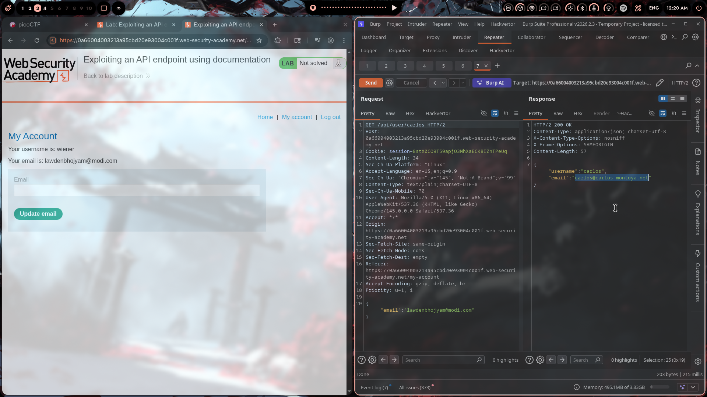

# Lab 01: Exploiting an API endpoint using documentation

## Category
Broken Access Control / API Security

## Vulnerability Summary
The application exposes undocumented API endpoints (`/api/user/{username}`) that allow any authenticated user to enumerate and delete other user accounts without proper authorization checks. This represents a classic Insecure Direct Object Reference (IDOR) vulnerability combined with dangerous HTTP methods being accessible without privilege verification.

## Attack Methodology
1. **API Discovery**: Identified hidden API endpoint pattern `/api/user/{username}` through application documentation or JavaScript file analysis.

2. **User Enumeration (GET)**: Sent GET request to `/api/user/carlos` which returned sensitive user information:
   ```
   GET /api/user/carlos HTTP/2
   Response: {"username": "carlos", "email": "carlos@carlos-montoya.net"}
   ```

3. **Account Deletion (DELETE)**: Modified HTTP method to DELETE to remove the target user:
   ```
   DELETE /api/user/carlos HTTP/2
   Response: {"status": "User deleted"}
   ```

4. **Verification**: Lab confirmed successful deletion of user 'carlos'.

## Technical Root Cause
The API backend failed to implement proper authorization checks on the `/api/user/{username}` endpoint. The vulnerability stems from:

1. **Broken Object Level Authorization (BOLA)**: No verification that the requesting user has permission to access or modify the target user resource.

2. **Dangerous HTTP Methods Enabled**: DELETE operations available without elevated privileges or confirmation.

3. **Undocumented/Hidden Endpoints**: API endpoints not exposed in UI but still fully functional, relying on security through obscurity.

4. **Lack of Rate Limiting**: No throttling on enumeration or deletion attempts.

Example vulnerable code pattern:
```javascript
// ❌ Vulnerable
app.delete('/api/user/:username', (req, res) => {
    db.deleteUser(req.params.username);
    res.json({ status: 'User deleted' });
});

// ✅ Secure
app.delete('/api/user/:username', authenticate, authorize, (req, res) => {
    if (req.user.username !== req.params.username && !req.user.isAdmin) {
        return res.status(403).json({ error: 'Forbidden' });
    }
    db.deleteUser(req.params.username);
    res.json({ status: 'User deleted' });
});
```

## Impact
An authenticated attacker can:
- Enumerate all user accounts and extract sensitive information (email addresses)
- Delete arbitrary user accounts without authorization
- Potentially perform mass deletion if endpoint allows looping
- Cause denial of service to legitimate users
- Escalate to account takeover if other HTTP methods (PUT/PATCH) are also unprotected

This would be classified as **High/Critical** severity in a production environment.

## Remediation
1. Implement proper authorization checks on all API endpoints
2. Restrict DELETE operations to admin users or self-only
3. Use indirect object references (UUIDs instead of usernames)
4. Apply rate limiting and monitoring on API endpoints
5. Document and security-review all API endpoints before deployment

## Tools Used
- Burp Suite Professional (Repeater tab)
- Chromium

## Screenshot

*DELETE request successfully removing user carlos*


*GET request leaking user information*

---

*Writeup by vibhxr | 2-3 years deep in pentesting, still learning every day*
