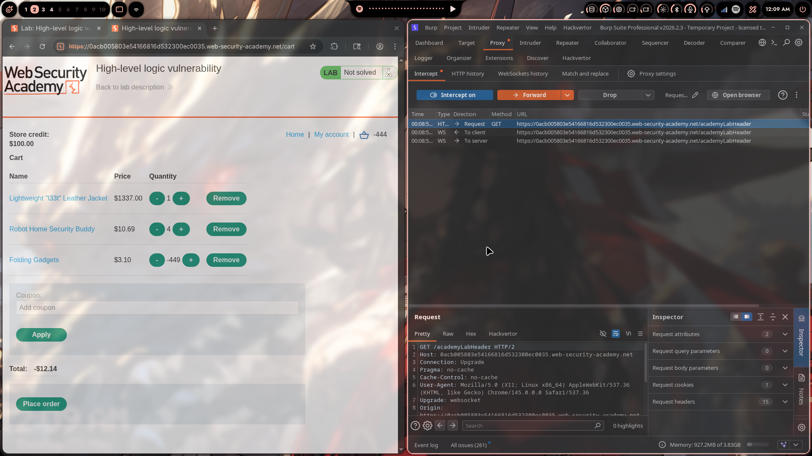
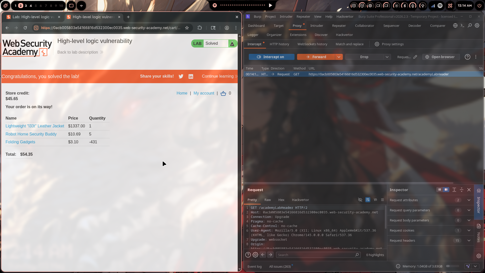

# Lab 02: High-Level Logic Vulnerability

> **Topic**: Business Logic Vulnerabilities
> **Lab Number**: 02
> **Platform**: PortSwigger Web Security Academy

## Category
Business Logic — Negative Quantity Manipulation (Integer Underflow / Missing Input Bounds Validation)

## Vulnerability Summary
The application validates that the quantity field is a non-zero integer but fails to enforce a lower bound — it accepts negative values. By adding an expensive target item to the cart and then adding a cheap item with a large negative quantity, the negative line total offsets the expensive item's price, bringing the cart total within the available store credit. The server never checks that the overall cart total or individual line quantities make logical sense for a purchase.

## Attack Methodology

### Step 1: Recon — Identify the Quantity Parameter
Added the **Lightweight "l33t" Leather Jacket** ($1337.00) to the cart and intercepted the `POST /cart` request in Burp Proxy. The request body:

```http
POST /cart HTTP/2
Host: 0acb005803e54166816d532300ec0035.web-security-academy.net
Cookie: session=<session>
Content-Type: application/x-www-form-urlencoded

productId=1&redir=PRODUCT&quantity=1&price=133700
```

Tested setting `quantity=-1` — the server accepted it without error, confirming no lower-bound validation on quantity.

### Step 2: Build the Attack Cart
The goal is to get the cart total below the store credit of **$100.00** while keeping the jacket in the cart.

**Items used:**

| Product | Price | Quantity | Line Total |
|---|---|---|---|
| Lightweight "l33t" Leather Jacket | $1337.00 | 1 | +$1337.00 |
| Robot Home Security Buddy | $10.69 | 5 | +$53.45 |
| Folding Gadgets | $3.10 | -431 | -$1336.10 |

**Cart total: $54.35** — within the $100.00 store credit.

The negative quantity on **Folding Gadgets** ($3.10 × -431 = -$1336.10) effectively cancels out the jacket's price, leaving a total the store credit can cover.

### Step 3: Tune the Negative Quantity
The negative quantity must be chosen so that:
1. The total is **positive** (the server likely rejects a negative total at checkout)
2. The total is **≤ store credit** ($100.00)

During testing, an intermediate state showed the cart at **-$12.14** with Folding Gadgets at **-449** — too negative. The quantity was adjusted upward (less negative) until the total landed at **$54.35**, which is positive and within budget.



### Step 4: Place the Order
With the cart at $54.35 and store credit at $100.00, clicked **Place order**. The server processed the order successfully.

Final cart at checkout:

| Item | Price | Quantity |
|---|---|---|
| Lightweight "l33t" Leather Jacket | $1337.00 | 1 |
| Robot Home Security Buddy | $10.69 | 5 |
| Folding Gadgets | $3.10 | -431 |
| **Total** | | **$54.35** |



## Technical Root Cause

### Missing Lower-Bound Validation on Quantity
The server validates that quantity is an integer and non-zero, but never checks `quantity > 0`:

```python
# Vulnerable pseudocode
def add_to_cart(request):
    product_id = request.POST['productId']
    quantity   = int(request.POST['quantity'])
    if quantity == 0:
        return error("Quantity cannot be zero")
    # ← No check: quantity > 0
    cart.add(product_id, quantity, product.price)
```

### Missing Cart-Level Sanity Checks
Even if individual quantities were validated, the server also fails to check:
- That each line item quantity is positive before checkout
- That the cart total is a reasonable positive value representing a real purchase

```python
# Vulnerable pseudocode
def place_order(request):
    total = sum(item.price * item.quantity for item in cart.items)
    # ← No check: all quantities > 0
    # ← No check: total > 0
    if total <= user.store_credit:
        process_payment(total)  # processes a suspiciously cheap order
```

### Secure Fix
```python
def add_to_cart(request):
    quantity = int(request.POST['quantity'])
    if quantity <= 0:
        return error("Quantity must be a positive integer")
    cart.add(product_id, quantity, product.price)

def place_order(request):
    for item in cart.items:
        if item.quantity <= 0:
            return error("Invalid cart state")
    total = sum(item.price * item.quantity for item in cart.items)
    if total <= 0:
        return error("Order total must be positive")
    process_payment(total)
```

## Impact
- **Purchase Expensive Items for Free (or Near-Free)**: Any high-value item can be obtained by offsetting its cost with negative quantities of cheap items
- **No Special Privileges Required**: Exploitable by any authenticated user with a store credit balance
- **Inventory Corruption**: Negative quantities could also corrupt stock levels if inventory is decremented by the order quantity

**Severity: High**

## Proof of Concept

1. Add target item (Lightweight "l33t" Leather Jacket, $1337.00, qty 1) to cart
2. Add cheap item (Folding Gadgets, $3.10) with a large negative quantity:

```http
POST /cart HTTP/2
Content-Type: application/x-www-form-urlencoded

productId=<cheap-item-id>&redir=PRODUCT&quantity=-431&price=310
```

3. Tune the negative quantity until `total > 0` and `total ≤ store_credit`
4. Place order

## Key Takeaways
1. **Validate All Numeric Inputs for Logical Bounds**: Any quantity, count, or numeric field must be validated for both type *and* range. A non-zero check is not sufficient — negative values are just as invalid as zero for a purchase quantity.
2. **Enforce Business Invariants Server-Side at Every Step**: The invariant "a cart must contain only positive quantities and a positive total" must be enforced at add-to-cart time *and* at checkout — not just one or the other.
3. **High-Level Logic Bugs Bypass Technical Controls**: This vulnerability has nothing to do with injection, authentication, or cryptography. The server is functioning correctly at a technical level — the flaw is purely in the business logic. Automated scanners typically miss this class of bug entirely.
4. **Test Boundary Conditions on Every Input**: Zero, negative, very large, and fractional values should all be tested on any numeric input that affects pricing or quantities.

## Mitigation

### 1. Enforce Positive Quantity at Add-to-Cart
```python
if quantity <= 0:
    return HttpResponseBadRequest("Quantity must be greater than zero")
```

### 2. Re-validate All Quantities at Checkout
```python
for item in cart.items:
    if item.quantity <= 0:
        return HttpResponseBadRequest("Invalid cart: all quantities must be positive")
```

### 3. Validate Cart Total Before Processing Payment
```python
total = cart.calculate_total()
if total <= 0:
    return HttpResponseBadRequest("Order total must be a positive value")
```

### 4. Set Maximum Quantity Limits
Prevent absurdly large quantities (positive or negative) that could be used for other manipulation:
```python
MAX_QUANTITY = 99
if not (1 <= quantity <= MAX_QUANTITY):
    return HttpResponseBadRequest(f"Quantity must be between 1 and {MAX_QUANTITY}")
```

## References
- [PortSwigger — High-level logic vulnerability](https://portswigger.net/web-security/logic-flaws/examples/lab-logic-flaws-high-level)
- [PortSwigger — Business Logic Vulnerabilities](https://portswigger.net/web-security/logic-flaws)
- [OWASP — Business Logic Security Cheat Sheet](https://cheatsheetseries.owasp.org/cheatsheets/Business_Logic_Security_Cheat_Sheet.html)
- [CWE-20: Improper Input Validation](https://cwe.mitre.org/data/definitions/20.html)
- [CWE-190: Integer Overflow or Wraparound](https://cwe.mitre.org/data/definitions/190.html)

## Tools Used
- Burp Suite Professional (Proxy, Intercept)
- Chromium

---

*Lab completed on: 2026-05-03*  
*Writeup by vibhxr*
