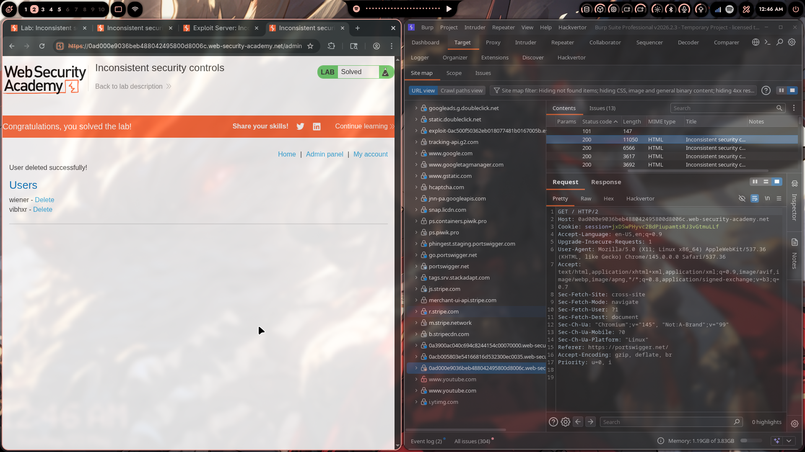
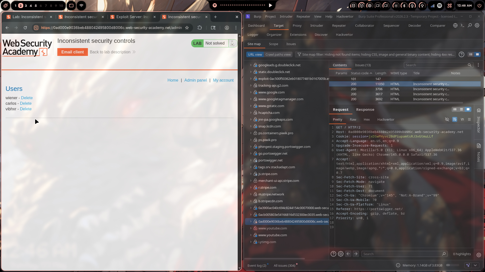

# Lab 03: Inconsistent Security Controls

> **Topic**: Business Logic Vulnerabilities
> **Lab Number**: 03
> **Platform**: PortSwigger Web Security Academy

## Category
Business Logic — Inconsistent Access Control Based on Unverified User-Supplied Data (Email Domain Privilege Escalation)

## Vulnerability Summary
The application grants admin privileges to any user whose registered email address ends in `@dontwannacry.com`, treating email domain as a trusted indicator of internal employee status. However, the application allows users to freely change their email address after registration — and never re-validates whether the new address is actually owned by the user. By registering a normal account, then updating the email to any `@dontwannacry.com` address, a regular user gains full admin access including the ability to delete other users.

## Attack Methodology

### Step 1: Content Discovery — Find Hidden Endpoints
Used Burp Suite's **Discover Content** feature (Target → right-click → Discover content) against the lab host to enumerate hidden paths. The discovery session made **7,080 requests** and identified the `/admin` endpoint among others (`/login/`, `/product/`, `/my-account/`, `/register/`, `/logout/`).


Navigating to `/admin` as a regular user returned a message indicating it was restricted to `@dontwannacry.com` employees.

### Step 2: Register a Normal Account
Registered a new account using the exploit server's email client to receive the confirmation link:

- Email used: `attacker@exploit-server.net` (any non-dontwannacry address)
- Confirmed the registration via the email link

### Step 3: Update Email to @dontwannacry.com
After logging in, navigated to **My account** and changed the registered email to:

```
anything@dontwannacry.com
```

The application accepted the change without sending a verification email to the new address — it simply stored the new value. No ownership verification was performed.

### Step 4: Access the Admin Panel
Navigated to `/admin`. The application checked the session user's email domain, found `@dontwannacry.com`, and granted full admin access.

The admin panel listed all users:
- wiener
- carlos
- vibhxr



### Step 5: Delete the Target User
Clicked **Delete** next to `carlos`. The server processed the deletion.



## Technical Root Cause

### Privilege Check Based on Unverified Attribute
The admin access check trusts the stored email domain without verifying that the user actually controls that email address:

```python
# Vulnerable pseudocode
def admin_panel(request):
    user = get_current_user(request)
    if not user.email.endswith('@dontwannacry.com'):
        return HttpResponseForbidden('Admin access restricted to company employees')
    return render_admin_panel()
```

### Email Change Without Verification
The account settings endpoint accepts any new email and stores it immediately:

```python
# Vulnerable pseudocode
def update_email(request):
    new_email = request.POST['email']
    request.user.email = new_email   # ← stored with no ownership check
    request.user.save()
```

### The Combined Flaw
Neither check is wrong in isolation — the problem is the combination:
1. Admin access is gated on email domain (reasonable in principle)
2. Email can be changed to anything without verification (breaks assumption 1)

Together they allow any user to self-assign the privileged email domain.

### Secure Fix
```python
# Secure: require email verification before applying the change
def update_email(request):
    new_email = request.POST['email']
    send_verification_link(new_email, token=generate_token(request.user, new_email))
    return HttpResponse("Check your new email address to confirm the change")

def confirm_email_change(request, token):
    user, new_email = validate_token(token)
    user.email = new_email
    user.save()
    # Only now is the email updated — after proving ownership
```

## Impact
- **Full Privilege Escalation**: Any registered user can elevate themselves to admin by changing their email to `*@dontwannacry.com`
- **No Special Access Required**: Exploitable by any user who can register an account
- **Complete Account Takeover of Other Users**: Admin panel allows deleting, modifying, or viewing all user accounts

**Severity: Critical**

## Proof of Concept

1. Register an account with any email (use exploit server to receive confirmation)
2. Confirm registration via the emailed link
3. Log in → navigate to My Account → change email to `attacker@dontwannacry.com`
4. Navigate to `/admin` — full admin access granted
5. Delete target user: `GET /admin/delete?username=carlos`

## Key Takeaways
1. **Never Trust User-Supplied Data for Privilege Decisions**: Email domain, username, or any other user-controlled attribute must not be used as the sole basis for granting elevated privileges without independent verification.
2. **Email Changes Must Require Verification**: Any change to a security-relevant attribute (email, phone, recovery options) must be verified by sending a confirmation to the *new* address before the change takes effect. The old address should also be notified.
3. **Content Discovery Reveals Hidden Attack Surface**: Endpoints like `/admin` that are not linked from the UI are still accessible if guessable. Security through obscurity is not access control — proper authentication and authorisation must be enforced server-side on every sensitive endpoint.
4. **Inconsistency Between Registration and Update Flows**: Registration required email confirmation; the update flow did not. Security controls must be applied consistently across all flows that touch the same data.

## Mitigation

### 1. Verify Email Ownership Before Applying Changes
Send a verification link to the new email address. Only update the stored email after the link is clicked:
```python
# On update request: send token, don't change email yet
# On token confirmation: apply the change
```

### 2. Notify the Old Email Address of Changes
Alert the previous email when a change is made, allowing the legitimate owner to detect and respond to account takeover:
```python
send_notification(old_email, "Your email address was changed. If this wasn't you, contact support.")
```

### 3. Use a Separate, Admin-Controlled Flag for Privilege
Instead of deriving admin status from email domain at runtime, use an explicit boolean flag set only by existing admins:
```python
# Schema: users table has is_admin BOOLEAN DEFAULT FALSE
# Only an existing admin can set is_admin=TRUE for another user
if not user.is_admin:
    return HttpResponseForbidden()
```

### 4. Enforce Access Control on All Sensitive Endpoints
Every admin endpoint must independently verify the user's privilege level — not rely on the UI hiding the link:
```python
@require_admin
def admin_panel(request):
    ...
```

## References
- [PortSwigger — Inconsistent security controls](https://portswigger.net/web-security/logic-flaws/examples/lab-logic-flaws-inconsistent-security-controls)
- [PortSwigger — Business Logic Vulnerabilities](https://portswigger.net/web-security/logic-flaws)
- [OWASP — Broken Access Control](https://owasp.org/Top10/A01_2021-Broken_Access_Control/)
- [CWE-284: Improper Access Control](https://cwe.mitre.org/data/definitions/284.html)
- [CWE-345: Insufficient Verification of Data Authenticity](https://cwe.mitre.org/data/definitions/345.html)

## Tools Used
- Burp Suite Professional (Proxy, Target, Content Discovery)
- Chromium

---

*Lab completed on: 2026-05-03*  
*Writeup by vibhxr*
