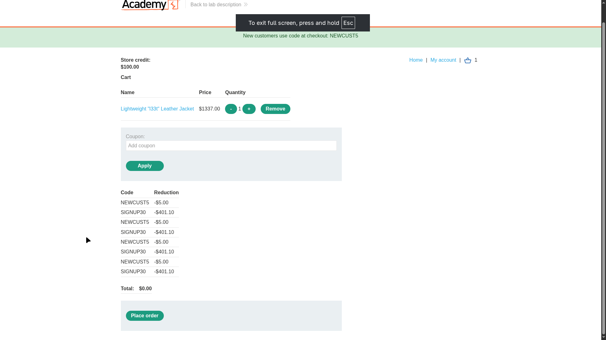
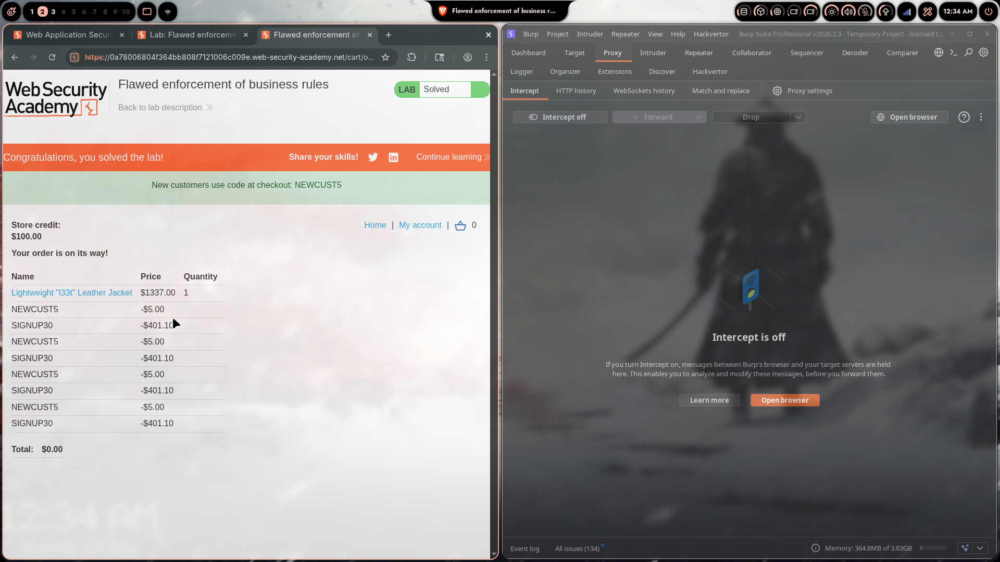

# Lab 04: Flawed Enforcement of Business Rules

> **Topic**: Business Logic Vulnerabilities
> **Lab Number**: 04
> **Platform**: PortSwigger Web Security Academy

## Category
Business Logic — Coupon Reuse via Alternating Application (No Per-Code Uniqueness Enforcement)

## Vulnerability Summary
The application offers two discount coupon codes: `NEWCUST5` (-$5.00, advertised to new customers) and `SIGNUP30` (-$401.10, given at account signup). The coupon system prevents applying the same code twice in a row but does not track whether a code has been used at all during the session. By alternating between the two codes repeatedly, an attacker can stack unlimited discounts and reduce any order total to $0.00, then place the order for free.

## Attack Methodology

### Step 1: Identify Available Coupon Codes
Two codes are available:
- `NEWCUST5` — advertised in a banner: *"New customers use code at checkout: NEWCUST5"* → -$5.00
- `SIGNUP30` — obtained during account registration → -$401.10

The target item is the **Lightweight "l33t" Leather Jacket** at **$1337.00**. Store credit is $100.00 (not directly usable to zero the cart).

### Step 2: Probe the Deduplication Logic
Applying `NEWCUST5` twice in a row is rejected — the application detects consecutive duplicate use. However, applying `SIGNUP30` after `NEWCUST5` succeeds. The check is only against the *last applied* code, not against the full set of applied codes.

### Step 3: Alternate Codes to Stack Discounts
Repeatedly alternate the two codes until the total reaches $0.00:

| Application # | Code Applied | Reduction | Running Total |
|---|---|---|---|
| 1 | NEWCUST5 | -$5.00 | $1332.00 |
| 2 | SIGNUP30 | -$401.10 | $930.90 |
| 3 | NEWCUST5 | -$5.00 | $925.90 |
| 4 | SIGNUP30 | -$401.10 | $524.80 |
| 5 | NEWCUST5 | -$5.00 | $519.80 |
| 6 | SIGNUP30 | -$401.10 | $118.70 |
| 7 | NEWCUST5 | -$5.00 | $113.70 |
| 8 | SIGNUP30 | -$401.10 | **-$287.40 → capped at $0.00** |

After 8 applications (4× each), the cart total is **$0.00**.

### Step 4: Place the Order
With the total at $0.00, click **Place order**. The order is accepted and the lab is marked solved.

```
POST /cart/coupon HTTP/2
Host: 0a7b0068...web-security-academy.net
Content-Type: application/x-www-form-urlencoded

csrf=...&coupon=NEWCUST5
```

```
POST /cart/coupon HTTP/2
Host: 0a7b0068...web-security-academy.net
Content-Type: application/x-www-form-urlencoded

csrf=...&coupon=SIGNUP30
```

Repeat alternating until total = $0.00, then:

```
POST /cart/order HTTP/2
Host: 0a7b0068...web-security-academy.net
Content-Type: application/x-www-form-urlencoded

csrf=...
```

Response: **Order placed. Lab solved.**





## Technical Root Cause

### Vulnerable Implementation (Pseudocode)
```python
def apply_coupon(session, coupon_code):
    # Only checks if the last applied code matches — not full history
    if session.get('last_coupon') == coupon_code:
        return error("Coupon already applied")

    discount = lookup_discount(coupon_code)
    session['cart_total'] -= discount
    session['last_coupon'] = coupon_code  # overwrites — no history kept
    return success()
```

The flaw: `last_coupon` is a single value. Alternating codes always passes the `!=` check, allowing infinite reuse.

### Secure Implementation (Pseudocode)
```python
def apply_coupon(session, coupon_code):
    # Track the full set of used codes, not just the last one
    used_coupons = session.get('used_coupons', set())

    if coupon_code in used_coupons:
        return error("Coupon already applied")

    discount = lookup_discount(coupon_code)
    session['cart_total'] -= discount
    used_coupons.add(coupon_code)
    session['used_coupons'] = used_coupons  # persist full set
    return success()
```

Additionally, enforce a floor of $0.00 on the cart total server-side and validate the final total before accepting payment.

## Impact
- **Full Price Bypass**: Any item can be purchased for $0.00 regardless of its price
- **Unlimited Coupon Stacking**: Both codes can be applied an arbitrary number of times
- **Revenue Loss**: Attacker acquires goods without payment; no rate limiting or session-level cap prevents this

**Severity: High**

## Proof of Concept

1. Add the Lightweight "l33t" Leather Jacket ($1337.00) to cart
2. Apply `NEWCUST5` → total: $1332.00
3. Apply `SIGNUP30` → total: $930.90
4. Repeat steps 2–3 three more times
5. Total reaches $0.00
6. Click **Place order** → order accepted, lab solved

## Key Takeaways
1. **Last-Code Checks Are Not Deduplication**: Tracking only the most recently applied coupon prevents back-to-back reuse but is trivially bypassed by alternating two codes. Deduplication requires a persistent set of all used codes for the session/order.
2. **Business Rules Must Be Enforced as Invariants**: The intended rule is "each coupon usable once per order." The implementation enforced a weaker proxy rule ("not the same as last time"), which does not capture the intent.
3. **Validate Final State, Not Just Transitions**: Even if individual coupon applications are validated, the final order total should be re-validated server-side before payment is accepted. A total of $0.00 for a $1337.00 item should trigger a sanity check.
4. **Discount Stacking Limits**: Where multiple coupons are intentionally allowed, define and enforce a maximum total discount percentage or absolute cap per order.

## Mitigation

### 1. Track All Applied Coupons Per Order
```python
# Store a set of used coupon codes in the order/session
if coupon_code in order.applied_coupons:
    raise ValidationError("Coupon already used on this order")
order.applied_coupons.add(coupon_code)
```

### 2. Enforce a Maximum Discount Cap
```python
MAX_DISCOUNT_PERCENT = 0.50  # e.g., no more than 50% off

total_discount = original_price - current_total
if total_discount / original_price > MAX_DISCOUNT_PERCENT:
    raise ValidationError("Maximum discount exceeded")
```

### 3. Server-Side Order Total Validation Before Charge
```python
def place_order(order):
    expected_total = calculate_total(order.items, order.applied_coupons)
    if expected_total != order.claimed_total:
        raise ValidationError("Order total mismatch — possible tampering")
    charge(order.payment_method, expected_total)
```

## References
- [PortSwigger — Flawed Enforcement of Business Rules](https://portswigger.net/web-security/logic-flaws/examples/lab-logic-flaws-flawed-enforcement-of-business-rules)
- [PortSwigger — Business Logic Vulnerabilities](https://portswigger.net/web-security/logic-flaws)
- [OWASP — Business Logic Security Cheat Sheet](https://cheatsheetseries.owasp.org/cheatsheets/Business_Logic_Security_Cheat_Sheet.html)
- [CWE-840: Business Logic Errors](https://cwe.mitre.org/data/definitions/840.html)

## Tools Used
- Burp Suite Professional (Proxy, HTTP history)
- Chromium

---

*Lab completed on: 2026-05-04*  
*Writeup by vibhxr*
