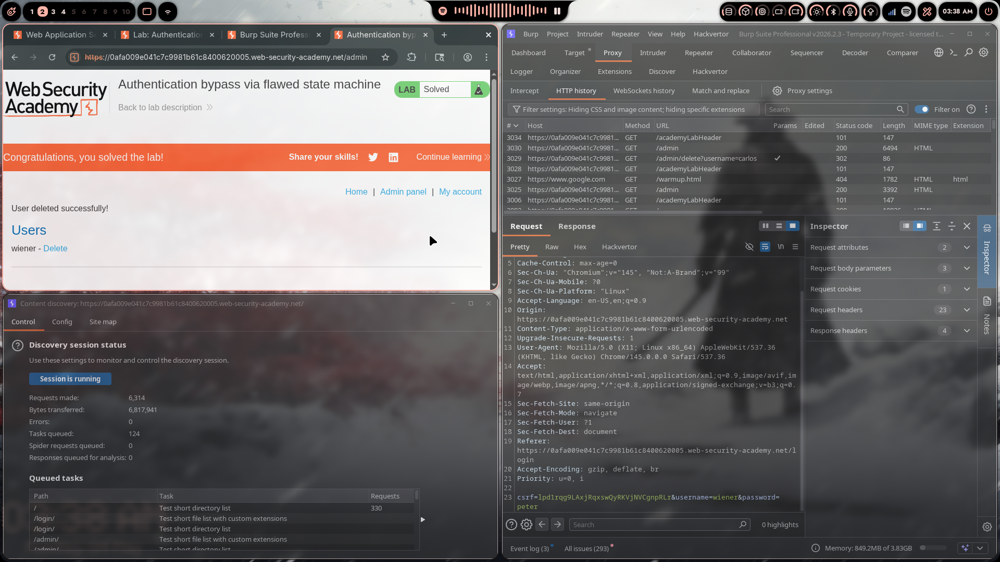

# Lab 09: Authentication Bypass via Flawed State Machine

> **Topic**: Business Logic Vulnerabilities
> **Lab Number**: 09
> **Platform**: PortSwigger Web Security Academy

## Category
Business Logic — Authentication Bypass via Workflow Step Skipping (Flawed Login State Machine)

## Vulnerability Summary
The application implements a two-step login: first the user submits credentials, then they are presented with a role-selection step. The server assigns the user's role based on the response to the second step. If the role-selection request is never sent (dropped), the server assigns a default role — which turns out to be `administrator`. By intercepting and dropping the role-selection POST after a successful credential check, any valid user can authenticate as an administrator without knowing the admin credentials.

## Attack Methodology

### Step 1: Map the Login Workflow
Logged in normally as `wiener:peter` with Burp Intercept on. The login flow consists of two requests:

1. `POST /login` — submit credentials
2. `POST /role-selector` (or equivalent) — select role from a presented list

The server only assigns the role after step 2. If step 2 is never completed, the server must decide on a default.

### Step 2: Drop the Role-Selection Request
After submitting credentials (`POST /login`), Burp Intercept caught the role-selection request. Instead of forwarding it, the request was **dropped**.

The browser was then navigated directly to `/admin`.

### Step 3: Access Admin Panel
The server, having received valid credentials but no role selection, defaulted to assigning the `administrator` role. `/admin` was accessible immediately.

```http
GET /admin HTTP/2
Host: 0afa009e041c7c9981b61c8400620005.web-security-academy.net
Cookie: session=<post-login-session>
```

Response: **200 OK** — admin panel loaded.

### Step 4: Delete carlos

```http
GET /admin/delete?username=carlos HTTP/2
```

Response: **302** — "User deleted successfully!" — Lab solved.



## Technical Root Cause

### Vulnerable Implementation (Pseudocode)
```python
def login(request):
    if verify_credentials(request.POST):
        session['authenticated'] = True
        session['role'] = 'administrator'  # default assigned immediately
        return redirect('/role-selector')  # user expected to downgrade role

def role_selector(request):
    session['role'] = request.POST.get('role')  # overwrites default if reached
    return redirect('/')
```

The flaw: the privileged default role is assigned at step 1 and only overwritten if step 2 is completed. Skipping step 2 leaves the default in place.

### Secure Implementation (Pseudocode)
```python
def login(request):
    if verify_credentials(request.POST):
        session['authenticated'] = True
        session['role'] = None          # no role until selection is complete
        session['awaiting_role'] = True
        return redirect('/role-selector')

def role_selector(request):
    if not session.get('awaiting_role'):
        return redirect('/login')       # enforce step ordering
    role = request.POST.get('role')
    if role not in get_permitted_roles(session['username']):
        return error("Invalid role")
    session['role'] = role
    session['awaiting_role'] = False
    return redirect('/')

def require_role(role):
    if not session.get('role'):         # None role = not fully authenticated
        return redirect('/role-selector')
```

### State Machine Comparison

```
Intended flow:
  POST /login (valid creds) → role = None → POST /role-selector → role = 'user' → access

Exploited flow:
  POST /login (valid creds) → role = 'administrator' (default) → [drop] → GET /admin ✅
```

## Impact
- **Full Admin Access with Any Valid Account**: Any user with valid credentials can authenticate as administrator by skipping one request
- **No Admin Credentials Required**: The attack uses the attacker's own account — no credential theft needed
- **Arbitrary User Deletion**: Admin panel fully accessible

**Severity: Critical**

## Proof of Concept

1. Enable Burp Intercept
2. Submit `POST /login` with `username=wiener&password=peter`
3. When Burp catches the redirect to `/role-selector`, click **Drop**
4. Navigate directly to `/admin`
5. Access granted — visit `/admin/delete?username=carlos`

## Key Takeaways
1. **Never Assign Privileged Defaults**: If a workflow step determines privilege level, the default state before that step completes must be the least-privileged option (or no role at all), not the most privileged.
2. **Enforce Step Ordering Server-Side**: Each step in a multi-step workflow must verify that all preceding steps were completed. A session that skipped step 2 must not be treated as fully authenticated.
3. **Incomplete Authentication = No Authentication**: A session where role selection was never completed should be treated as unauthenticated for all privileged operations and redirected back to complete the flow.
4. **State Machines Must Be Explicit**: Implicit defaults in state transitions are a common source of logic flaws. Every state transition should be explicit, validated, and logged.

## Mitigation

### 1. No Role Until Selection Is Complete
```python
session['role'] = None  # set at login, only populated after role-selector POST
```

### 2. Guard All Privileged Endpoints Against Incomplete Auth
```python
def require_complete_auth(view):
    if not session.get('role'):
        return redirect('/role-selector')
    return view(request)
```

### 3. Validate Role Against User's Permitted Roles
```python
PERMITTED_ROLES = {'wiener': ['user'], 'administrator': ['administrator', 'user']}

def role_selector(request):
    chosen = request.POST.get('role')
    if chosen not in PERMITTED_ROLES.get(session['username'], []):
        return error("Role not permitted for this account")
    session['role'] = chosen
```

## References
- [PortSwigger — Authentication Bypass via Flawed State Machine](https://portswigger.net/web-security/logic-flaws/examples/lab-logic-flaws-authentication-bypass-via-flawed-state-machine)
- [PortSwigger — Business Logic Vulnerabilities](https://portswigger.net/web-security/logic-flaws)
- [CWE-841: Improper Enforcement of Behavioral Workflow](https://cwe.mitre.org/data/definitions/841.html)
- [CWE-287: Improper Authentication](https://cwe.mitre.org/data/definitions/287.html)

## Tools Used
- Burp Suite Professional (Proxy, Intercept — Drop function, HTTP history)
- Chromium

---

*Lab completed on: 2026-05-04*  
*Writeup by vibhxr*
