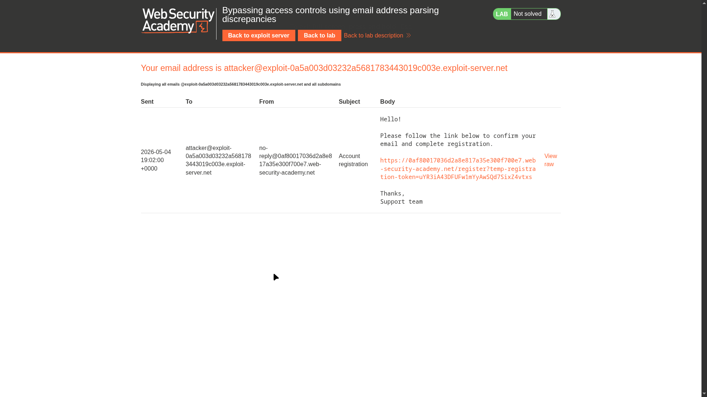
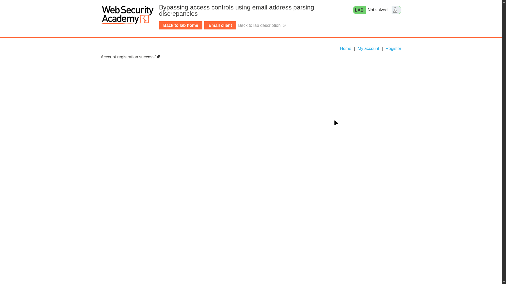
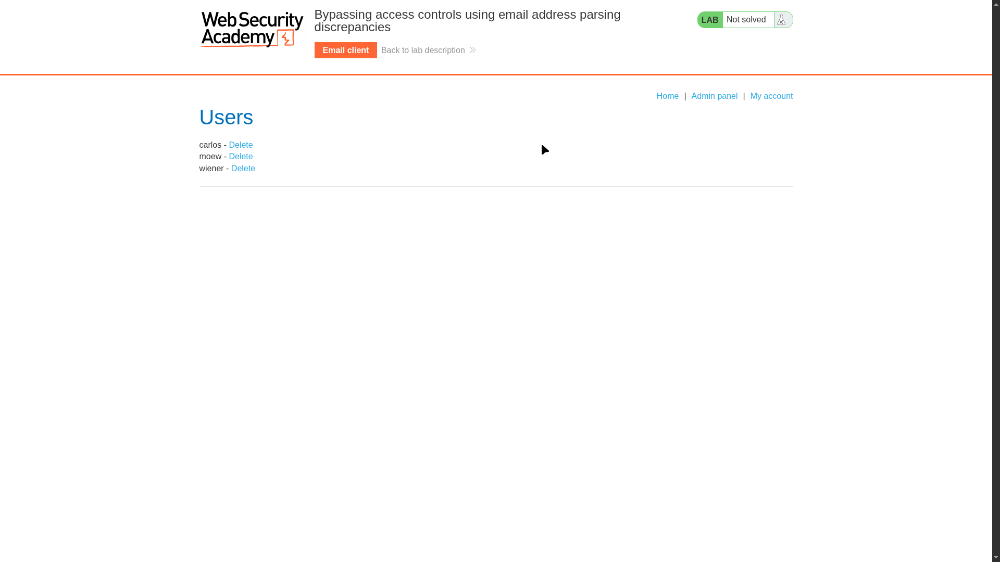
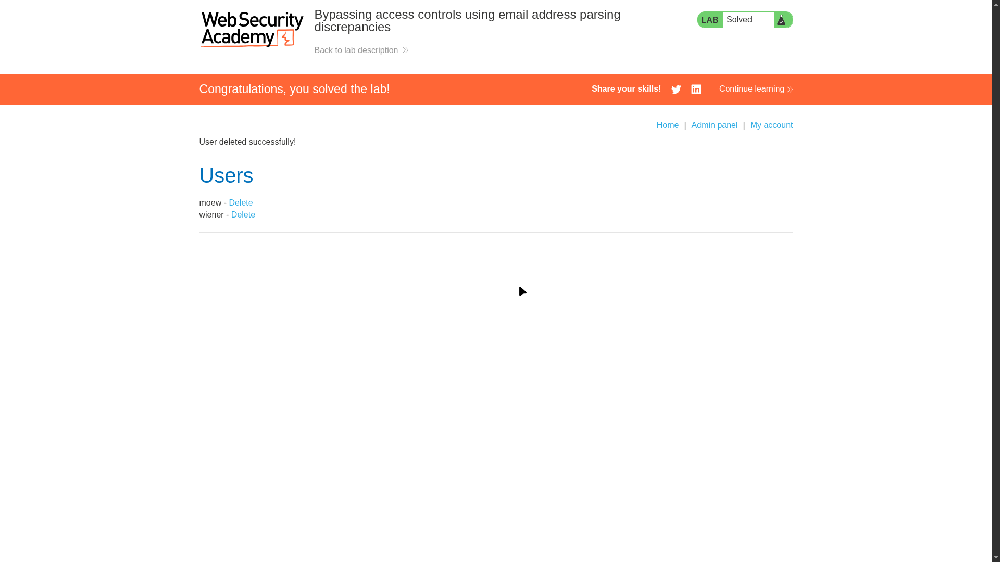

# Lab 12: Bypassing Access Controls Using Email Address Parsing Discrepancies

> **Topic**: Business Logic Vulnerabilities
> **Lab Number**: 12
> **Platform**: PortSwigger Web Security Academy

## Category
Business Logic — Access Control Bypass via Email Address Parsing Discrepancy

## Vulnerability Summary
The application grants admin privileges based on the domain of the registered email address (e.g., only `@dontwannacry.com` users become admins). However, the server-side email parser and the access-control logic interpret the email address differently. By registering with a crafted email address that contains the privileged domain as a subdomain of an attacker-controlled domain (e.g., `attacker@dontwannacry.com.exploit-server.net`), the registration confirmation is delivered to the attacker's exploit server while the access-control check incorrectly identifies the domain as `dontwannacry.com`, granting admin access.

## Attack Methodology

### Step 1: Identify the Privileged Email Domain
Browsing the application reveals that admin functionality is restricted. Inspecting the lab description confirms that users with a `@dontwannacry.com` email address are granted admin privileges.

### Step 2: Register with a Crafted Email Address
Using the exploit server's email client, register a new account with an email address that embeds the privileged domain as a subdomain:

```
attacker@dontwannacry.com.exploit-server.net
```

The registration flow sends a confirmation email to this address. Since `exploit-server.net` is the actual domain, the email is delivered to the attacker's exploit server inbox.



### Step 3: Confirm Registration via the Email Link
Open the exploit server's email client. The confirmation email arrives with a registration link:

```
https://<lab-id>.web-security-academy.net/register?temp-registration-token=<token>
```

Click the link to confirm the account.



### Step 4: Access the Admin Panel
Log in with the newly registered account. The server's access-control logic parses the email domain and extracts `dontwannacry.com` (everything before the last `.exploit-server.net` suffix is ignored or the split is done on the first `@`-separated component incorrectly). Admin panel access is granted.



### Step 5: Delete the Target User
From the admin panel, click **Delete** next to `carlos`.

```
GET /admin/delete?username=carlos HTTP/2
Host: <lab-id>.web-security-academy.net
Cookie: session=<admin-session-token>
```

Response: `User deleted successfully!` — Lab solved.



## Technical Root Cause

### Vulnerable Logic (Pseudocode)
```python
def get_email_domain(email):
    # Splits on '@' and takes the right part
    # Then checks if the privileged domain is a SUBSTRING of the result
    domain = email.split('@')[1]
    if 'dontwannacry.com' in domain:   # ← substring check, not equality
        return 'admin'
    return 'user'
```

An email like `attacker@dontwannacry.com.exploit-server.net` passes the `in` check because `dontwannacry.com` is a substring of `dontwannacry.com.exploit-server.net`. The actual email is delivered to `exploit-server.net`.

### Secure Logic (Pseudocode)
```python
def get_email_domain(email):
    domain = email.split('@')[1].lower()
    # Exact equality — no substring matching
    if domain == 'dontwannacry.com':
        return 'admin'
    return 'user'
```

Exact equality ensures that `dontwannacry.com.exploit-server.net` does not match `dontwannacry.com`.

### The Parsing Discrepancy

```
Attacker registers:   attacker@dontwannacry.com.exploit-server.net
                                 ↑
                     privileged domain embedded as subdomain

Email delivery:       → exploit-server.net  (actual MX record)
                        attacker receives the confirmation link ✅

Access-control check: 'dontwannacry.com' in 'dontwannacry.com.exploit-server.net'
                        → True  ✅  admin granted ← WRONG
```

## Impact
- **Full Admin Access**: Any attacker who controls a domain can register with `attacker@<privileged-domain>.<attacker-domain>` and gain admin privileges
- **Privilege Escalation Without Credentials**: No need to compromise a legitimate admin account
- **Arbitrary User Deletion / Account Takeover**: Full admin panel functionality is accessible

**Severity: High**

## Proof of Concept

1. Register with email: `attacker@dontwannacry.com.<exploit-server-domain>`
2. Receive confirmation email at exploit server → click the registration link
3. Log in → navigate to `/admin` → admin access granted
4. Delete target user: `GET /admin/delete?username=carlos`

## Key Takeaways
1. **Substring Matching on Domains Is Dangerous**: Checking `'trusted.com' in email_domain` allows any domain that contains `trusted.com` as a substring (e.g., `trusted.com.evil.net`) to pass. Always use exact equality.
2. **Email Delivery ≠ Domain Ownership**: The domain that receives an email (the actual MX-resolved domain) is not necessarily the domain the access-control logic extracts. These two must agree.
3. **Validate the Full Domain, Not a Component**: After splitting on `@`, validate the entire right-hand side with exact equality or a strict allowlist — never a `contains`/`in` check.
4. **Email Confirmation Does Not Prove Domain Ownership**: Confirming an email only proves the user can receive mail at that address. It does not prove they own the privileged domain embedded within it.

## Mitigation

### 1. Use Exact Domain Equality
```python
ADMIN_DOMAIN = 'dontwannacry.com'

def assign_role(email):
    domain = email.split('@')[1].strip().lower()
    if domain == ADMIN_DOMAIN:
        return 'admin'
    return 'user'
```

### 2. Normalize and Validate with a Proper Email Parser
```python
import email.headerregistry

def get_domain(raw_email):
    # Use a standards-compliant parser, not manual string splitting
    addr = email.headerregistry.Address(addr_spec=raw_email)
    return addr.domain.lower()
```

### 3. Out-of-Band Domain Verification
For high-privilege role assignment based on email domain, require additional verification (e.g., DNS TXT record ownership proof) rather than relying solely on email delivery.

## References
- [PortSwigger — Bypassing access controls using email address parsing discrepancies](https://portswigger.net/web-security/logic-flaws/examples/lab-logic-flaws-bypassing-access-controls-using-email-address-parsing-discrepancies)
- [PortSwigger — Business Logic Vulnerabilities](https://portswigger.net/web-security/logic-flaws)
- [RFC 5321 — Simple Mail Transfer Protocol (SMTP)](https://datatracker.ietf.org/doc/html/rfc5321)
- [RFC 5322 — Internet Message Format](https://datatracker.ietf.org/doc/html/rfc5322)
- [CWE-1287: Improper Validation of Specified Type of Input](https://cwe.mitre.org/data/definitions/1287.html)

## Tools Used
- Burp Suite Professional (Proxy, Repeater)
- PortSwigger Exploit Server (Email Client)
- Chromium

---

*Lab completed on: 2026-05-04*  
*Writeup by vibhxr*
