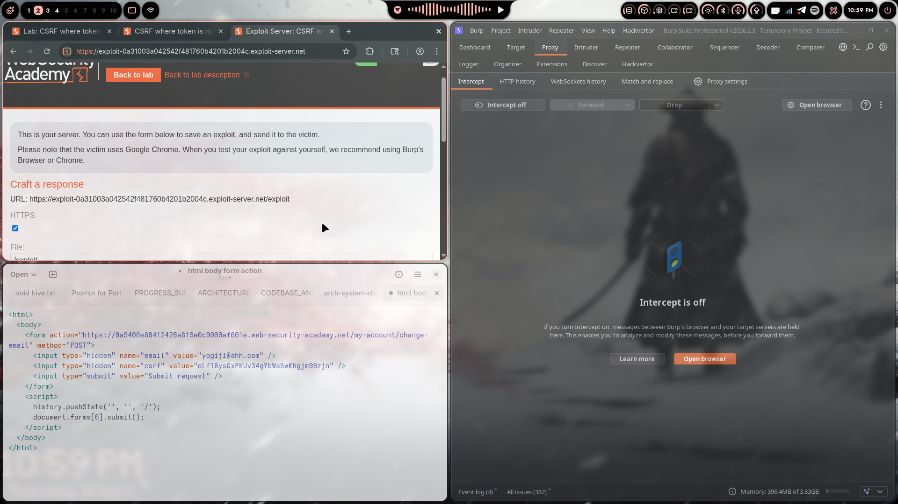
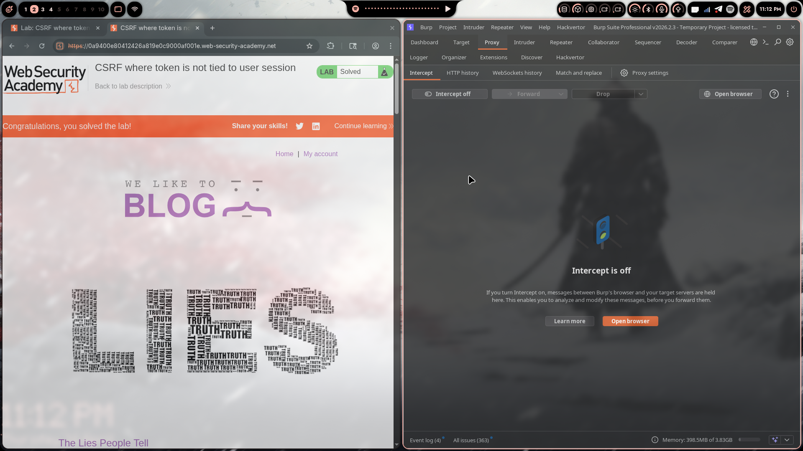

# Lab 04: CSRF where token is not tied to user session

> **Topic**: CSRF Vulnerabilities
> **Lab Number**: 04
> **Platform**: PortSwigger Web Security Academy

## Category
Cross-Site Request Forgery (CSRF)

## Vulnerability Summary
The application implements CSRF tokens but fails to tie them to the authenticated user's session. Tokens are generated and stored in a global pool — any valid, unused token is accepted regardless of which user it was issued to. An attacker can obtain a valid CSRF token from their own account and use it in a forged request targeting a different victim's session, bypassing the CSRF protection entirely.

## Attack Methodology
1. **Identify the CSRF Attack Surface**: Captured the `POST /my-account/change-email` request through Burp Suite Proxy while changing the email on the attacker's own account. The request includes a `csrf` parameter.

2. **Analyze the Token Behaviour**: Observed that the CSRF token is not bound to the attacker's session — it is drawn from a shared pool. Dropping the attacker's own request after capturing the token leaves it valid and reusable.

3. **Craft the CSRF Exploit**: Built an HTML page that auto-submits the email-change form using the attacker's captured token against the victim's session:

   

   ```html
   <html><body>
     <form action="https://0a9400e80412426a819e0c9000af001e.web-security-academy.net/my-account/change-email" method="POST">
       <input type="hidden" name="email" value="yogiji@ahh.com" />
       <input type="hidden" name="csrf" value="oLf18ysQxPKUv34gYbWa5wKhgjm99zjn" />
       <input type="submit" value="Submit request" />
     </form>
     <script>history.pushState('', '', '/'); document.forms[0].submit();</script>
   </body></html>
   ```

4. **Host the Exploit**: Uploaded the malicious HTML to the PortSwigger Exploit Server at `/exploit`.

5. **Deliver to Victim**: Sent the exploit URL to the victim. When the victim's browser loaded the page, the form auto-submitted, changing their email to the attacker-controlled address using the attacker's own (but globally valid) CSRF token.

6. **Lab Verification**: Lab marked as solved — victim's email successfully changed:

   

## Technical Root Cause
The CSRF token implementation is flawed because tokens are stored in a global pool rather than being bound to individual user sessions:

```python
# ❌ Vulnerable — token pool shared across all sessions
csrf_token_pool = set()

def generate_csrf_token():
    token = secrets.token_hex(16)
    csrf_token_pool.add(token)   # stored globally, not per-session
    return token

def validate_csrf_token(token):
    if token in csrf_token_pool:
        csrf_token_pool.discard(token)
        return True
    return False

# ✅ Secure — token tied to the specific user session
def validate_csrf_token(token, session):
    if token == session.get('csrf_token'):
        del session['csrf_token']
        return True
    return False
```

The server only checks that the token exists and hasn't been used — it never verifies that the token was issued to the same session making the request.

## Impact
An attacker who can obtain any valid CSRF token (e.g. from their own account) can forge requests on behalf of any authenticated victim. In this lab:

- **Account takeover**: Changing the victim's email enables a password-reset flow to the attacker's inbox
- **Bypassed CSRF defence**: The presence of a CSRF token gives a false sense of security while providing no actual protection
- **Scalable attack**: A single captured token can be used against any victim before it is consumed

Severity is **High** given the direct path to account takeover.

## Remediation
1. **Bind tokens to the user session**: Store the CSRF token in the server-side session and validate that the submitted token matches the one issued to *that specific session*

2. **Use the Double Submit Cookie pattern correctly**: If using stateless tokens, sign them with a secret and include the user identifier so cross-user reuse is detectable

3. **Set `SameSite=Lax` or `Strict` on session cookies**: Provides defence-in-depth against cross-site form submissions

4. **Rotate tokens per request**: Invalidate and reissue the token after each state-changing request to limit the reuse window

5. **Validate `Origin`/`Referer` headers**: Reject requests whose origin does not match the application's own domain

## Tools Used
- Burp Suite Professional (Proxy, Repeater)
- Chromium
- PortSwigger Exploit Server

---

*Writeup by vibhxr*
