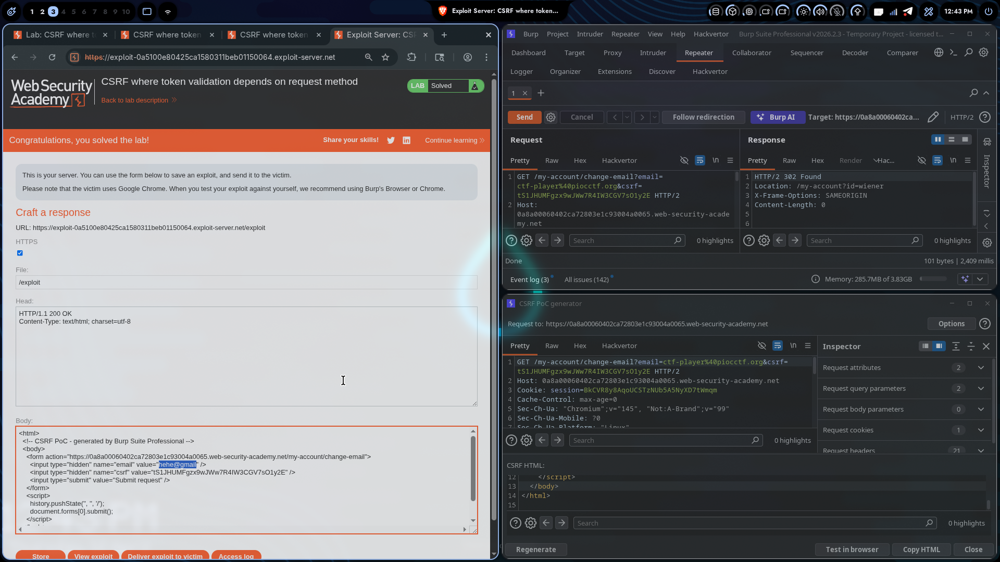

# Lab 01: CSRF where token validation depends on request method

## Category
CSRF (Cross-Site Request Forgery) - Token Validation Bypass

## Vulnerability Summary
The application is vulnerable to CSRF attacks because the token validation logic depends on the HTTP request method. Specifically, the server validates CSRF tokens only for POST requests but fails to validate them for GET requests. This allows an attacker to bypass CSRF protection by changing the request method from POST to GET.

## Attack Methodology
1. **Request Capture:** Intercepted the change email request using Burp Suite Proxy to identify the CSRF token mechanism.
2. **Token Analysis:** Observed that the application uses a CSRF token (`csrf`) in the request body for POST requests.
3. **Method Manipulation:** Changed the HTTP method from POST to GET while keeping the parameters as query strings.
4. **Validation Bypass:** Discovered that the server does not validate the CSRF token when the request method is GET, allowing the email change to succeed without a valid token.
5. **Exploitation:** Crafted a malicious request that changes the user's email address without requiring a valid CSRF token.

## Technical Root Cause
The server's CSRF token validation is implemented in a method-dependent manner. The validation logic only checks for and validates CSRF tokens in POST requests. When the same functionality is accessed via a GET request, the validation is bypassed entirely. This is a common implementation flaw where developers assume that state-changing operations will only occur via POST requests and fail to implement consistent security checks across all HTTP methods.

## Impact
An attacker can perform unauthorized actions on behalf of a victim user by crafting a malicious GET request. In this case, the attacker can change the victim's email address without their knowledge or consent. This could lead to account takeover, as the attacker can then use the email change to reset the password or gain further access to the account.

## Remediation
- Implement CSRF token validation consistently across all HTTP methods that perform state-changing operations.
- Do not rely on HTTP method as a security control; validate tokens regardless of the request method.
- Use a framework-level CSRF protection mechanism that enforces token validation uniformly.
- Ensure that sensitive operations (like email changes) are protected by CSRF tokens regardless of how they are accessed.
