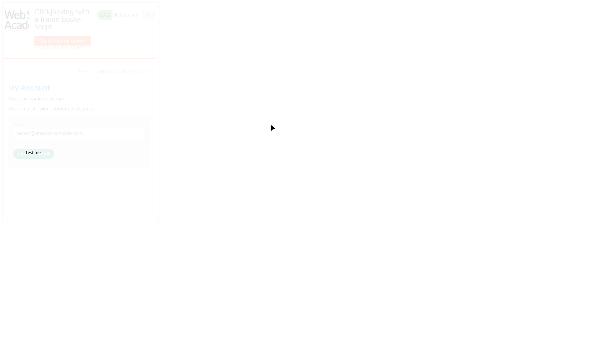
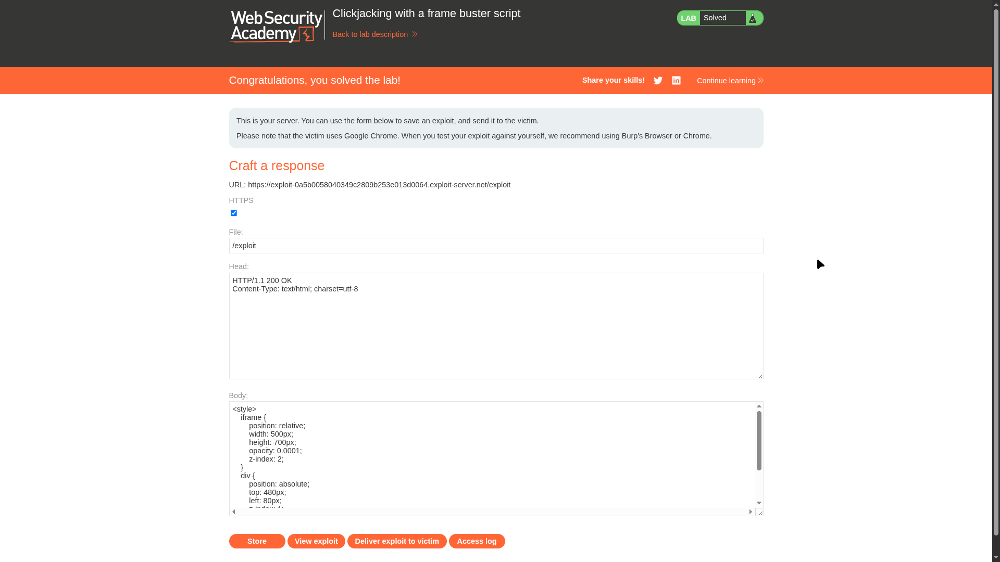

# Lab 03: Clickjacking with a frame buster script

> **Topic**: Clickjacking
> **Lab Number**: 03
> **Platform**: PortSwigger Web Security Academy

## Category
Clickjacking — Bypassing Frame Buster Scripts with HTML5 Sandbox

## Vulnerability Summary
This lab introduces a legacy defense mechanism known as a "frame buster" script. These are JavaScript snippets designed to prevent a page from being framed by checking if `top.location` is the same as `self.location`. If they differ (indicating the page is framed), the script redirects the top window to the target page's URL. However, this defense can be bypassed using the HTML5 `sandbox` attribute on the `<iframe>`. By specifying `sandbox="allow-forms"`, the browser allows the framed page to submit forms but prevents it from executing scripts, effectively neutralizing the frame buster while still allowing the clickjacking attack to succeed.

## Attack Methodology

### Step 1: Recon and Verification
I logged in to the account page and identified that the email field can be pre-filled via a URL parameter (`?email=...`), similar to Lab 02. I attempted to frame the page using a simple iframe and observed that the page automatically redirected the top window, confirming the presence of a frame buster script.

### Step 2: Crafting the Bypass
To bypass the frame buster, I used the `sandbox` attribute. This attribute enables a set of extra restrictions on any content hosted by the iframe. By including `allow-forms` but omitting `allow-scripts`, the frame buster script is blocked from executing, but the user can still submit the "Update email" form.

**Exploit Payload:**
```html
<style>
    iframe {
        position: relative;
        width: 500px;
        height: 700px;
        opacity: 0.0001; /* Invisible to the victim */
        z-index: 2;
    }
    div {
        position: absolute;
        /* Aligned over the 'Update email' button */
        top: 480px; 
        left: 80px;
        z-index: 1;
    }
</style>
<div>Click me</div>
<iframe sandbox="allow-forms" src="https://0a5b0058040349c2809b253e013d0064.web-security-academy.net/my-account?email=hacker@attacker-website.com"></iframe>
```

### Step 3: Alignment
I used an initial opacity of `0.1` to align the "Click me" text precisely over the hidden "Update email" button in the framed account page.


*The target page pre-filled with the attacker's email, showing the "Click me" button alignment over the hidden form button.*

### Step 4: Execution
After setting the opacity to `0.0001` and storing the exploit, I delivered it to the victim. The `sandbox="allow-forms"` attribute prevented the frame buster from breaking out of the iframe, allowing the victim to unknowingly click the "Update email" button.


*The exploit server configuration with the sandbox attribute used to neutralize the frame buster.*

## Technical Root Cause
The vulnerability exists because the application relies on client-side JavaScript (the frame buster) for security. Client-side defenses are inherently fragile because the attacker controls the environment (the parent page) and can use browser features like the `sandbox` attribute to selectively disable the security logic of the framed page.

## Impact
- **Bypass of Legacy Defenses**: Demonstrates that many common "frame-busting" techniques are obsolete against modern browsers.
- **Account Compromise**: Allows for unauthorized modification of sensitive account details (email) even on sites that attempt to prevent framing.

## Proof of Concept
1. Identify a frame buster script on the target page.
2. Use a sandboxed iframe with `allow-forms` to host the target page.
3. Overlay a decoy UI to trick the user into performing a sensitive action.
4. Verify that the script-based defense is neutralized and the action is performed.

## Key Takeaways
1. **Client-Side Security is a Fallacy**: Never rely solely on JavaScript for security features like framing prevention.
2. **The `sandbox` Attribute is a Double-Edged Sword**: While useful for isolating untrusted content, it can also be used by attackers to disable security scripts in framed pages.
3. **Use Modern Headers**: Security headers like `X-Frame-Options` and CSP `frame-ancestors` are processed by the browser at a level that cannot be bypassed by sandboxing or other client-side tricks.

## Mitigation
1. **Use HTTP Security Headers**: 
    - `X-Frame-Options: SAMEORIGIN` or `DENY`.
    - `Content-Security-Policy: frame-ancestors 'self'`.
2. **Deprecate Frame Busters**: Replace fragile JavaScript-based framing checks with robust server-side headers.
3. **Form Confirmation**: Implement a secondary confirmation step for sensitive actions that is not easily performed with a single click.

## References
- [PortSwigger Clickjacking Lab - Clickjacking with a frame buster script](https://portswigger.net/web-security/clickjacking/lab-frame-buster-script)
- [HTML5 Sandbox Attribute - MDN](https://developer.mozilla.org/en-US/docs/Web/HTML/Element/iframe#attr-sandbox)

---

*Lab completed on: 2026-05-16*
*Writeup by vibhxr*
