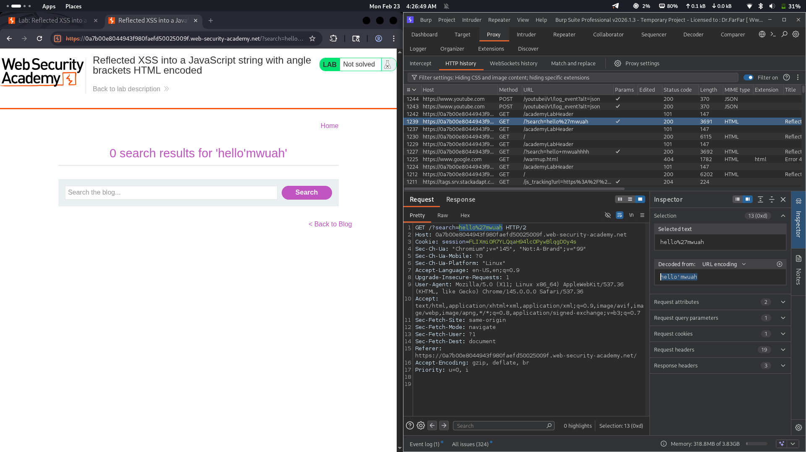
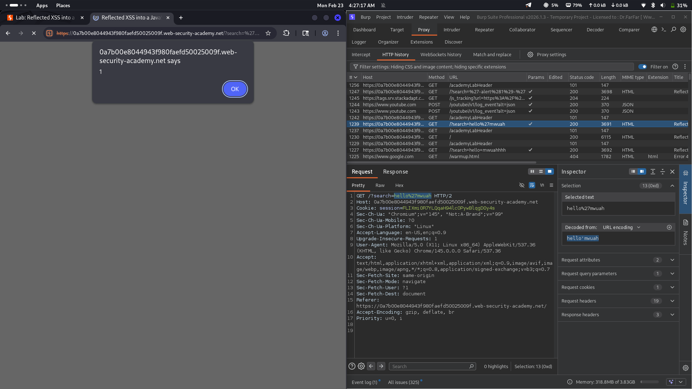
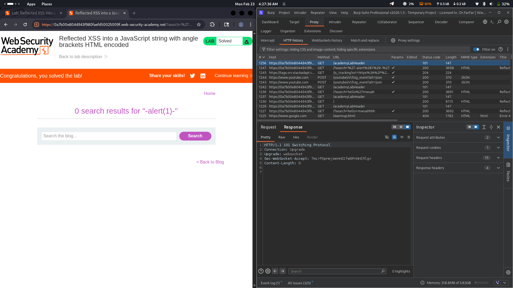

# Lab 09: Reflected XSS into a JavaScript String with Angle Brackets HTML Encoded

## Category
Cross-Site Scripting (XSS) - Reflected

## What I Found
The website has a reflected XSS vulnerability in a JavaScript string. The server HTML-encodes angle brackets but doesn't sanitize single quotes. User input is reflected inside a JavaScript string without proper escaping, allowing me to break out and inject code.

## How I Exploited It
1. Sent a request and noticed the input appears inside a JavaScript string
2. Angle brackets are encoded but single quotes aren't escaped
3. Injected a payload like `'; alert(1); //` to break out of the string
4. The JavaScript executed when the page loaded

## Why It Happens
The developers only focused on encoding HTML special characters (`<`, `>`) but forgot that input inside JavaScript strings needs different handling. Single quotes should be escaped as `\'` to prevent breaking out of the string context.

## Impact
- Attacker can steal session cookies
- Users can be redirected to phishing pages
- Arbitrary JavaScript execution in victim's browser

## Fix
- **Escape single quotes inside JavaScript strings** — `'` should become `\'`
- **Use JSON.stringify()** for safely embedding data in JavaScript
- **Avoid reflecting user input directly in JavaScript** — use data attributes or separate JSON endpoints instead
- **Implement CSP headers** to limit script execution
