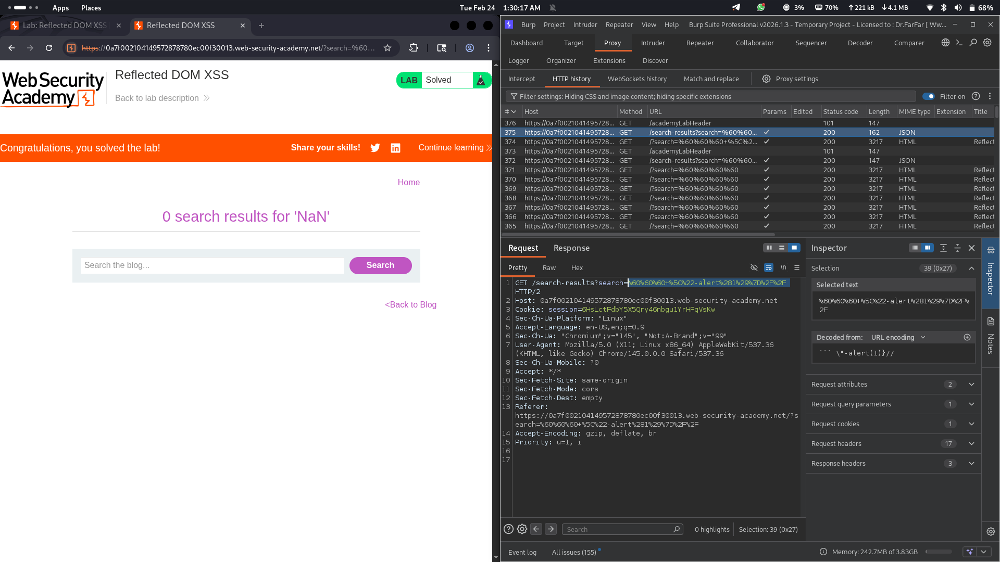

# Lab 12: Reflected DOM XSS via JSON Response with Unsafe DOM Writing

## Category
Cross-Site Scripting (XSS) - Reflected DOM-based

## What I Found
The website has a reflected DOM-based XSS vulnerability in its search functionality. When a user submits a search query, the input is sent to the server, which returns it in a JSON response. The client-side JavaScript then reads this JSON response and writes the data directly to the DOM without proper sanitization. This creates a dangerous flow where attacker-controlled input travels through the server and gets rendered unsafely in the victim's browser.

## How I Exploited It
1. **Reconnaissance:** Identified the search feature that sends queries to the server via AJAX
2. **Request Analysis:** Observed that the search term is sent to the server and returned in a JSON response
3. **Response Inspection:** Found that the server reflects the input in the JSON without proper encoding
4. **Client-Side Analysis:** Discovered that the JavaScript uses unsafe methods to write the JSON data to the DOM
5. **Payload Injection:** Crafted a malicious search query containing a script payload
6. **Execution:** When the JSON response was processed, the script executed in the browser

Example payload in search parameter:
```
search=
```

Or if the server breaks on certain characters:
```
search=test"><script>alert(1)</script>
```



## Why It Happens
The vulnerability exists due to multiple security failures in the application architecture:

1. **Unsafe JSON Parsing:** The client-side code may be using `eval()` to parse the JSON response instead of the safer `JSON.parse()` method. This allows JavaScript code embedded in the response to execute.

2. **No Output Encoding:** When writing data from the JSON response to the DOM, the application uses dangerous methods like `innerHTML` or `document.write()` instead of safe alternatives like `textContent`.

3. **Server Trust Assumption:** The client-side code implicitly trusts data coming from the server, assuming it's safe. However, the server simply reflects user input without sanitization.

4. **Broken Sanitization:** The server attempts some form of sanitization but breaks when handling certain characters or JSON formatting, allowing payloads to slip through.

5. **Insecure Data Flow:** The pattern of `user input → server reflection → JSON → unsafe DOM write` creates a complete XSS attack vector.

## Impact
- **Malicious Link Attacks:** Attackers can craft URLs with embedded payloads and send them to victims via email, social media, or messaging platforms
- **Immediate Script Execution:** The alert fires immediately when the victim visits the malicious link
- **Session Hijacking:** Attackers can steal session cookies and authentication tokens
- **Account Takeover:** Full compromise of victim accounts is possible
- **Phishing:** Attackers can inject fake login forms or modify page content
- **Data Theft:** Sensitive user information can be exfiltrated to attacker servers
- **Malware Distribution:** Users can be redirected to malicious download pages

## Fix
To prevent this type of reflected DOM XSS vulnerability, implement these security measures:

### 1. Never Use eval() for JSON Parsing
Always use the safe `JSON.parse()` method:
```javascript
// ❌ Dangerous - allows code execution
const data = eval('(' + responseText + ')');

// ✅ Safe - only parses JSON
const data = JSON.parse(responseText);
```

### 2. Use Safe DOM Methods
Replace unsafe DOM writing methods with safe alternatives:
```javascript
// ❌ Dangerous
element.innerHTML = data.searchTerm;
document.write(data.searchTerm);

// ✅ Safe
element.textContent = data.searchTerm;
```

### 3. Server-Side Input Validation
Validate and sanitize all user input on the server before including it in responses:
```javascript
// Validate against allowlist patterns
// Reject or encode special characters
// Use proper JSON encoding
```

### 4. Implement Content Security Policy (CSP)
Add CSP headers to restrict script execution:
```
Content-Security-Policy: default-src 'self'; script-src 'self'; object-src 'none'
```

### 5. Use Modern Frameworks
Frameworks like React, Vue, and Angular automatically escape content by default:
```javascript
// React automatically escapes content
<div>{searchTerm}</div>  // Safe - auto-escaped
```

### 6. Validate JSON Schema
Ensure the JSON response follows a strict schema and reject unexpected fields or types.

### 7. HTTP Security Headers
Add protective headers:
```
X-Content-Type-Options: nosniff
X-XSS-Protection: 1; mode=block
```

## References
- [PortSwigger: DOM XSS](https://portswigger.net/web-security/cross-site-scripting/dom-based)
- [OWASP: DOM based XSS](https://owasp.org/www-community/attacks/DOM_based_XSS)
- [MDN: JSON.parse()](https://developer.mozilla.org/en-US/docs/Web/JavaScript/Reference/Global_Objects/JSON/parse)
- [MDN: eval()](https://developer.mozilla.org/en-US/docs/Web/JavaScript/Reference/Global_Objects/eval)
