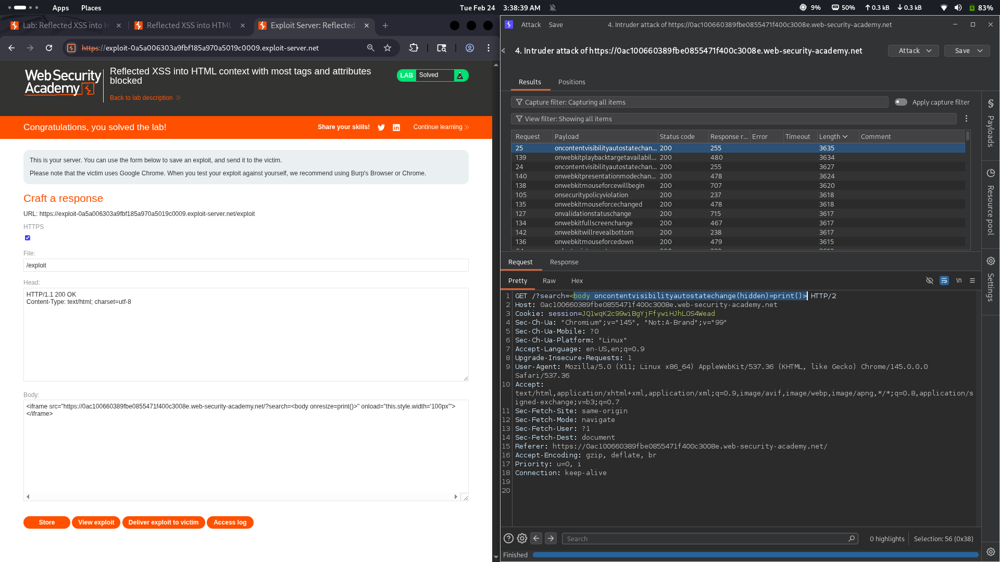

# Lab 14: Reflected XSS into HTML context with most tags and attributes blocked

## Category
Cross-Site Scripting (XSS) - Reflected

## Vulnerability Summary
The website implements a Web Application Firewall (WAF) that sanitizes user input and blocks common XSS payloads. However, the WAF uses a blacklist-based approach which can be bypassed using carefully crafted event handlers and HTML tags. This allows attackers to execute arbitrary JavaScript despite the security controls in place.

## Attack Methodology
1. **Reconnaissance:** Identified that the search functionality reflects user input back in the HTML response.
2. **WAF Detection:** Submitted standard XSS payloads (`<script>alert(1)</script>`) which were blocked by the WAF.
3. **Filter Analysis:** Tested various payloads to understand what tags and attributes are being filtered.
4. **Bypass Discovery:** Found that the WAF doesn't block certain event handlers combined with specific HTML tags.
5. **Payload Construction:** Created a crafted payload using allowed event handlers and tags.
6. **Execution:** Successfully bypassed the WAF and executed JavaScript in the victim's browser.



## Technical Root Cause
The WAF implements a **blacklist-based filtering approach** which has inherent weaknesses:

- **Incomplete Filter List:** The WAF blocks known malicious patterns but misses edge cases and lesser-known event handlers.
- **No Context-Aware Parsing:** The filter doesn't properly parse HTML context, allowing attackers to find gaps.
- **Predictable Blocking:** Blacklist rules are predictable, allowing attackers to test and find unblocked vectors.
- **Event Handler Bypass:** Certain event handlers (like `onmouseover`, `onfocus`, `onload`) may not be fully covered.

### Why Blacklists Fail
```
❌ Blacklist Approach: Block known bad patterns
   → Attacker finds unblocked pattern → Bypass successful

✅ Whitelist Approach: Allow only known good patterns
   → Everything not explicitly allowed is blocked → Much harder to bypass
```

## Impact
- **Zero-Click Exploitation:** Attacker sends a crafted link to the victim, and simply opening the page triggers the exploit — no additional clicks required.
- **Session Hijacking:** Malicious JavaScript can steal session cookies and authentication tokens.
- **Credential Theft:** Keyloggers can be injected to capture passwords and sensitive input.
- **Browser Takeover:** Attacker gains control over the victim's browser session.
- **Lateral Movement:** Compromised sessions can be used to access internal resources or attack other users.

## Proof of Concept
A typical bypass payload might look like:
```html

<!-- or -->
<svg onload=alert(1)>
<!-- or -->
<body onpageshow=alert(1)>
```

*(Exact payload depends on the specific WAF rules in place)*

## Mitigation

### 1. Replace Blacklist with Whitelist
**This is the most critical fix.** Instead of trying to block bad input, only allow known-safe patterns:

```
❌ Bad: Block <script>, javascript:, onerror, onload, etc.
✅ Good: Only allow plain text, block everything else by default
```

### 2. Output Encoding
Encode all user-controllable data based on context:
- **HTML Body:** Use HTML entity encoding (`<` → `&lt;`, `>` → `&gt;`)
- **HTML Attributes:** Use attribute encoding with proper quote escaping
- **JavaScript:** Use JavaScript Unicode escaping
- **URLs:** Use URL encoding

### 3. Content Security Policy (CSP)
Implement a strict CSP to limit script execution even if XSS occurs:
```
Content-Security-Policy: default-src 'self'; script-src 'self'; object-src 'none'; base-uri 'self'
```

### 4. HTTP Security Headers
Add protective headers:
```
X-Content-Type-Options: nosniff
X-XSS-Protection: 1; mode=block
Referrer-Policy: strict-origin-when-cross-origin
Permissions-Policy: geolocation=(), microphone=(), camera=()
```

### 5. WAF Best Practices
- Use WAF as **defense in depth**, not primary security
- Regularly update WAF rules
- Combine with input validation and output encoding
- Monitor and log blocked requests for analysis

### 6. Regular Security Testing
- Automated scanning with XSS-specific tools
- Manual penetration testing focusing on WAF bypass techniques
- Code reviews for input handling and output rendering
- Bug bounty programs to crowdsource vulnerability discovery

## References
- [OWASP XSS Prevention Cheat Sheet](https://cheatsheetseries.owasp.org/cheatsheets/Cross_Site_Scripting_Prevention_Cheat_Sheet.html)
- [PortSwigger XSS Knowledge Base](https://portswigger.net/web-security/cross-site-scripting)
- [CSP Guide - MDN](https://developer.mozilla.org/en-US/docs/Web/HTTP/CSP)

---
*Lab completed on: 2026-02-24*
