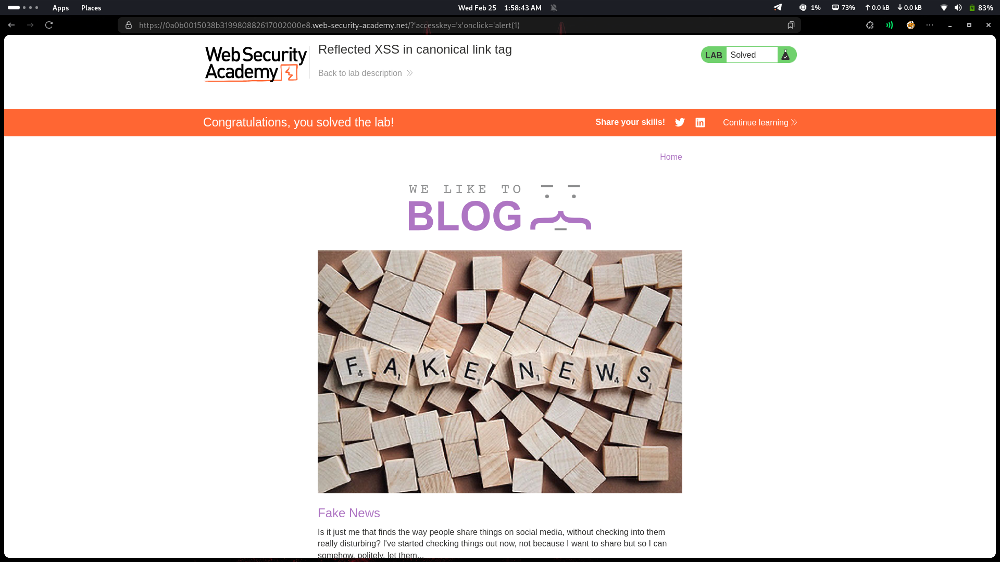

# Lab 17: Reflected XSS in Canonical Link Tag

## Category
Cross-Site Scripting (XSS) - Reflected

## Vulnerability Summary
The website inserts the page URL directly into a hidden `<link rel="canonical">` tag without proper sanitization. Single quotes are not encoded, allowing attackers to break out of the `href` attribute and inject new attributes like `accesskey` and `onclick` into the `<link>` tag.

## Attack Methodology
1. **Reconnaissance:** Identified that the page URL is reflected in a `<link rel="canonical">` tag.
2. **Injection Point:** Found that single quotes in the URL are not encoded.
3. **Attribute Breakout:** Crafted a payload that closes the `href` attribute and injects new attributes.
4. **Access Key Trigger:** Used `accesskey="x"` to assign a keyboard shortcut (ALT+SHIFT+X) that triggers `onclick`.
5. **Execution:** Victim presses the keyboard shortcut, JavaScript fires instantly.



## Technical Root Cause
The application fails to encode single quotes in HTML attribute context:

- **No Attribute Encoding:** `'` is not encoded to `&#x27;` inside the `href` attribute.
- **Attribute Injection:** Attacker can inject new attributes into the `<link>` tag.
- **Access Key Feature:** The `accesskey` attribute creates a keyboard shortcut that triggers JavaScript.

### Payload Used
```html
' accesskey='x' onclick='alert(1)'
```

Injected into:
```html
<link rel="canonical" href='[PAYLOAD]' />
```

Resulting in:
```html
<link rel="canonical" href='' accesskey='x' onclick='alert(1)' />
```

## Impact
- **Keyboard Shortcut Trigger:** Victim presses ALT+SHIFT+X, JavaScript executes instantly.
- **Session Hijacking:** Attacker can steal session cookies and authentication tokens.
- **Credential Theft:** Malicious scripts can capture keystrokes or redirect to phishing pages.
- **Hidden Vulnerability:** The `<link>` tag is invisible to users, making detection harder.

## Mitigation
1. **Encode single quotes:** `'` → `&#x27;` in all HTML attributes.
2. **Use context-aware encoding:** Apply proper encoding based on HTML attribute context.
3. **Avoid dynamic URLs in attributes:** Don't reflect user input directly into HTML attributes.

---
*Lab completed on: 2026-02-25*
