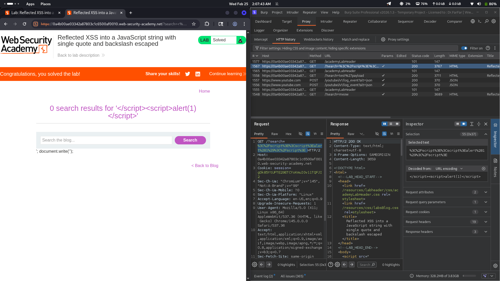

# Lab 18: Reflected XSS into a JavaScript string with single quote and backslash escaped

## Category
Cross-Site Scripting (XSS) - Reflected

## Vulnerability Summary
The website inserts user input inside a JavaScript string and attempts to escape single quotes (`'`) and backslashes (`\`). However, this protection is insufficient because attackers can break out of the script block entirely using `</script>`, bypassing the escaping mechanism.

## Attack Methodology
1. **Reconnaissance:** Identified that user input is reflected inside a JavaScript string within a `<script>` block.
2. **Escape Detection:** Found that single quotes and backslashes are properly escaped.
3. **Bypass Discovery:** Realized that closing the `<script>` tag doesn't require escaping — it simply ends the script block.
4. **Payload Construction:** Used `</script>` to exit the JavaScript context, then injected arbitrary HTML/JavaScript.
5. **Execution:** Browser parses the injected code as new HTML/JavaScript outside the original script context.



## Technical Root Cause
The developer incorrectly assumed that escaping quotes and backslashes is sufficient:

- **Partial Escaping:** Only `'` and `\` are escaped, but `</script>` is not filtered.
- **Context Breakout:** The `</script>` tag closes the script block entirely.
- **New Context Injection:** After closing the script, attacker can inject new HTML or script tags.

### Payload Used
```html
</script><script>alert(1)</script>
```

This works because:
- `</script>` closes the current script block.
- `<script>alert(1)</script>` is parsed as a new, attacker-controlled script.

## Impact
- **Session Hijacking:** Attacker can steal session cookies and authentication tokens.
- **Credential Theft:** Malicious scripts can capture keystrokes or redirect to phishing pages.
- **Full JavaScript Execution:** Attacker gains complete control over the page's JavaScript context.

## Mitigation
1. **Use json_encode():** Use `json_encode()` or proper JavaScript encoding for user data inside scripts.
2. **Never concatenate user input:** Don't directly insert user data into `<script>` blocks.
3. **Use data attributes:** Pass data via HTML `data-*` attributes and read them with JavaScript.

---
*Lab completed on: 2026-02-25*
