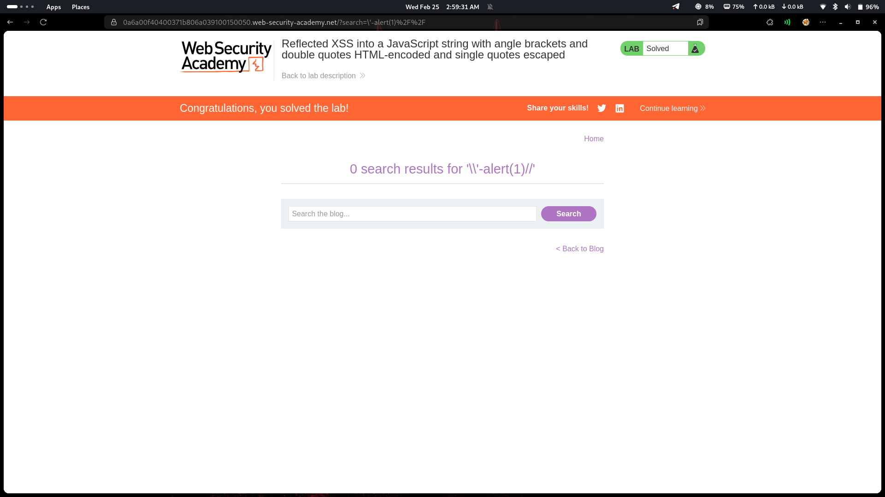

# Lab 19: Reflected XSS — JavaScript string backslash escape bypass

## Category
Cross-Site Scripting (XSS) - Reflected

## Vulnerability Summary
The website escapes single quotes (`'`) and HTML encodes `<>` and `"` — but fails to escape backslashes (`\`). This allows attackers to neutralize the escape mechanism by injecting a backslash before the quote, breaking out of the JavaScript string.

## Attack Methodology
1. **Reconnaissance:** Identified that user input is reflected inside a JavaScript string.
2. **Escape Detection:** Found that single quotes are escaped (`'` → `\'`), but backslashes are not.
3. **Bypass Discovery:** Injected `\'` which gets escaped to `\\'` — the double backslash becomes a literal backslash, leaving the quote unescaped.
4. **Payload Construction:** Used `\'-alert(1)//` to break out of the string and inject JavaScript.
5. **Execution:** Script executes instantly on page load.



## Technical Root Cause
The escaping logic is incomplete:

- **Backslash Not Escaped:** `\` is not escaped before escaping quotes.
- **Escape Neutralization:** When attacker sends `\'`, server escapes it to `\\'`.
- **Browser Interpretation:** `\\` = literal backslash, `'` = string terminator.

### Payload Used
```
\'-alert(1)//
```

When escaped by server:
```
\\'-alert(1)//
```

Browser sees:
- `\\` = escaped backslash (literal `\`)
- `'` = string terminator
- `-alert(1)//` = injected JavaScript

## Impact
- **Instant Execution:** Script executes immediately on page load.
- **Session Hijacking:** Attacker can steal session cookies.
- **Credential Theft:** Malicious scripts can capture user input.

## Mitigation
1. **Escape backslashes first:** Always escape `\` before escaping quotes.
2. **Use json_encode():** Use proper JavaScript encoding functions.
3. **Avoid user input in scripts:** Don't concatenate user data directly into JavaScript strings.

---
*Lab completed on: 2026-02-25*
