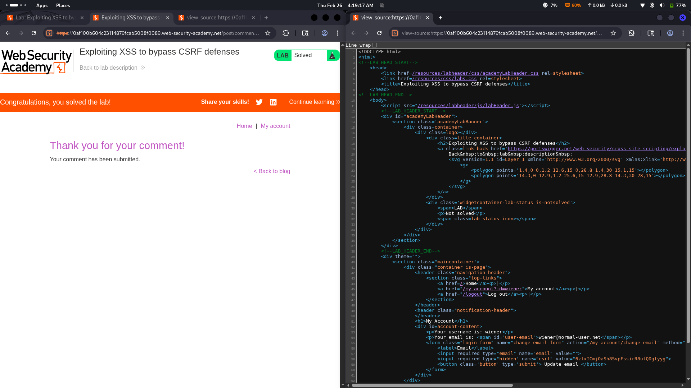

# Lab 24: Exploiting XSS to bypass CSRF defenses

## Category
Cross-Site Scripting (XSS) - Stored (CSRF Bypass)

## Vulnerability Summary
The website implements CSRF (Cross-Site Request Forgery) protection mechanisms, but these defenses can be bypassed using a stored XSS vulnerability. The attacker injects a malicious payload into the comment section. When the victim visits the page and clicks on the compromised comments, the script executes and issues a request to change the user's email address in the backend. Since the request originates from the victim's own browser session (same-origin), the CSRF token is automatically included, effectively bypassing all CSRF protections.

## Attack Methodology
1. **Vulnerability Discovery:** Attacker identifies stored XSS in the comment function.
2. **Payload Crafting:** Creates a malicious script that programmatically submits a "change email" request using the victim's authenticated session.
3. **Injection:** Posts the payload as a comment on the vulnerable page.
4. **Victim Interaction:** When the victim visits the page and clicks on the comments, the script executes.
5. **CSRF Token Extraction:** The script reads the CSRF token from the page (since it runs in the same origin).
6. **Request Forgery:** The script sends a legitimate request to change the email, including the valid CSRF token.
7. **Email Changed:** The server processes the request as legitimate since it contains a valid CSRF token from the user's session.



## Technical Root Cause
The application has CSRF protection but fails to prevent XSS:

- **XSS Trumps CSRF:** CSRF tokens protect against cross-origin requests, but XSS runs in the same origin.
- **Same-Origin Access:** The malicious script has full access to the DOM, including CSRF tokens.
- **Authenticated Context:** The script executes in the victim's authenticated session, inheriting all privileges.
- **No Defense in Depth:** Relying solely on CSRF tokens without preventing XSS creates a bypass vector.

### Payload Example
```html
<script>
  // Get CSRF token from the page
  var csrfToken = document.querySelector('input[name="csrf"]').value;
  
  // Create and submit the change email request
  fetch('/my-account/change-email', {
    method: 'POST',
    headers: {'Content-Type': 'application/x-www-form-urlencoded'},
    body: 'email=attacker@evil.com&csrf=' + csrfToken
  });
</script>
```

## Impact
- **CSRF Defense Bypassed:** Attacker bypasses CSRF protection using XSS as a vector.
- **Account Takeover:** Changing the email allows attacker to reset password and lock out the victim.
- **Session Hijacking:** Attacker can perform any action the victim is authorized to do.
- **Privilege Escalation:** If admin is targeted, attacker can escalate privileges or create backdoor accounts.
- **Data Manipulation:** Attacker can modify sensitive account settings, payment details, or personal information.

## Mitigation
1. **Prevent XSS First:** XSS prevention is critical since XSS can bypass any CSRF defense. Use modern frameworks that auto-escape output.
2. **Use SameSite Cookies:** Set cookies with `SameSite=Strict` or `SameSite=Lax` to prevent cross-site cookie sending.
3. **Implement Content Security Policy (CSP):** Restrict script execution and reduce XSS impact.
4. **Input Validation & Output Encoding:** Sanitize all user input and encode output based on context.
5. **Defense in Depth:** Combine CSRF tokens with additional checks like re-authentication for sensitive actions.

---
*Lab completed on: 2026-02-26*
