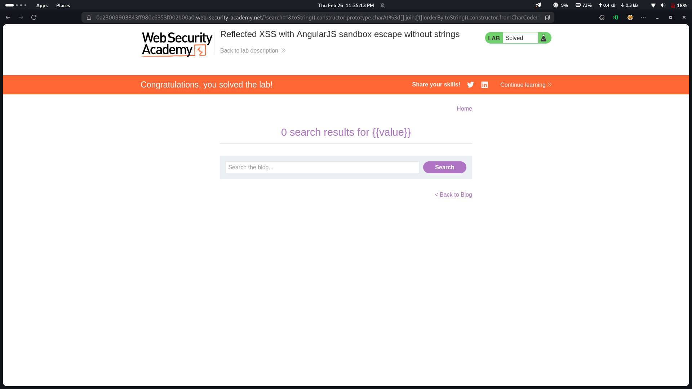

# Lab 25: Reflected XSS with AngularJS sandbox escape without strings

## Category
Cross-Site Scripting (XSS) - Reflected (AngularJS Sandbox Escape)

## Vulnerability Summary
The website uses AngularJS with a sandbox mechanism designed to filter and prevent XSS payloads. However, the sandbox protection is insufficient and can be bypassed using a technique that avoids string literals entirely. By combining JavaScript constructors, `charAt()`, and other native methods, an attacker can construct arbitrary strings and escape the AngularJS sandbox to execute malicious code.

## Attack Methodology
1. **Reconnaissance:** Identified that user input is reflected within an AngularJS template expression.
2. **Sandbox Detection:** Found that the AngularJS sandbox blocks standard XSS payloads and string literals.
3. **Bypass Discovery:** Discovered that strings can be constructed without using string literals by combining:
   - `constructor` property to access function constructors
   - `charAt()` method to extract individual characters
   - Native JavaScript objects and methods
4. **Payload Construction:** Built a payload that constructs the `alert` function and executes it without using any string literals.
5. **Execution:** The payload bypasses the sandbox and executes arbitrary JavaScript code.



## Technical Root Cause
The AngularJS sandbox is designed as a security layer, not a complete protection mechanism:

- **Sandbox Limitations:** The sandbox is not designed to be a security boundary; it can be escaped.
- **String Construction:** Strings can be built character-by-character using `charAt()` on existing strings.
- **Constructor Access:** The `constructor` property provides access to the Function constructor.
- **No String Literals Needed:** By combining these techniques, attackers can build any string without quotes.

### Payload Example
```javascript
{{constructor.constructor('alert(1)')()}}
```

Or without string literals:
```javascript
{{
  a = {}.constructor.constructor;
  b = 'ale';
  c = 'rt(1)';
  a(b+c)()
}}
```

Using charAt to build strings:
```javascript
{{
  ''.charAt.constructor('alert(1)')()
}}
```

## Impact
- **Alert Popup:** Basic proof-of-concept demonstrates code execution capability.
- **Full JavaScript Execution:** Attacker can execute arbitrary JavaScript in the victim's browser.
- **Session Hijacking:** Malicious scripts can steal session cookies and authentication tokens.
- **Account Takeover:** When delivered to victims, the payload can lead to complete account compromise.
- **Data Theft:** Attacker can access and exfiltrate sensitive data from the page.

## Mitigation
1. **Upgrade AngularJS:** Use AngularJS version 1.6+ with improved sandbox protections, or migrate to modern Angular.
2. **Disable AngularJS Expressions:** Don't allow user input to be interpolated as AngularJS expressions.
3. **Use Modern Frameworks:** Migrate to React, Vue, or Angular (2+) which have better security models.
4. **Input Validation:** Strictly validate and sanitize all user input before rendering.
5. **Content Security Policy (CSP):** Implement CSP to restrict script execution sources.

---
*Lab completed on: 2026-02-26*
