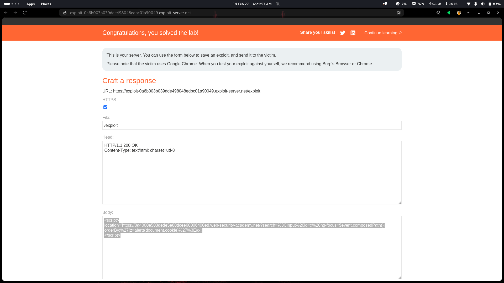

# Lab 26: Reflected XSS with AngularJS sandbox escape and CSP bypass

## Category
Cross-Site Scripting (XSS) - Reflected (AngularJS + CSP Bypass)

## Vulnerability Summary
The website implements Content Security Policy (CSP) to block JavaScript and XSS attacks from untrusted sources. However, the CSP is configured to allow scripts from AngularJS as a trusted source. The attacker bypasses this protection by using AngularJS-specific event handlers like `ng-focus`, which the CSP treats as trusted AngularJS code. This allows the malicious script to execute within the AngularJS context, triggering a cookie-stealing alert popup.

## Attack Methodology
1. **Reconnaissance:** Identified that user input is reflected within an AngularJS template with CSP protection.
2. **CSP Detection:** Found that CSP blocks inline scripts and external JavaScript from untrusted sources.
3. **Trusted Source Discovery:** Discovered that AngularJS directives are whitelisted as trusted sources by the CSP.
4. **Bypass Technique:** Used AngularJS event handler directives like `ng-focus`, `ng-click`, or `ng-mouseover` to inject malicious code.
5. **Payload Construction:** Crafted a payload that executes JavaScript within the AngularJS context using trusted directives.
6. **Execution:** When the victim interacts with the page (e.g., focuses on an element), the script executes and displays an alert with cookie data.



## Technical Root Cause
The CSP configuration is too permissive with AngularJS:

- **Overly Trusted AngularJS:** CSP trusts all AngularJS code, assuming it's safe.
- **Directive Injection:** User input can be injected into AngularJS event handler directives.
- **Event Handler Execution:** Directives like `ng-focus` execute JavaScript when triggered by user interaction.
- **CSP Blind Spot:** The CSP doesn't distinguish between legitimate and malicious AngularJS code.

### Payload Example
```html
<input ng-focus="constructor.constructor('alert(document.cookie)')()">
```

Or with other event handlers:
```html
<div ng-mouseover="alert(document.cookie)">Hover me</div>
```

When the victim focuses on the input or hovers over the element, the AngularJS expression executes and displays the session cookie.

## Impact
- **Alert Popup:** Basic proof-of-concept demonstrates code execution capability.
- **Session Hijacking:** Attacker can steal session cookies via `document.cookie`.
- **Account Takeover:** Stolen cookies allow attacker to impersonate the victim.
- **Data Exfiltration:** Malicious scripts can send sensitive data to attacker-controlled servers.
- **CSP Bypass:** The primary defense mechanism (CSP) is rendered ineffective.

## Mitigation
1. **Upgrade AngularJS:** Use AngularJS version 1.6+ with improved security features, or migrate to modern Angular.
2. **Strict CSP Configuration:** Don't blindly trust AngularJS; use stricter CSP directives.
3. **Disable AngularJS Expressions in User Input:** Never allow user input to be interpolated as AngularJS expressions.
4. **Use Modern Frameworks:** Migrate to React, Vue, or Angular (2+) which have better security models without sandbox bypasses.
5. **Input Validation & Output Encoding:** Sanitize all user input and encode output based on context.

---
*Lab completed on: 2026-02-27*
