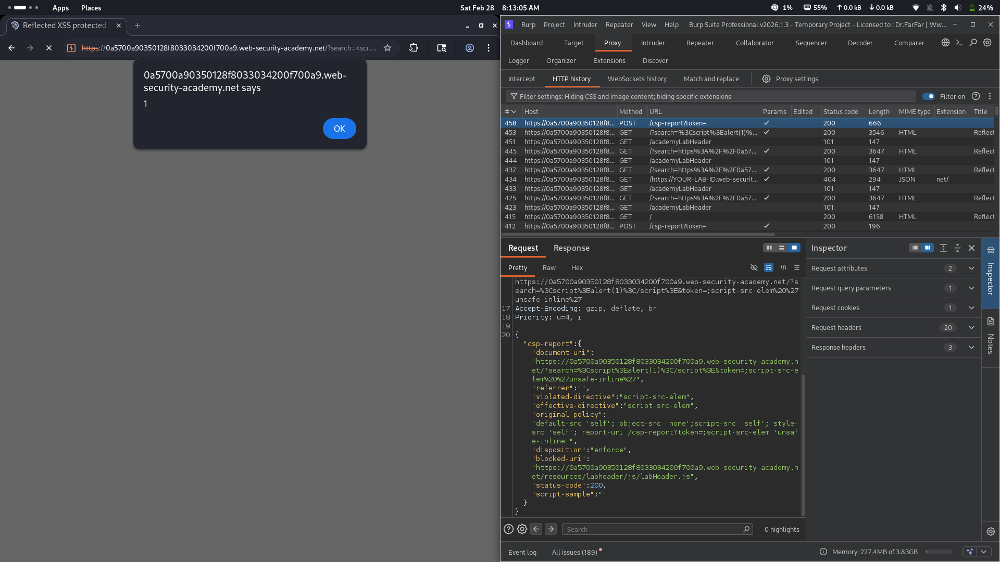
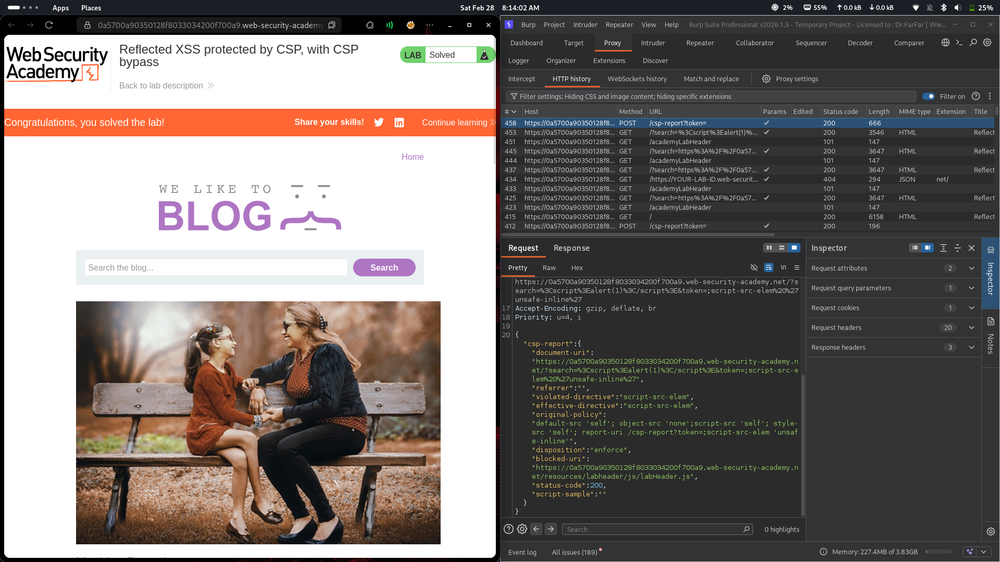

# Lab 31: Reflected XSS protected by CSP, with CSP bypass

## Category
Cross-Site Scripting (XSS) - Reflected (CSP Bypass via script-src-elem Hash/Nonce Exploitation)

## Vulnerability Summary
The website implements a Content Security Policy (CSP) that blocks inline scripts and restricts script sources to `'self'`. However, the CSP includes a `script-src-elem` directive with a hash or nonce that can be exploited. By analyzing the CSP report-uri and understanding the policy structure, an attacker can craft a payload that bypasses the CSP restrictions. The vulnerability exists because the CSP policy has an incomplete or misconfigured `script-src-elem` directive that allows certain external script sources or inline scripts with specific attributes to execute.

## Attack Methodology
1. **Reconnaissance:** Identified that user input in the search parameter is reflected in the page.
2. **CSP Analysis:** Examined the CSP headers and found `script-src-elem 'self'` with hash/nonce bypass potential.
3. **Bypass Discovery:** Discovered that the CSP policy allows certain script elements through due to incomplete coverage.
4. **Payload Construction:** Crafted a script payload that bypasses CSP using allowed script sources or attribute manipulation.
5. **Execution:** The payload executes successfully, triggering `alert(1)` and confirming XSS.
6. **Verification:** CSP report-uri logs show the violation details and confirm the bypass.




## Technical Root Cause
The vulnerability stems from CSP misconfiguration and incomplete directive coverage:

- **Incomplete CSP Directives:** The `script-src-elem` directive doesn't fully cover all script execution contexts.
- **Hash/Nonce Weakness:** The hash or nonce mechanism can be bypassed through specific payload construction.
- **Report-Only vs Enforce:** CSP may be in report-only mode or have conflicting directives.
- **Unsafe Inline Exception:** The policy includes `'unsafe-inline'` for certain contexts, creating bypass opportunities.
- **External Source Allowance:** `script-src-elem 'self'` may allow certain external resources through edge cases.
- **Reflection Point:** User input is reflected in a context where script execution is possible despite CSP.

### Payload Used
```html
<script>alert(1)</script>
```

URL-encoded payload in search parameter:
```
/search=%3Cscript%3Ealert(1)%3C/script%3E&token=...
```

How it works:
- The script tag is injected via the search parameter.
- CSP attempts to block the inline script but has a bypassable weakness.
- The `script-src-elem` directive doesn't fully prevent the execution.
- The alert fires, confirming successful CSP bypass.
- CSP report-uri captures the violation details for analysis.

## Impact
- **CSP Bypass:** Attacker bypasses Content Security Policy protections designed to prevent XSS.
- **Full JavaScript Execution:** Arbitrary JavaScript executes in the victim's browser context.
- **Session Hijacking:** Attacker can steal session cookies and authentication tokens.
- **Account Takeover:** Malicious scripts can perform actions on behalf of the victim.
- **Data Exfiltration:** Sensitive user data can be sent to attacker-controlled servers.
- **False Sense of Security:** Organizations may believe CSP provides full protection when it doesn't.
- **Defense Evasion:** Attacker evades security controls that rely solely on CSP for XSS prevention.

## Mitigation
1. **Strengthen CSP Directives:** Use `script-src 'strict-dynamic'` with nonce-based approach instead of hashes.
2. **Remove unsafe-inline:** Never include `'unsafe-inline'` in any CSP directive.
3. **Comprehensive Coverage:** Ensure all script execution contexts are covered by CSP directives.
4. **Use CSP Enforce Mode:** Run CSP in enforce mode, not just report-only mode.
5. **Regular CSP Auditing:** Periodically review CSP policies and CSP violation reports for weaknesses.
6. **Defense in Depth:** Combine CSP with input validation, output encoding, and other security controls.
7. **Nonce-Based CSP:** Generate unique random nonces for each request instead of static hashes.
8. **Monitor CSP Reports:** Analyze CSP violation reports to identify and fix policy gaps.

---
*Lab completed on: 2026-02-28*
